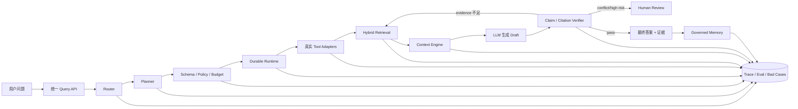
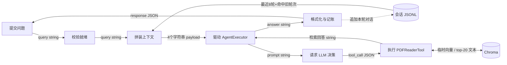
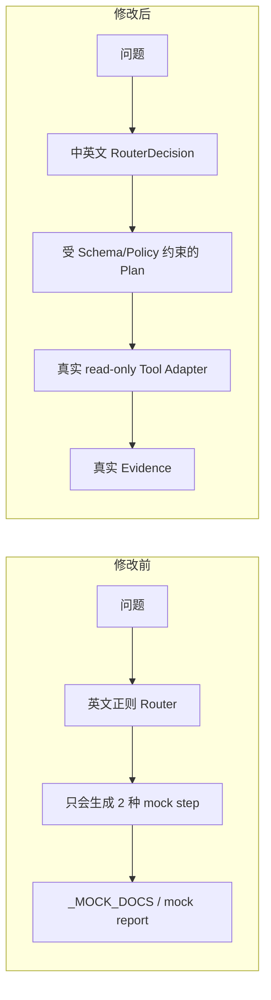
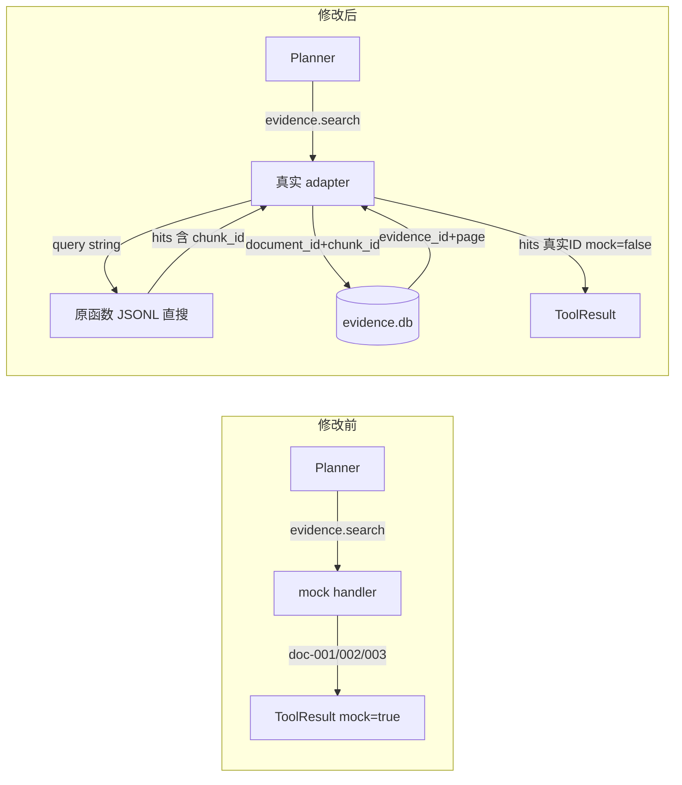
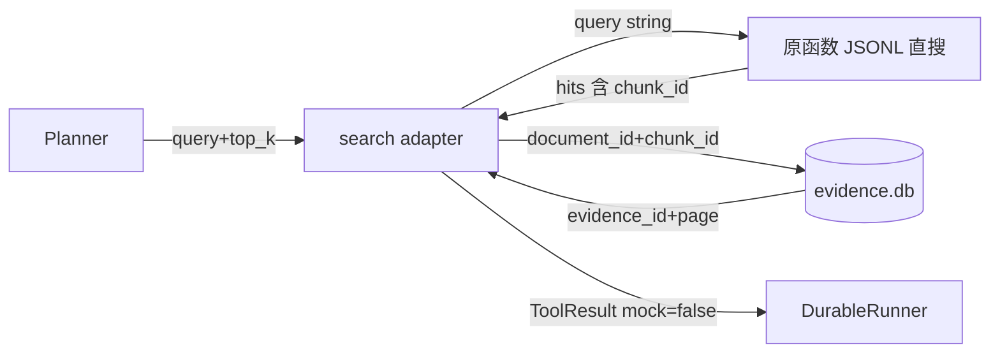
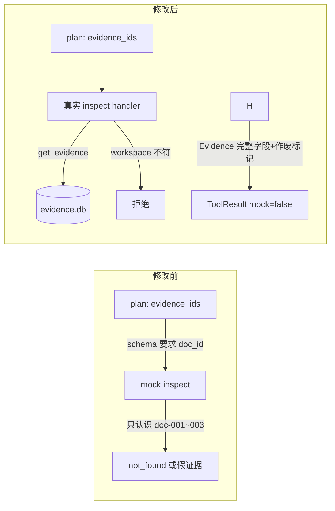
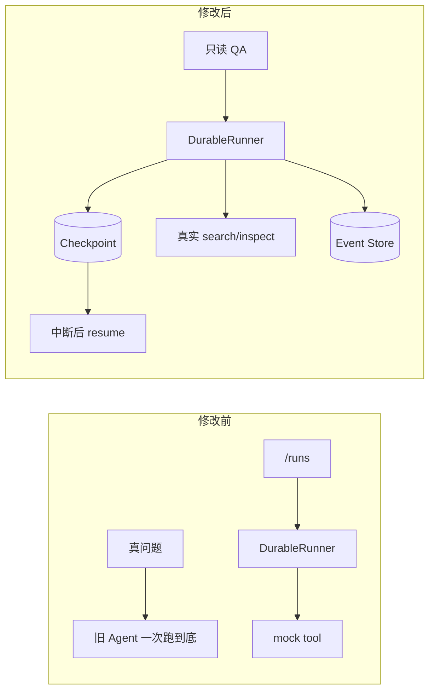
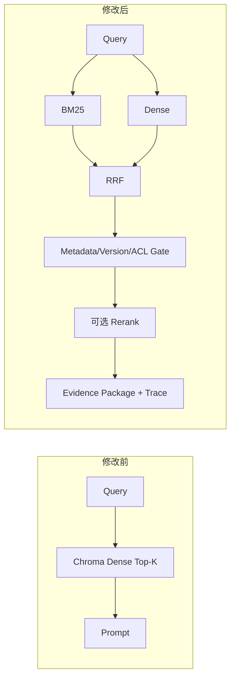
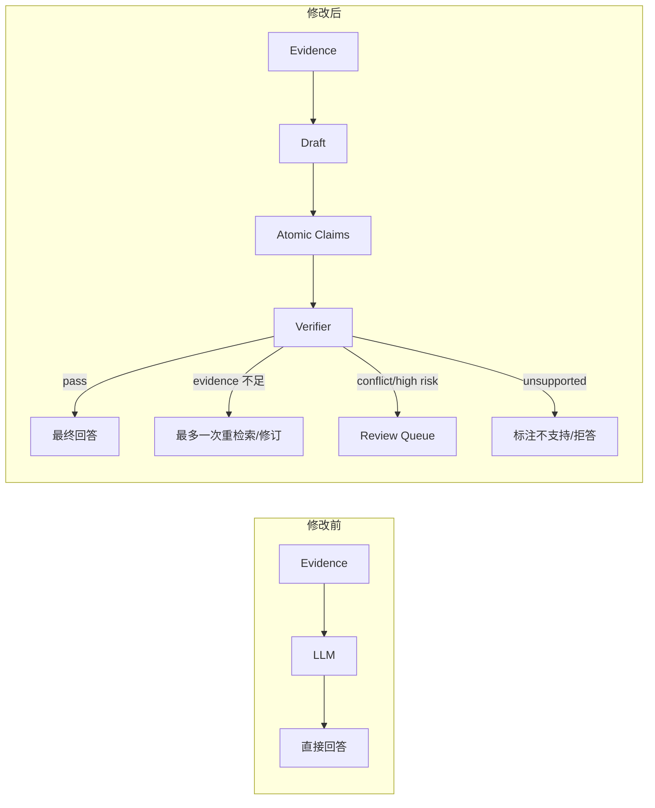

# RADIANT-Control 逐阶段教学执行计划 V2

> 这是新的主任务书，取代旧的《RADIANT-Control 逐阶段协作执行计划》。  
> 实施对象是现有 **RADIANT-LLM** 仓库，不是单独重做 Visual-Parser。  
> 目标不只是“Kimi 把代码写完”，而是“你能说清设计、审查改动、重现指标并应对面试追问”。  
> 所有仓库路径、端口、数据目录和数据库位置由运行时发现或配置，不写死。

---

## 当前进度（Kimi 维护，每次完成即更新）

> 最后更新：2026-09-23 ｜ **当前位置：S1-5 收尾（实现+smoke 已完成，全量回归待最后确认）｜ 下一步：S1-6 中英文 Router**
> 约定：T1 完整讲解（用户只看 T1）；T2–T4 由 Kimi 自主执行并交付报告。详细台账见《RADIANT-Control_执行跟踪与数据飞轮.md》第 16 节。

| 卡 | 状态 | 关键产物 |
|---|---|---|
| S0-1 ~ S0-4 | ✅ 完成（2026-09-23） | 三条链路解读（笔记见"我的笔记"节） |
| S0-5 | ✅ 完成 | 基线 429 passed/1 skipped：`artifacts/baseline/s0-baseline-20260923.md` |
| S0-6 | ✅ 完成 | 风险台账（app/core 1.4GB 待 S9-4） |
| S0-7 | ✅ 完成 | `benchmarks/teaching_case.jsonl`（TEACH-T01） |
| S1-1 | ✅ 完成 | QueryRequest 契约 + `docs/CONTRACTS_SLICE1.md` |
| S1-2 | ✅ 完成 | 包装点裁决：`direct_jsonl_kb_search` |
| S1-3 | ✅ 完成 | `app/evidence/search_adapter.py`（smoke 命中 gold ev-1467，mock=false） |
| S1-4 | ✅ 完成 | `app/evidence/inspect_adapter.py` + D1 修复（valid_to 列覆盖） |
| S1-5 | 🔶 收尾 | 生产接线已通（无旗标 smoke 无 mock）；全量回归待确认 |
| S1-6 ~ S1-9 | ⬜ 未开始 | — |

---

## 0. 先回答：为什么 S0-1 你会看不懂

Kimi 上一次的 S0-1 属于“给代码审查者看的报告”，不是“给初学者看的讲义”。它有三个问题：

1. 先堆文件名、行号和类名，没有先说这条链在干什么。
2. 没有用同一个具体问题贯穿整条流程，你很难建立直觉。
3. 只要求了“列出调用链”，没要求“先说人话、再画图、再解释名词、最后自测”。

因此新计划将每个小任务分为两道验收：

```text
代码验收：实现、测试、smoke、trace 是否正确
                 +
学习验收：你是否能不看报告，用 1–3 分钟讲清楚
```

任何一道未通过，小任务都不算完成。

---

## 1. 你先要看懂的全局图

### 1.1 当前状态：三条并列链路

```mermaid
flowchart LR
    U[用户问题] --> Q[/query 或 /stream-query]
    Q --> OLD[原 Chatbot / AgentExecutor]
    OLD --> OLDRET[原 Chroma Top-K 检索]
    OLD --> OLDTOOL[14 个原工具]
    OLD --> ANS[直接回答]

    U --> RUN[/runs]
    RUN --> ROUTER[RuleRouter]
    ROUTER --> PLAN[RulePlanner]
    PLAN --> GUARD[Schema Guard + Policy]
    GUARD --> DUR[DurableRunner]
    DUR --> MOCK[4 个 mock 工具]

    PDF[PDF] --> INGEST[/documents/ingest]
    INGEST --> EDB[(evidence.db)]

    classDef problem fill:#ffe2e2,stroke:#c62828;
    class MOCK,OLDRET problem;
```

用人话说：

- 真正给用户回答的旧 Agent，不经过新控制面。
- 新控制面有很多工程能力，但它执行的主要是假工具。
- PDF 摄取和 Evidence Store 又是第三条链，与前两条没打通。

### 1.2 最终状态：一条受控主链



我们所有 S 阶段的本质，都是把当前的三条断开链路，逐段收敛成上面这一条。

---

## 2. Kimi 必须遵守的“教学输出合同”

只要任务包含“理解、解读、审查、复盘”，Kimi 必须严格按下列顺序输出：

### A. 先说人话（不超过 200 字）

- 这个模块是干什么的？
- 它现在有什么问题？
- 修完后用户能感受到什么变化？

### B. 用一个固定例子走全程

全项目优先使用这个教学 case：

> “根据已摄取 PDF，找到指定技术概念的定义，回答并附上 PDF 名、页码和 Evidence ID。”

解释该 case 从输入到输出经过哪些对象，每步数据长什么样。

### C. 画一张小图

- 不超过 10 个节点；
- 节点使用中文动词；
- 边上写清数据类型，例如 `query string`、`ExecutionPlan`、`Evidence[]`；
- 先画“修改前”，再画“修改后”。

### D. 名词表（最多 8 个）

| 名词 | 一句人话 | 在本项目的对应对象 |
|---|---|---|
| 例：Checkpoint | 任务执行到哪里的存档 | `CheckpointStore` |

### E. 只讲 3–5 个关键代码位置

不得一次堆几十个行号。每个位置按下面解释：

```text
文件/类/函数：
输入：
输出：
会读写什么状态：
为什么要看它：
```

### F. 本次只需要记住的三件事

只允许写 3 条，禁止增加第 4 条。

### G. 三道自测题

- 一道“数据怎么流”；
- 一道“为什么这样设计”；
- 一道“如果不做会怎样”。

Kimi 给出问题后立即停止，不要自己给标准答案。用户回答后，再逐题纠正。

---

## 3. 实施任务的固定节奏

每一张任务卡都分成四次对话，不得合并：

```text
T1 理解：只读代码 + 教学输出 + 自测题
T2 设计：最小方案 + 接口 + 失败测试，不修代码
T3 实现：用户确认后才写代码，跑定向测试和 smoke
T4 复盘：逐文件讲 diff、trace、指标和限制
```

即使 T3 代码已经通过，也必须完成 T4，才能进入下一张任务卡。

### 3.1 给 Kimi 的通用理解指令

```text
阅读《RADIANT-Control 逐阶段教学执行计划 V2》。
现在只执行任务卡【编号】的 T1 理解环节，不修改文件。
严格按计划第 2 节的 A–G 教学输出合同讲解，使用固定教学 case。
不得用文件名和行号代替原理解释。
输出 3 道自测题后立即停止，等待我回答。
```

### 3.2 给 Kimi 的通用设计指令

```text
现在只执行任务卡【编号】的 T2 设计环节。
输出：修改前/后小图、数据契约、仅需修改的文件、禁止修改的文件、
一个预期先失败的测试、一个真实 smoke case、回滚方案。
不修改代码，不安装依赖，不执行后续任务。
最后用不超过 150 字告诉我：我需要确认哪些决策。
```

### 3.3 给 Kimi 的通用实现指令

```text
现在只执行任务卡【编号】的 T3 实现环节，使用已确认的 T2 方案。
先跑指定 baseline，再新增失败测试，确认它因目标缺口失败，然后做最小实现。
只修改 T2 授权文件。运行定向测试和真实 smoke case。
输出 git diff --stat、测试结果、smoke 证据、新增副作用和未完成限制。
不自动 commit/push，不删除数据、日志、数据库、artifact 或 core dump。
完成后立即停止。
```

### 3.4 给 Kimi 的通用复盘指令

```text
现在只执行任务卡【编号】的 T4 复盘环节，不再修改代码。
用一个真实输入走一遍修改后数据流，展示对应 trace。
按“为什么改→改了什么→如何验证→失败时怎么办→剩余限制”讲解。
严格按 A–G 教学输出合同，最后出 3 道自测题并停止。
```

---

## 4. 统一禁止项和停止门

### 4.1 禁止项

- 不得一次完成一个 S，每次只能完成一张任务卡的一个 T 环节。
- 不得为了让测试变绿而删除失败 case、降低阈值或把 fail 改成 skip。
- 不得将 mock、synthetic fixture、simulated score 或 token-overlap proxy 宣称为真实系统结果。
- 不得将自研 `StateGraph` 称为 LangGraph。
- 未实装真模型前，不得写 Cross-Encoder rerank。
- 无 bbox 时，不得写 region-level visual evidence。
- 不得自动 commit、push、删库、清日志、删 artifact 或删 core dump。
- 不得未经核验就宣称代码或整仓继承 Apache-2.0。

### 4.2 每张任务卡的停止门

下列任意一项不满足，Kimi 必须停止并报告，不能自行扩大范围：

- 需要修改 T2 未授权文件；
- baseline 在修改前已失败；
- 需要新的密钥、模型、付费 API、GPU 或大规模数据；
- 需要删除/覆盖现有状态；
- 新测试的失败原因不是本任务目标；
- smoke 调用没有经过目标模块；
- 用户无法回答 T1/T4 的自测题。

---

## 5. 推荐的第一条 Vertical Slice

第一条被新控制面接管的真实任务固定为：

> **只读 PDF 知识问答**：对已经摄取到 Evidence Store 的 PDF 提问，返回答案、PDF 名、页码和 Evidence ID。

不在第一条 slice 中做：

- 不摄取新 PDF；
- 不做 Web Search；
- 不导出报告；
- 不写长期 Memory；
- 不做视觉问答；
- 不做 Multi-Agent；
- 不引入 Cross-Encoder。

选它的原因：它是最短、最低风险、最能验证“新控制面是否真的接入原 RADIANT 数据”的端到端任务。

---

# 6. S0：基线、代码地图与学习准备

## S0 完成后你应该会什么

- 用 2 分钟讲清旧问答链、新控制链和摄取链；
- 知道 query、plan、tool result、evidence、checkpoint、event 的区别；
- 会运行原问答 smoke、新控制面 smoke 和全量测试；
- 知道哪些是源码，哪些是运行产物，哪些不能随便删。

## S0 任务卡

| ID | 类型 | 任务 | 只读/可修改 | 交付与验收 |
|---|---|---|---|---|
| S0-1 | 地图 | 仓库状态、三条链路及断点 | 只读 | 三张小图 + 名词表 + 三道自测 |
| S0-2 | 旧链 | 用固定 case 跟踪 `/query → convchain_api → AgentExecutor` | 只读 | 请求/状态/副作用图，只讲 5 个代码点 |
| S0-3 | 新链 | 用固定 case 跟踪 `/runs → Router → DurableRunner` | 只读 | RouterDecision、ExecutionPlan、ToolResult、Checkpoint 样例 |
| S0-4 | 摄取链 | 跟踪 PDF 到 `evidence.db`/Chroma 的输出 | 只读 | 一条真实 evidence 的字段说明 |
| S0-5 | 基线 | 运行全量测试、旧问答 smoke、新 `/runs` smoke | 仅生成日志 | 命令、环境、耗时、输出、失败集 |
| S0-6 | 风险 | 调查 dirty files、运行 DB、日志、backup、core dump | 只读 | 分类台账：保留/忽略/备份/待调查 |
| S0-7 | 冻结 | 定义固定教学 case 和首个 vertical slice 验收 | 可写 docs/benchmarks | case ID、输入、gold evidence、预期回答、失败方式 |

### S0-1 当前状态

- 代码审计：**已完成**。
- 学习验收：**已完成**（2026-09-23，A–G 合同重讲 + 三道自测题纠正通过）。

### S0 阶段门

- S0-1 至 S0-7 全部完成；
- 用户可不看图说出三条旧链如何变成一条新链；
- baseline 可重现；
- 没有删除未知运行产物；
- 首个 vertical slice 的输入与 gold evidence 已冻结。

### 我的笔记
#### S0-2 旧问题链
1. 旧问答链：问题从/query进来 -> 问题拼接工作目录 -> 检索会话历史注入 -> skill content注入 -> AgentExecuor 自主决定调用 PDFReaderTool -> Chroma检索LLM综合答案
2. Q：为什么把 Router、Planner、Guard/Policy、DurableRunner 拆成独立组件，而不是让一个 LLM Agent 直接决定调什么工具？
  A：拆开是为了可控、可审计、恢复，不是为了防幻觉。让 LLM 自己决定调什么，LLM 是不可预测、可被提示词注入的，它可以同时是"决策者"和"执行者"；新链把决策（Router/Planner）、审查（Guard/Policy，fail-closed）、执行（DurableRunner）分开，LLM 产出的计划必须先过确定性校验才能碰到工具副作用，而且计划落盘后进程重启还能继续。
3. 原论文的回答链：你发一个问题，FastAPI 把它交给一个全局唯一的 Chatbot 对象；这个对象把问题、工作目录、最近几轮对话、技能提示拼成一包，交给 Lang 的 AgentExecutor；LLM 自己决定要不要调 PDF 工具，工具去 Chroma 向量库里捞文本回来，LLM 综合成答案，再做一轮格式化处理后返回。全程对话追加到磁盘文件。它的问题：没有编号、没有审批校验、上下文超了只能等报错后再补救。
  具体流程：
  (1) 进请求：POST /query，body 是 {"query": "..."}。API 先检查三件套（LLM、embedding、agent）是否就绪，不就绪返回 503。
  (2) 拼输入：convchain_api 给 query 尾巴上拼 | Working directory: <目录>；再去本会话的 JSONL 里做模糊检索，命中的旧轮次 prepend 到问题前面；如果之前压缩过记忆，再加一段 [COMPRESSED SESSION MEMORY] 前缀；再生成 skill context 字符串。数据仍是纯字符串。
  (3) 调 Agent：payload 是 {input, global_directory_message, skill_context, runtime_context} 四个字符串字段，交给 AgentExecutor.invoke。prompt 里还有 chat_history——从会话 JSONL 读出的最近 8 轮。
  (4) LLM第一轮：返回的不是答案，而是一个 tool_call JSON："我要调 PDFReaderTool，参数是这个问题"。
  (5) 工具执行：PDFReaderTool 内部先检查工作目录有没有新 PDF（有就先摄取：切块写 JSONL 知识库 + 入 Chroma），然后把 query 临时向量化，在 Chroma 里取 top-20 相似文本块，再用一次 LLM 把这些块成一段检索回答文字，作为工具的"观察结果"返回给 Agent。向量只存在于工具内部，出来的还是字符串。
  (6) LLM 第二轮：拿着这段文字 + 对话历史，写出最终答案字符串。PDF 名和页码能不能出现，全凭 LLM 自觉从文本里抄；Evidence ID 没有任何环节能产生。
  (7)  收尾：字符数估算上下文占用；默认再过一次 LLMMarkdownParser（第二次额外 LLM 调用，做排版）；把本轮问答追加进会话 JSONL、更新会话索引；返回 {query, response, raw_response, intermediate_steps, reasoning_events, ...}。
4. 用户的 query string 在真正进入 LLM 的 prompt 之前，加入：工作目录（这是PDF工具能找到文件的依据）、8轮窗口（由 AgentExecutor 自动最近 8 轮塞进 prompt 的 chat_history）、历史检索（在本会话全部旧轮次里做模糊匹配，把相关轮次 prepend 到 query 文字前面）、skill内容、压缩记忆
5. Q: /stream-query 为什么不直接流式输出 LLM 的 token，而是每 250ms 轮询 reasoning_events 推步骤？（提示：想想 convchain_api 是同步一次性返回的，以及 Agent 的执行模式）
  A: 直接原因：convchain_api 是一次性同步返回的函数，Agent 跑完才有一次性返回 token 的可能；而且 Agent 的执行是"LLM 决策 → 调工具 → 决策"的多轮循环，中间穿插多次 LLM 调用和工具调用，根本不存在一段连续的、代表"答案"的 token 流——最终答案只在循环结束时才完整存在。
  设计原因：在 Agent 模式下，用户等待时真正想知道的是"它现在在干嘛"（在检索？在调工具？卡住了？），这些信息恰好以推理事件的形式在循环中逐步产生。所以 SSE 推 reasoning_events 是用最低改造成本（复用现有回调 + 轮询全局列表）给了用户过程可见性。token 级流式要改造成本高得多，且对多步 Agent 体验提升有限。
6. 作用图

#### S0-3 新问题链
1. 新控制链是一条"先审批、后干活、全程留痕"的执行链：你提交一个目标，系统先判断你想干什么（Router），再生成一张结构化的执行工单（Planner），工单要经过格式校验（Schema Guard）和权限预算检查（Policy）才放行，最后由 DurableRunner 逐步执行，每步都往 SQLite 里写存档和事件，崩了能续跑。它的问题是：审批很严，但执行的活是假的——搜索返回三条写死的假文档；而且对中文问题，Router 大概率直接说"我口头答一下"，连工单都不建。
2. (1) Router 识别意图：先过注入正则（含一条中文"绕过/无需审批/跳过），再过意图关键词——全是英文正则。这句中文问题一个也匹配不上，落入默认分支：intent=knowledge_qa，confidence=0.75。又因为英文的 tool-call 模式也没命中，action=respond。
  (2) 链就此终止：action 不是 tool_call 时，create_run 直接返回 {run_id: null, status: "respond"}——不建 run、不生成计划、不执行任何工具。这就是固定 case 今天在新链上的结局（S1-6 补中英文 Router 就是为了修它）。
  (3) 假如用英文提问命中 tool_call（如 "search the ingested PDFs for the definition of X and cite evidence"），(1) 才会走完整链： -Planner 生成工单**：固定产出一步 s1-search（调 evidence.search，top_k=3，5 秒超时，只许重试瞬时错误）；只有 goal 含 export/report 才追加第二步 s2-export（内容硬编码 "mock report body"）。
  (3-1) Schema Guard 校验：工具已注册？参数类型对？风险没降标？依赖无环？预算没超上限？任一不过 → 422。
  (3-2) Policy 授权：workspace在 ACL 白名单里吗？写操作带幂等键吗？高风险要人工审核吗？DENY → 403。
  (3-3) DurableRunner 执行：起后台线程，按依赖拓扑序执行。每个 step 开始和各写一次 checkpoint，事件按 seq 递增写入 events 表。
  (3-4) 工具执行：evidence.search 返回 _MOCK_DOCS——三条写死的假文档。trace 完整、存档齐全、证据是假的。
3. Q：为什么所有契约模型都设 extra="forbid"？如果允许 Planner 输出契约之外的多余字段，会造成什么具体风险？（提示：想想 Guard 校验的是契约内的字段）
  A：extra="forbid"让数据契约变成一份封闭白名单——契约没声明的字段，在 pydantic 校验时就直接拒绝（API 层返回 422 planner.invalid_output）。
  如果允许多余字段，风险是具体的：Schema Guard 和 Policy 只校验契约里声明的字段。设想 Planner 未来换成 LLM 生成，它在 plan 里多塞一个 "workspace_override": "admin" 或 "skip_review": true——Guard 只查已声明字段，不会拦；下游代码如果碰巧读了这些键，未审查的数据就绕过全部关卡直达执行层。models.py 开头的设计注释说的就是这个："forbid extra fields so that a planner cannot smuggle unreviewed keys through the pipeline"。
  这是纵深防御的第一层：契约白名单（models）→ 结构与风险校验（Guard）→ 权限与预算（Policy），每层只信上一层已验证的东西。

#### S0-4 摄取链
1. 摄取链负责把 PDF 变成"可引用的证据"：解析 PDF 成文本块和图表描述，存进一个结构化的证据数据库，每条证据带编号、页码、来源文件指针和版本信息。关键发现：它和旧问答链共用同一个 PDF 解析器，分叉只在最后一步——旧链把解析结果转向量存进 Chroma（只支持相似度搜索），摄取链把同一份结果存进 evidence.db（结构化、可审计）。目前的断点：本仓库正在运行的 evidence.db 是空的，真实数据只存在于 baseline 归档里；而且没有任何问答去读这个证据库。
2. (1) Router 识别意图：先过注入正则（含一条中文"绕过/无需审批/跳过），再过意图关键词——全是英文正则。这句中文问题一个也匹配不上，落入默认分支：intent=knowledge_qa，confidence=0.75。又因为英文的 tool-call 模式也没命中，action=respond。
  (2) 链就此终止：action 不是 tool_call 时，create_run 直接返回 {run_id: null, status: "respond"}——不建 run、不生成计划、不执行任何工具。这就是固定 case 今天在新链上的结局（S1-6 补中英文 Router 就是为了修它）。
  (3) 假如用英文提问命中 tool_call（如 "search the ingested PDFs for the definition of X and cite evidence"），才会走完整链： -Planner 生成工单**：固定产出一步 s1-search（调 evidence.search，top_k=3，5 秒超时，只许重试瞬时错误）；只有 goal 含 export/report 才追加第二步 s2-export（内容硬编码 "mock report body"）。
  - Schema Guard 校验：工具已注册？参数类型对？风险没降标？依赖无环？预算没超上限？任一不过 → 422。
  - Policy 授权：workspace在 ACL 白名单里吗？写操作带幂等键吗？高风险要人工审核吗？DENY → 403。
  - DurableRunner 执行：起后台线程，按依赖拓扑序执行。每个 step 开始和各写一次 checkpoint，事件按 seq 递增写入 events 表。
  - 工具执行：evidence.search 返回 _MOCK_DOCS——三条写死的假文档。trace 完整、存档齐全、证据是假的。
3. Q: 一个 PDF 从目录到 evidence.db 经过哪两个阶段？如果目录里已经存在 01_chunks_kb.jsonl，流程会有什么不同？每条 evidence 的正文文本来自哪个文件？
  A: 登记任务 → 目录里没有 KB 文件但有 PDF 时先解析 → 产出三种 KB 文件（文本块、图表 VLM 描述、元数据）→ 入库 evidence.db。补两个点：
  问题问的"如果 KB 文件已存在"你没答：此时解析阶段整个跳过（has_kb 检查为真），直接进 ingest 阶段把已有 JSONL 写库。这意味着 KB 文件是解析和入库之间的交接格式——你可以把别处解析好的 JSONL 放进目录直接入库，不必每次重新解析 PDF。
  正文来源你没答：每条 evidence 的正文来自 01_chunks_kb.jsonl（图表类证据来自 02_visuals_kb.jsonl，文档级信息来自 03_metadata_kb.jsonl）。另外注意解析产物写回同一个 input_dir（output_dir=input），就地交接。
4. Q: 为什么 evidence 表要同时保存 content_hashdocument_version 和 valid_from/valid_to，而不是简单地"一个文档一行"？（提示：同一个 PDF 修改内容后重新摄取，旧证据该怎么处理）
  A: 同一个 PDF 修改后重新摄取：content_hash 变了 → 生成新的 document_version → 写入新的 evidence 行，同时把旧版本记录的 valid_to 设为当前时间——旧证据不删除，只是标记"从此刻起失效"。这样：历史 run 引用的旧证据依然可查（可复现、可审计）；查询只取 valid 的记录（结果正确）；任何时候都能回答"当时系统知道什么"。如果只用一个 hash 去重，改过的文件会覆盖旧证据，历史答案就再也追不回去了。

---

# 7. S1：意图、计划与真实工具控制

## S1 修改前/后



## S1 完成后你应该会什么

- 区分 Router、Planner、Guard、Policy、Registry 和 Adapter；
- 说清“意图识别”与“选工具”不是同一件事；
- 说清为什么 Planner 不应直接执行工具；
- 能阅读一个 Pydantic schema 和 ToolResult。

## S1 任务卡

| ID | 任务 | 主要位置 | 允许的实现边界 | 验收 |
|---|---|---|---|---|
| S1-1 | 冻结首个 slice 的数据契约 | `control/models.py`、Evidence models | 优先只改 docs/tests/contract | 给出 QueryRequest、RouterDecision、ExecutionPlan、ToolResult、Evidence 样例 |
| S1-2 | 读懂原 PDF 检索函数的输入输出 | `tools/pdf_tools.py`、`utils/pdf_helpers.py` | 只读 | 确定 adapter 最小包装点，不重写 pipeline |
| S1-3 | 实现真实 `evidence.search` adapter | `control/registry.py` + 新 adapter | 只读检索，不调 LLM | 返回真实 Evidence ID/PDF/page，`mock=false` |
| S1-4 | 实现真实 `evidence.inspect` adapter | Evidence Store/adapter | 按 Evidence ID 只读查询 | 返回 source span、modality、artifact pointer |
| S1-5 | 给 Registry 注册真实 handler | `control/registry.py` | 仅替换 search/inspect mock | 真实 handler 可调，旧 mock 不在生产配置 |
| S1-6 | 完善中英文 Router | `control/router.py` + cases | 保持确定性，暂不引入 LLM Router | 中英文 knowledge/visual/ingest/compare/audit 与 clarify/abstain 通过 |
| S1-7 | 让 Planner 为只读 QA 生成真实 plan | `control/planner.py` | 仅 search→inspect，不做 report/memory | plan 无 mock content，依赖和预算正确 |
| S1-8 | Guard/Policy 负向用例 | guard/policy tests | 未知工具、错 schema、风险降标、越权 workspace | 所有负向 case fail closed，工具未被调用 |
| S1-9 | 端到端 Tool Control smoke | `/runs` + trace | 仅第一条 slice | trace 含 decision/plan/policy/tool/evidence，无 `_MOCK_DOCS` |

### S1 阶段门

- 生产路径的 search/inspect 不再读 `_MOCK_DOCS`；
- 固定问题返回真实 PDF、page 和 Evidence ID；
- 负向请求在工具副作用前被拦截；
- 用户能根据一个输入讲出 Router→Planner→Guard→Registry 的差别。

---

### 我的学习笔记
#### S1-2 PDF检索链
1. 原 PDF 检索是三层套娃：最外层 VisualParserPDFAnalyser 把"解析 PDF + 建向量库 + 检索 + LLM 答题"揉成一步（有写盘副作用、必须有模型）；中层 RetrievalOnlyUtility 只做检索，但返回的是 LLM 整理好的文章字符串，结构化数据在这一步被吞掉；底层才有我们需要的：Chroma 里每个文本块都带着 document_id、chunk_id、page 元数据，还有一个现成的 direct_jsonl_kb_search 只读关键词搜索（不需要任何模型）。adapter 的最小包装点在底层，上层两个都不能包。
2. S1-2设计修改前后的流程图：

#### S1-3 evidence.search adapter
1. 把控制链的"搜索"从假数据换成真数据。原来 evidence.search 返回三条写死的假文档；改完后它去真的知识库搜，命中后去证据库换出 Evidence ID。

2. 数据流：evidence.search({query, top_k:3}) → adapter → ① 原函数 direct_jsonl_kb_search 扫 KB JSONL 打分（只读、免模型）→ 命中带 document_id+chunk_id → ② 用它们查 evidence.db 补出 evidence_id → ToolResult 带真实 ID、mock:false`。

#### S1-4 evidence.inspect(s2-inspect跟在s1-search后面)
1. 是"按证据编号取原件"的工具：search 找到候选后，inspect 按 Evidence ID 取出完整证据（正文、页、模态、来源文件指针），供最终答案引用。现在它是 mock：只认识三条假文档，而且入参叫 doc_id，和 S1-1 冻结契约里的 evidence_ids 数组对不上。S1-4 就是把它换成真查证据库，顺带修两个 S1-3 暴露的问题：作废状态看不见、跨 workspace 不校验。
2. S1-4设计修改前后的流程图：

3. 需要记住的三件事
- inspect 的真实读路径已存在且在产线使用，adapter = 薄包装 + 两个校验，不重写 store。
- 契约要迁移：doc_id 单个 → evidence_ids 数组，对齐 S1-1 冻结样例。
- adapter 层必须补两个校验：workspace 一致性（防跨域引用）和作废状态如实上报（D1，本卡 store.py 在授权范围内，可以修）。

#### S1-5 让真实 handler 进生产配置
1. S1-3/S1-4 的真实 adapter 现在藏在旗标后面，默认还是 mock——好比新发动机造好了但车上还是旧的。S1-5 就是把新发动机装上车：生产环境默认用真实 handler，mock 降级为测试专用。风险点：很多老测试默认吃到的是 mock，翻默认会震碎它们，所以要讲究手法。

--------

# 8. S2：Durable 执行控制

## S2 修改前/后



## S2 完成后你应该会什么

- 区分 run state、step state、checkpoint、event 和 log；
- 解释 retry、timeout、cancel、resume、lease、fencing token、idempotency；
- 说清自研 StateGraph 与 LangGraph 的关系和边界。

## S2 任务卡

| ID | 任务 | 主要位置 | 验收 |
|---|---|---|---|
| S2-1 | 用一个两步 plan 讲解 StateGraph 转移 | `durable/graph.py` | 输出状态转移图、非法转移例子和自测 |
| S2-2 | 保存完整 plan/workspace/config | checkpoint schema/store | 进程重启后不依赖 `rt.plans` 也能读取 plan |
| S2-3 | 让真实 search/inspect plan 经过 runner | runner/registry integration | checkpoint 中记录真实 ToolResult，不是 mock |
| S2-4 | retry 与 typed error | retry/runner + failure fixture | 仅 retryable error 重试；terminal error 不重试 |
| S2-5 | timeout 与 cancel | runner/cancel tests | timeout 后状态一致；cancel 后不启动新 step |
| S2-6 | lease 与 fencing | lease/runner tests | stale owner 无法续写 checkpoint/event |
| S2-7 | 持久幂等 | idempotency ledger | 进程重启+同 key 不重复执行副作用 |
| S2-8 | SSE 断线续传 | Event Store/API | `Last-Event-ID` 后 seq 连续、无丢失、无重复 |
| S2-9 | 真实进程中断与 resume | API subprocess smoke | kill/restart 后从 checkpoint 继续，已成功 step 不重跑 |

### S2 阶段门

- 使用真实 search/inspect 的 run 可 resume/cancel；
- 恢复不依赖进程内 plan map；
- 重复副作用数和事件丢失数均为 0；
- 用户能说清“为什么只有 retry 不够”。

---

# 9. S3：检索控制

## S3 修改前/后



## S3 任务卡

| ID | 任务 | 实现边界 | 验收 |
|---|---|---|---|
| S3-1 | 逐阶段讲解现有 RetrievalPipeline | 只读 | 用三条候选手算一次 RRF，说清 rank 与 score |
| S3-2 | 统一 Evidence ID 映射 | Evidence Store↔Chroma adapter | 同一 chunk 在 BM25/Dense 不再出现两个 ID |
| S3-3 | 将 Hybrid Retrieval 接入 S1 search tool | 只替换 adapter 内部 | `/runs` trace 出现 BM25/Dense/RRF |
| S3-4 | Metadata/Version/Workspace ACL Gate | 召回后、prompt 前 | 旧版、越权、非活跃来源被丢弃并有 reason code |
| S3-5 | Relevance/Anchor/Sufficiency Gate | 保留可解释轨迹 | 证据不足返回 retrieve_more/abstain，不硬生成 |
| S3-6 | 重现并解释 BL-T05 | 不删 case | 给出召回失败的具体阶段和候选变化 |
| S3-7 | A0/A1/A2/A4 真实对照 | 同数据/同 seed/同 top-k | Recall@K/MRR/nDCG/Anchor Hit/p50/p95 + case diff |
| S3-8 | 决定是否引入真 Cross-Encoder | 先 benchmark，不预设必须使用 | 有质量、延迟、内存对比；无收益则不接入 |

### S3 阶段门

- 真实 Agent search 使用 Hybrid Retrieval；
- 每条候选有保留/丢弃理由和 config fingerprint；
- 报告均值/方差与逐 case diff，不只报一个总分；
- proxy reranker 不被写成 Cross-Encoder。

---

# 10. S4：上下文预算与 Evidence 组装控制

## S4 任务卡

| ID | 任务 | 实现边界 | 验收 |
|---|---|---|---|
| S4-1 | 对比旧上下文逻辑与 Context Engine | 只读 | 画出字符估算/溢出后压缩与预算前置的差异 |
| S4-2 | 定义 `ContextPackage` | 数据契约先行 | system/turn/memory/evidence/artifact/tool-result 分区明确 |
| S4-3 | 统一 token 计数 | 唯一 tokenizer 入口 | 移除主链字符估算分支，同输入计数稳定 |
| S4-4 | 分区预算和 source/modality quota | 先选择后压缩 | 单一来源/纯文本不能吃满 evidence budget |
| S4-5 | Anchor pinning、去重和 neighbor expansion | 保留 lineage | gold anchor 在压缩中保留，重复 chunk 不反复占预算 |
| S4-6 | 递归压缩与 artifact pointer | 原 evidence 不被覆写 | 可从压缩文本追回原 Evidence ID/artifact |
| S4-7 | 在 LLM call 前接入 Context Engine | 仅第一条 slice | 无需先触发 context overflow 才压缩 |
| S4-8 | 真实小型多 PDF 压力测试 | pseudo-source 与 real 分开报告 | token 节省率、gold/visual retention、answer 不退化 |

### S4 阶段门

- 每次 LLM call 前都产生 ContextPackage trace；
- 上下文压缩有 lineage 和 drop reason；
- 真实多 PDF 数据与 pseudo-source 指标分开；
- 用户能说清“节省 token 为什么不等于上下文更好”。

---

# 11. S5：Memory 写入、召回与隔离控制

## S5 任务卡

| ID | 任务 | 实现边界 | 验收 |
|---|---|---|---|
| S5-1 | 区分 chat history、session summary、long-term memory、evidence | 只读+契约 | 为 10 条样例分类，证据不进用户 Memory |
| S5-2 | 冻结 MemoryRecord 与 namespace | 优先沿用现有 models | provenance/workspace/session/TTL/confidence/status 齐全 |
| S5-3 | 将 Write Gate 接入回答后处理 | 默认 deny | 未确认模型推断不写；确认偏好/决策可写 |
| S5-4 | 将 Read Gate 接入 Context Engine | 召回后再过滤 | workspace/namespace/TTL/ACL/topic 全部生效 |
| S5-5 | supersede 与 conflict review | 禁止静默覆盖 | 旧值保留审计、召回只返回 active 值 |
| S5-6 | 删除、过期与审计 | 区分软失效/真删除 | stale memory 不召回，操作有 actor/reason/event |
| S5-7 | 真实跨会话/workspace API 测试 | 不只测 store 类 | cross-session contamination=0，ACL leakage=0 |
| S5-8 | Memory 指标与失败案例 | 不用单测通过率代替质量 | write precision、Recall@K、stale hit、pollution 可重放 |

### S5 阶段门

- 真实主链读写受治理 Memory；
- 所有对话不再默认进长期 Memory；
- 串味率和 ACL 泄漏数均为 0；
- 用户能为一条新信息决定 deny/write/review/supersede。

---

# 12. S6：Claim、引用、修订与人工审核控制

## S6 修改前/后



## S6 任务卡

| ID | 任务 | 实现边界 | 验收 |
|---|---|---|---|
| S6-1 | 讲解 citation 与 claim support 的区别 | 只读+样例 | 为 5 句回答拆 atomic claims，识别数字/单位/限定词 |
| S6-2 | Claim extractor 接入 draft | 先确定性规则，再可选 LLM | 输出 claim ID、text、type、numeric fields |
| S6-3 | Claim-Evidence Map | 强制 Evidence ID/source/page/span | 每个可验证 claim 有候选证据或明确 no-evidence |
| S6-4 | Citation/Scope Grader | 输出结构化 verdict | supported/unsupported/conflict/out-of-scope 可解释 |
| S6-5 | 有界 retrieve→revise 环 | 最多一次，有预算 | 不会无界反思；重试前后 claim/evidence diff 可见 |
| S6-6 | Review Queue 接入真实 claims | 不再传 `claims=[]` | approve/edit/reject 都能 resume 原 run |
| S6-7 | 最终输出合约 | 答案+引用+验证状态 | 前端/API 能看到每条 claim 的证据状态 |
| S6-8 | 安全性与可回答性联合评测 | 不允许全拒答刷分 | citation precision/coverage、HR、CiH/source drift、fact recall 同时报告 |

### S6 阶段门

- 真实回答无法绕过 Verifier；
- Review Queue 收到真实 claim/evidence/plan；
- unsupported rate 下降时 fact recall 不得跌破预设门槛；
- 用户能解释“引用来源正确，为什么 claim 仍可能不被支持”。

---

# 13. S7：真实视觉证据控制

## S7 任务卡

| ID | 任务 | 实现边界 | 验收 |
|---|---|---|---|
| S7-1 | 读懂 Visual Parser 真实输出 | 只读一个 PDF artifact | 说清 page、figure/table、caption、description、artifact 哪些真实存在 |
| S7-2 | 冻结 5–10 题真实 visual gold set | 人工标注 | 每题有 PDF/page/figure/table/gold fact；synthetic 单独标签 |
| S7-3 | 视觉 Evidence Schema 补全 | 无 bbox 则用 page/figure-level | 不伪造 region-level，artifact pointer 可访问 |
| S7-4 | text-to-visual 召回 | 查询文本→视觉候选 | top-k 返回 figure/table evidence 与分数 |
| S7-5 | visual-to-text neighbor expansion | 视觉证据→caption/相邻文本 | 能追回相关文本，不混入其他页 |
| S7-6 | modality quota/rerank | 先配额后可选重排 | 纯文本不挤掉所有视觉证据 |
| S7-7 | Visual Fact Gate | 检查回答是否真使用视觉证据 | 纯文本旁证不被计为 visual support |
| S7-8 | 真实视觉对照评测 | 文本单路/视觉单路/融合 | Visual Recall@K、ViR、错引率、延迟，与 fixture 指标分开 |

### S7 阶段门

- 至少一个真实视觉问题经过整条 Agent 主链；
- 输出可定位到 PDF/page/figure 与 artifact；
- 真实 ViR 与 synthetic fixture 不混报；
- 用户能解释“VLM 生成图片描述”为什么不等于“视觉事实已被证明”。

---

# 14. S8：Eval Harness、可观测、Release Gate 与数据飞轮

## S8 任务卡

| ID | 任务 | 实现边界 | 验收 |
|---|---|---|---|
| S8-1 | 统一 run/trace/config/data/model fingerprint | 不记录 secret | 任意简历数字可追到 run/case/config |
| S8-2 | 让 Eval Adapter 调用真实主链 | 不再只调离线模块 | report 中 trace URI 指向真实 Agent run |
| S8-3 | 分层指标注册 | deterministic/judge/human/operational 分类 | 未测指标明确 not_measured，不补假分 |
| S8-4 | LLM Judge 与人工抽检 | 小比例即可 | 记录 judge model/prompt/version 与 human agreement |
| S8-5 | Bad Case Registry | append-only 或可审计 | 记录失败阶段、证据、修复 commit、回归 case |
| S8-6 | Release Gate 完整候选运行 | 候选必须包含所有必需层 | 不再因只跑 control 层产生 9 个 missing-metric fail |
| S8-7 | 实现一次完整数据飞轮 | 一个 bad case 即可 | 发现→归因→修复→回归→gate 全部有 artifact |
| S8-8 | Dashboard 展示 | 优先读现有 API，不复制指标逻辑 | 能查 run、step、event、evidence、claim、review、benchmark |

### S8 阶段门

- 一条命令跑完整候选 Harness；
- Release Gate 通过，或明确暴露真实回归；
- 至少一个 bad case 完成全闭环；
- 用户能为每个指标说出“数据从哪来、谁计算、局限是什么”。

---

# 15. S9：统一主链、运维收口与求职交付

## S9 任务卡

| ID | 任务 | 实现边界 | 验收 |
|---|---|---|---|
| S9-1 | 统一 `/query`、`/stream-query`、`/runs` 语义 | 先保留旧链 feature flag | 默认进新控制链，资源 API 命名一致 |
| S9-2 | 处理旧 Agent 回退与迁移 | 有对照期后再删 | 新链故障的降级行为可解释，不静默切换 |
| S9-3 | 运行数据目录与 `.gitignore` | 不删用户数据 | DB/log/artifact/core/backup 管理边界清楚 |
| S9-4 | 定位 core dump 与启动竞态 | 先诊断再修复 | 有根因、复现、修复和回归；不只删 core |
| S9-5 | 日志轮转、健康检查与故障恢复 | 适配当前部署，不写死路径 | 服务重启后可读历史 run/review/trace |
| S9-6 | 一键 end-to-end smoke | 小数据集 | ingest/query/retrieve/context/verify/memory/resume/trace 全覆盖 |
| S9-7 | 架构图与 5 分钟 demo | 与真实代码一致 | 任何图上模块都能在 trace 找到 |
| S9-8 | 简历 bullets、面试 Q&A、限制清单 | 只使用已验收事实 | 数字可追溯，proxy/synthetic/未实现均不夸大 |

### S9 最终门

- 默认只有一条真实 Agent 主链；
- 固定教学 case 和真实视觉 case 全部通过；
- 中断可恢复，重放无重复副作用；
- 全量测试与 Release Gate 通过；
- 你能脱离文档完成 5 分钟项目介绍和 10 分钟架构追问。

---

## 16. 每张任务卡的记录模板

Kimi 在远程仓库的项目纪录目录中，按任务 ID 保存一份记录，但必须在 T2 中先确认具体路径，不写死目录。

```markdown
# Task <ID>

## 1. 人话目标
## 2. 修改前流程图
## 3. 修改后流程图
## 4. 名词表
## 5. 数据契约与关键代码
## 6. 失败测试
## 7. 修改文件和 diff
## 8. 测试与 smoke 证据
## 9. Trace 中如何证明接入主链
## 10. 限制、风险与回滚
## 11. 我只需记住的三件事
## 12. 自测题与用户的回答
## 13. 可用/不可用的简历表达
```

---

## 17. 当前下一步：只重做 S0-1 的教学验收

现在不要立即开始 S0-2，也不要开始写代码。将下面的指令原样发给 Kimi：

```text
阅读《RADIANT-Control 逐阶段教学执行计划 V2》。
你之前已经完成 S0-1 的代码审计，不要重新扫描仓库，不要修改任何文件。

现在只重做 S0-1 的“学习验收”：
1. 严格按计划第 2 节 A–G 教学输出合同，用初学者能懂的中文重新讲解。
2. 用固定教学 case分别走一遍旧问答链、新控制链和 PDF 摄取链。
3. 为三条链各画一张不超过 10 个节点的 Mermaid 图，箭头上写数据类型。
4. 名词表最多 8 个，只解释本次必需名词。
5. 代码位置只讲 5 个，每个都说清输入、输出、状态和副作用。
6. 最后只写“我需要记住的三件事”，然后出 3 道自测题。

出题后立即停止，不要自己回答，不要开始 S0-2。
```

