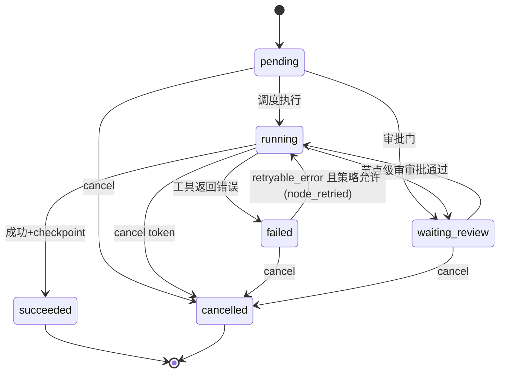

# STATE_MACHINE — RADIANT-Control M3 状态机

实现：`app/durable/graph.py`（自包含轻量状态图，无 langgraph 依赖）。
节点 = `ExecutionPlan` 的步骤（`PlanStep`），边 = `depends_on`。所有迁移都经过
显式合法迁移表守卫；表外迁移抛 `IllegalTransitionError`（`app/durable/errors.py`）。

## 状态枚举

StepState（节点级）与 RunState（run 级）取值相同、语义分层：

| 状态 | 含义 |
|---|---|
| `pending` | 未开始（依赖未满足或等待调度） |
| `running` | 正在执行（崩溃后会留下该状态的快照） |
| `succeeded` | 成功完成（**终态**，checkpoint 已落盘） |
| `failed` | 一次尝试失败（可经 retry 重入 `running`） |
| `waiting_review` | 等待人工/策略审批 |
| `cancelled` | 已取消（**终态**） |

## 合法迁移表

### 节点级（STEP_TRANSITIONS）

| from \ to | running | succeeded | failed | waiting_review | cancelled |
|---|---|---|---|---|---|
| pending | ✓ | — | — | ✓ | ✓ |
| running | — | ✓ | ✓ | ✓ | ✓ |
| failed | ✓ (retry 重入) | — | — | — | ✓ (重试间隔中取消) |
| waiting_review | ✓ (审批通过) | — | — | — | ✓ |
| succeeded | — | — | — | — | — |
| cancelled | — | — | — | — | — |

### Run 级（RUN_TRANSITIONS）

| from \ to | running | succeeded | failed | waiting_review | cancelled |
|---|---|---|---|---|---|
| pending | ✓ | — | — | — | ✓ |
| running | ✓ (**resume 重入边**) | ✓ | ✓ | ✓ | ✓ |
| waiting_review | ✓ (审批后恢复) | — | — | — | ✓ |
| failed | ✓ (失败后从 checkpoint 恢复) | — | — | — | ✓ |
| succeeded | — | — | — | — | — |
| cancelled | — | — | — | — | — |

`running → running` 是显式的 resume 边：worker 崩溃后 run 在库里仍是 `running`，
resume 不是"重新开始"，而是带着 `run_resumed` 审计事件重入 `running`。

## 图

## 不变量

1. **终态不可出**：`succeeded`/`cancelled` 没有任何出边。
2. **retry 只走 `failed → running`**，且仅当 `ToolResult.status == retryable_error`
   且步骤 `retry_policy == transient_only` 且尝试次数未耗尽（`app/durable/retry.py`）。
3. **resume 重建不是迁移**：`StateGraph.restore()` 直接从持久化快照重建图，
   只有 `succeeded` 被保留；死 worker 留下的 `running/failed/waiting_review`
   一律归一化为 `pending` 以便合法重入——不存在"从头重跑冒充 resume"，
   已完成节点带 checkpoint 跳过（`node_skipped` 事件可审计）。
4. **迁移即审计**：每次合法迁移伴随 checkpoint 快照或事件（见
   `docs/FAILURE_RECOVERY.md`）。
