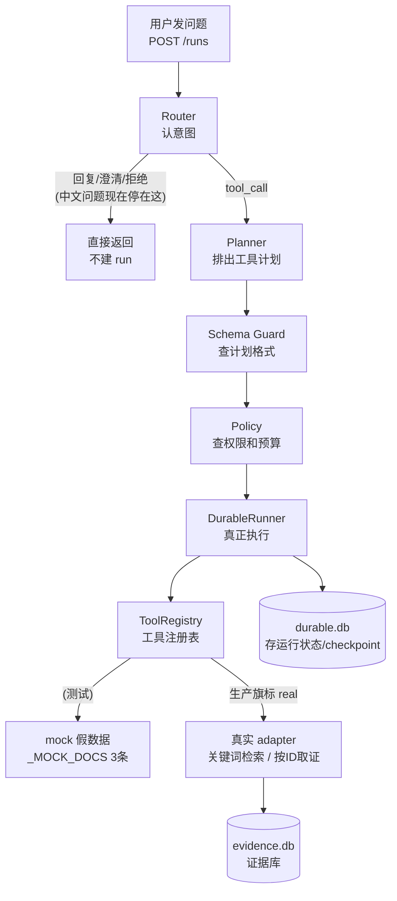
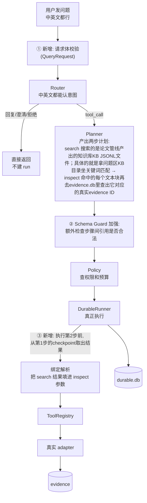

# S1 理解轨讲义：意图、计划与工具控制

> 范围：S1（V3 计划第 8 节）。只读代码、只写文档。
> 所有行号以 2026-09-24 的 `main` 工作区为准；引用前均已打开文件核对。

---

## 1. 人话摘要（200 字内）

`/runs` API 收到一句 PDF 问题后，要依次过 Router（认意图）、Planner（排工具步骤）、Schema Guard（查计划格式）、Policy（查权限和预算），最后由 DurableRunner 真正调用工具。工具分真假两套：Registry 默认注册的是 `_MOCK_DOCS` 假数据，S1-3/S1-4 新增了两个真实只读 adapter（关键词检索 + 按 Evidence ID 批量取证），S1-5 已让生产 `RunRuntime` 默认用真 adapter。现在还缺三件：中文问题进不了工具链（Router 只认英文关键词）；Planner 不会生成 search→inspect 两步计划；第二步拿不到第一步的输出（步骤间数据引用只有设计，见 ADR-0003，未实现）。修完后，中英文固定问题都能创建真实 run，返回的 Evidence ID 可在 evidence.db 查到，`mock=false`。

---

## 2. 修改前图（现状数据流，12 节点）



## 3. 修改后图（T2 目标：新增控制点与失败出口）



- 绑定解析：planner写计划的时候，search还没执行，所以它不可能知道会到哪些 Evidence ID。那 s2-inspect 的参数 evidence_ids 该填什么？填一个"取数说明"，而不是具体值。把取数说明变成具体值的过程是绑定解析
- ToolRegistry：这个是工具的总调度台，所有工具在这里登记（名字、参数格式要求、对应的真实函数）。Runner 不直接调工具，而是把参数交给 Registry，Registry 先按 inspect 的参数格式要求再查一遍（`evidence_ids 必须是字符串数组），合格了才真正调用。这是第二道安检——防止绑定解析拼出来的东西格式不对。
- 真实adapter：Registry 查到 evidence.inspect 登记的是真实 adapter（不是 mock），就调用它。adapter 拿着 ["ev-a", "ev-b", "ev-c"] 去 evidence.db 逐条取全文，返回结果。


## 4. 固定案例：TEACH-T01 逐步输入输出形状

案例原文（benchmarks/teaching_case.jsonl，S0 已冻结）：

> "What two main components does the Transformer architecture consist of? Answer with the PDF name, page number and Evidence ID."
> workspace_id = "default"

gold（`ev-1467122274c2347e3ed99f4c`，page 1，attention_is_all_you_need_1706.03762.pdf）**只存在于 teaching_case.jsonl 作为验收锚点，任何 plan、测试 fixture、运行参数都不得出现它**（V3 第 4 节禁止项）。

**第 0 步：POST /runs（现状）**

```json
POST /runs  {"goal": "<上面的英文问题>", "workspace": "default"}
```

现状实测（runtime/bin/python 调 RuleRouter）：该问题不含 search/retrieve/find 等英文工具关键词 → `wants_tools=False` → confidence 0.75 ≥ 0.6 → **action=respond**，`create_run` 在 app/api.py:860 短路，返回 `{"run_id": null, "status": "respond", ...}`，**不产生 run**。中文问题同理永远到不了 tool_call：纯中文（无空格）`len(text.split())<3` → confidence 0.35 → clarify（router.py:98-105）；中英混排带空格 → respond。这是 S1-6 要修的核心缺口。

**第 1 步：RouterDecision（目标形状，S1-6 后）**

```json
{"intent": "knowledge_qa", "action": "tool_call", "confidence": 0.9,
 "working_subject": null, "reason_codes": ["router.keyword_match"],
 "response_contract": {"format": "answer", "citation_required": true}}
```

**第 2 步：ExecutionPlan（S1-7C 目标形状）**

现状 Planner（planner.py:36-48）只会产出单个 `s1-search`；目标两步 plan：

```json
{"run_id": "<uuid4>", "goal": "<question>",
 "steps": [
  {"step_id": "s1-search", "tool": "evidence.search",
   "arguments": {"query": "<question>", "top_k": 3, "workspace_id": "default"},
   "depends_on": [], "risk": "read_only", "timeout_ms": 5000, "retry_policy": "transient_only"},
  {"step_id": "s2-inspect", "tool": "evidence.inspect",
   "arguments": {"evidence_ids": {"ref": "step_output", "from_step": "s1-search",
                                   "path": "output.hits[*].evidence_id", "expects": "array<string>"}},
   "depends_on": ["s1-search"], "risk": "read_only", "timeout_ms": 5000, "retry_policy": "transient_only"}],
 "budgets": {"max_tokens": 8000, "max_tool_calls": 4, "max_wall_time_ms": 30000}}
```

`evidence_ids` 的值是结构化引用（ADR-0003），不是 gold ID 列表。

**第 3 步：s1-search 真实输出（ToolResult.output，search_adapter.py:114-125）**

```json
{"query": "<question>",
 "hits": [{"evidence_id": "ev-<运行时解析出的真实ID>", "document_id": "<sha1前16位>",
           "chunk_id": "...", "page": 1, "source": "...pdf", "score": 0.83, "snippet": "..."}],
 "mock": false, "retrieval": "kb_keyword+store_resolve", "unresolved_count": 0}
```

**第 4 步：绑定解析（S1-7B，当前不存在）**：从 s1-search 成功 checkpoint 的 `output.hits[*].evidence_id` 取列表，重过 inspect 的 schema（registry.py:265-271 要求 `evidence_ids: array<string>`），得到 resolved arguments `{"evidence_ids": ["ev-...", ...]}`——**值来自第一步真实输出**，命中几条传几条。

**第 5 步：s2-inspect 输出（inspect_adapter.py:60-64）**

```json
{"evidence": [{"evidence_id": "...", "content": "<正文>", "page": 1,
               "valid_from": "...", "valid_to": null, ...}],
 "not_found": [], "mock": false}
```

**第 6 步：验收判法**（teaching_case.jsonl failure_modes）：无 evidence_id（FM-1）、页码错（FM-2）、ID 在 evidence.db 查不到（FM-3）、缺 encoder/decoder（FM-4）、错文档（FM-5）、_MOCK_DOCS 混入（FM-6）均 fail。

## 5. 状态流：内存 / SQLite / trace 三分

| 状态 | 位置 | 谁写 | 重启后 |
|---|---|---|---|
| `rt.plans`（run_id → ExecutionPlan）、`rt.workspaces`、`cleared_steps`、review 门 bookkeeping | 进程内存（api.py:713-719） | create_run / review 决议 | **丢**（review 项的 plan_json 另存 review_queue.db，可恢复 review 路径） |
| StateGraph 节点状态（RUNNING/SUCCEEDED/…） | 执行期内存（runner.py:309-364） | DurableRunner | 丢，但可从 checkpoint 重建 |
| BudgetLedger（workspace token 额度） | PolicyEngine 持有的内存 ledger（api.py:698） | scheduler 外不持久化 | 丢 |
| `runs` 表（run 状态/owner/config_fingerprint/cancel 标志） | **durable.db**（api.py:691） | DurableRunner | 保留 |
| `checkpoints` 表（每 step 的状态、output、error、attempt） | **durable.db** | `_save_step`（runner.py:549-573） | 保留——resume 只重跑无 succeeded checkpoint 的 step（runner.py:224-226） |
| `events` 表（append-only：run_started/node_*/run_completed…，EventType 见 app/durable/events.py:21-35） | **durable.db** | events.append | 保留——trace/SSE（`GET /runs/{run_id}/events`，api.py:1016）从这里读 |
| leases、persistent idempotency ledger | **durable.db** | runner/invoke | 保留 |
| evidence/documents/ingest_state | **evidence.db**（store.py:81-96，RADIANT_EVIDENCE_DB > RADIANT_LLM_CONFIG_DIR > ./evidence.db） | 摄取链 | 保留 |
| review items | review_queue.db（api.py:712，RADIANT_REVIEW_DB 覆盖） | ReviewQueue | 保留 |
| 后台线程异常日志 | `RADIANT_LLM_Logs`（appendStreamEventLog，api.py:787 等） | 后台 worker | 保留（文件） |

要点：**计划文本只住内存，步骤输出住 checkpoint**。这正是绑定解析必须以 checkpoint 为数据源的原因（resume 后内存结果不存在，见 ADR-0003）。

## 6. 关键代码位置（5 处）

**① `app/api.py:844-919` create_run（控制面入口）**
输入：HTTP payload dict（goal/query、workspace、budgets 覆盖）；输出：202 `{"run_id", "steps", "policy_verdict", "config_fingerprint", ...}`，或 respond/clarify/abstain 的 `{"run_id": null}`；副作用：`rt.plans[run_id]=plan`、起 daemon 线程跑 `DurableRunner.run`；失败行为：router 异常 500、planner 非法 422、guard 不过 422、policy deny 403——**全部在工具调用前拦截**。重要性：唯一把五件套（Router/Planner/Guard/Policy/Runner）接起来的生产路径，全部失败出口都集中在这里。

**② `app/control/router.py:55-121` RuleRouter.__call__（认意图）**
输入：纯 `str`；输出：`RouterDecision`（intent/action/confidence/reason_codes/response_contract）；副作用：无（纯函数）；失败行为：空输入→clarify+`router.empty_input`；注入模式命中→abstain+`router.injection_suspected`（中英两套正则，router.py:27-37）；置信 <0.6→clarify。重要性：决策完全由三组英文正则驱动（`_TOOL_CALL_PATTERN` router.py:46 无中文分支），这是中文问题进不了工具链的根因；callable 签名 `(str)->RouterDecision` 预留了 LLM Router 注入位（router.py:127）。

**③ `app/evidence/search_adapter.py:54-125` evidence_search_handler（JSONL hit → 真实 Evidence ID）**
输入：arguments `{query, top_k, workspace_id}` + ToolContext；输出：ToolResult，hits 含真实 `evidence_id`；副作用：只读（打开/关闭 SQLite）；失败行为：`RADIANT_EVIDENCE_KB_DIR` 未设或不是目录 → `evidence.kb_dir_missing` TERMINAL_ERROR（fail closed，**不退 mock**，:56-63）；解析逻辑：复用上游 `direct_jsonl_kb_search`（utils/pdf_helpers.py:846）取候选 → 从 hit.metadata 取 `document_id`（或按文件名 sha1 前 16 位补算，adapter.py:43-46）与 `chunk_id` → 用 `store.query_evidence(workspace_id, document_id)` 拉全量、按 `source_span.chunk_id` 建索引、优先当前有效版本（:40-51,77-96）→ 组出 `{evidence_id, page, score, snippet}`；无法解析的候选计入 `unresolved_count` 绝不硬塞（:84-96）。重要性：这是"真实 Evidence ID"的唯一生产来源，包装而非重写上游检索。

**④ `app/evidence/inspect_adapter.py:29-65` evidence_inspect_handler（workspace 隔离 + 有效期状态）**
输入：`{evidence_ids: [...], workspace_id?}`；输出：`{evidence: [...], not_found: [...], mock: false}`；失败行为：ID 不存在→进 `not_found`；**workspace 不匹配→整条 DENIED + `evidence.workspace_mismatch`，一条都不返回**（:43-51，fail closed）；有效期：`store.get_evidence` 从 SQLite **列**读 `valid_from/valid_to` 覆盖 payload JSON（store.py:312-323）——supersede 只更新列，所以有效期报告列准确。重要性：隔离边界在工具层强制执行，planner/runner 再错也跨不了 workspace。

**⑤ `app/durable/runner.py:503-543` _invoke_isolated + `app/control/registry.py:196-221` invoke（执行工具）**
输入：PlanStep + run_id + workspace；输出：ToolResult；副作用：handler 调用、checkpoint 写 output、events；失败行为：超时→`node.timeout` RETRYABLE_ERROR；取消→`run.cancelled` DENIED；handler 异常在 invoke 内被包成 `tool.execution_error` TERMINAL_ERROR（registry.py:214-221，异常不外泄）。**关键证据：`registry.invoke(step.tool, step.arguments, ...)`（runner.py:513-514）原样传计划里的字面量参数——步骤间数据引用机制在此为零，s2-inspect 目前没有任何途径拿到 s1-search 的输出**。这既是 S1-7B 的落点，也是 ADR-0003 要改的公共面。

## 7. 术语表（8 个）

- **RouterDecision**：Router 的输出单。intent（问题类型）+ action（respond/tool_call/clarify/abstain）+ confidence + reason_codes（可解释原因码）。
- **ExecutionPlan / PlanStep**：计划与步骤。PlanStep 有 tool、arguments、depends_on、risk、timeout_ms、retry_policy；全部模型 `extra="forbid"`，多一个字段直接拒。
- **fail closed**：宁可拒绝不可冒险。guard/policy/adapter 任何拿不准的情况都返回拒绝类结果，绝不放行或静默降级（如 kb_dir 缺失不退回 mock）。
- **Reason code**：稳定错误码（`router.*`/`guard.*`/`policy.*`/`runtime.*`/`tool.*`/`evidence.*`），每个拒绝必须带至少一个，trace 可解释。
- **Registry 旗标**：`build_default_registry(evidence="real")`（api.py:697 生产用）或环境变量 `RADIANT_EVIDENCE_SEARCH_REAL=1` / `RADIANT_EVIDENCE_INSPECT_REAL=1`（registry.py:241/253）决定 evidence 两工具挂真 handler 还是 `_MOCK_DOCS` 假 handler。
- **Evidence ID**：证据身份，`sha256(workspace_id|document_version|locator)` 前 24 位（models.py:66-70），可在 evidence.db 反查。
- **checkpoint**：每 step 每次状态变化写入 durable.db 的快照（状态/output/error/attempt）；resume 的依据。
- **步骤输出引用（binding）**：让后一步参数从前一步输出取值的受控机制。**设计已冻结（ADR-0003），代码未实现**；语义示例 `{"$from_step": "s1-search", "$path": "output.hits[*].evidence_id"}`。

## 8. T2 变更清单（S1-T2 按 V3 顺序：5C → 6 → 7A → 7B → 7C → 8 → 9）

**预计修改文件**（按任务分）：

- S1-5C 服务配置：`.env.example` / 启动说明文档登记 `RADIANT_EVIDENCE_KB_DIR`、`RADIANT_EVIDENCE_DB`（读点已确认：search_adapter.py:27,56；store.py:82-87；api.py:673-680）；确认启动入口（app/main.py 挂载 app.api 的 FastAPI app）。
- S1-6 Router：`app/control/router.py`（中英文关键词/规范化规则；保持注入与低置信出口）。
- S1-7A Guard + 契约：`app/control/models.py`（新增 StepOutputReference 受控值类型）、`app/control/schema_guard.py`（静态校验引用）、`tests/control/` 负向测试。
- S1-7B Runner：`app/durable/runner.py`（执行前解析、resolved 重过 schema、typed error、trace 记录）、`app/durable/events.py`（如需新 EventType）。
- S1-7C Planner：`app/control/planner.py`（只读 QA 两步 plan，删 mock report body）。
- S1-8：`tests/control/` 负向合同（handler 调用次数 = 0 断言）。
- S1-9：HTTP smoke 脚本/记录（请求、响应、trace、config_fingerprint 存档）。

**禁止修改**：`benchmarks/teaching_case.jsonl`（冻结）、gold 相关断言值、`app/evidence/store.py` 的身份/有效期语义、既有 reason code 的既有含义、测试基线（445 passed 不得降）、任何把 gold ID 写进运行参数的行为。

**将先写的失败测试（红→绿）**：

1. 中文固定问题（如"注意力机制由哪两个主要部分组成？"）→ RouterDecision.action == tool_call（当前红：clarify）。
2. TEACH-T01 英文问题 → tool_call（当前红：respond）。
3. PlanStep.arguments 含 `{"$from_step": "未知step", ...}` → guard 拒（`guard.binding_unknown_step`）。
4. 引用未来 step / 非依赖 step → guard 拒（`guard.binding_not_in_dependency_closure`）。
5. 非法 path / 声明类型与目标 schema 不可能匹配 → guard 拒。
6. s1-search 输出空 hits → s2-inspect 收到 `runtime.binding_empty`，**inspect handler 调用次数 = 0**。
7. resume 后绑定解析结果与进程内一致（从 checkpoint 读，不依赖内存）。

**Smoke 计划**：设 `RADIANT_EVIDENCE_KB_DIR`（指向真实 KB JSONL 目录）、`RADIANT_EVIDENCE_DB`（指向已摄取的 evidence.db），真实启动 API（**不设** `RADIANT_EVIDENCE_*_REAL`，生产路径走 `evidence="real"`），POST /runs 中英文各一问 → 202 → GET /runs/{id} 与 /runs/{id}/events → 断言 `mock=false`、Evidence ID 可查、无 `_MOCK_DOCS`；缺 KB_DIR 时 `evidence.kb_dir_missing`；保存请求/响应/trace/指纹。

**回滚方式**：全部改动集中在控制面新代码路径 + 旗标后面；`build_default_registry()` 无参默认仍是 mock（tests/evidence/test_production_registry.py:67-72 钉死），生产回归即把 RunRuntime 的 `evidence="real"` 改回（api.py:697 单行）；引用机制若出问题，planner 回退纯字面量 plan 即恢复单步行为；DB schema 无新增（绑定不进库，resolved 值只进 checkpoint output）。

## 9. 三件必须记住的事

1. **现在中文（和 TEACH-T01 英文）问题根本到不了工具链**：Router 三组正则全是英文（router.py:39-48），固定 case 实测落在 respond/clarify，S1 的一切真实 adapter 都还没有生产流量入口。
2. **第二步拿到第一步输出这件事目前不存在**：`registry.invoke(step.tool, step.arguments)` 原样传字面量（runner.py:513-514），绑定机制只有 ADR-0003 设计；S1-7 之前任何"search→inspect 自动衔接"的说法都是把计划写成事实。
3. **真与假只有 Registry 一处开关**：`build_default_registry(evidence="real")` / `RADIANT_EVIDENCE_*_REAL=1`（registry.py:241/253）；`_MOCK_DOCS` 只活在 app/control/registry.py:31-35 的 mock handler 里，真 adapter 的 fail closed（kb_dir_missing、workspace_mismatch）保证错配置不会被静默 mock 掉。

## 10. 自测题（折叠答案）

**Q1（数据流）**：s1-search 的 `hits[].evidence_id` 经过哪些环节才能成为 s2-inspect 的 `evidence_ids`？

<details><summary>答案</summary>

现状：不可能——`registry.invoke` 原样传 `step.arguments`（runner.py:513-514），Planner 也不会生成 s2-inspect。目标链（S1-7）：search handler 把 evidence_id 写进 ToolResult.output（search_adapter.py:97-107）→ runner 把 output 存进 succeeded checkpoint（runner.py:452-460，durable.db）→ 执行 s2-inspect 前绑定解析从该 checkpoint 按 `output.hits[*].evidence_id` 取值 → resolved arguments 重过 inspect schema（evidence_ids: array<string>，registry.py:265-271）→ 才调用 inspect。解析失败（空列表/缺 path/类型不符）产生 `runtime.binding_*` typed error，inspect 调用次数为 0。

</details>

**Q2（设计取舍）**：步骤引用为什么选"arguments 内嵌受控值类型"而不是独立 `bindings` 字段或字符串模板？

<details><summary>答案</summary>

独立 `bindings` 字段会让一份计划有两张参数表，Guard 要同步校验两处，planner 容易把数据放错地方，且 PlanStep 已 `extra="forbid"`、arguments 本就是 `dict[str, Any]`，内嵌受控值类型（带判别标记的 StepOutputReference）对纯字面量 plan 完全向后兼容。字符串模板（f-string/eval）被 V3 冻结方向明确排除：不可静态校验、路径写错只能运行时炸、还可能被注入。结构化引用的 path 用受限语法（key 与 `[*]`），Guard 能在执行前把"step 不存在/不在依赖闭包/类型不可能匹配"全部拒掉。

</details>

**Q3（失败后果）**：生产环境忘了设 `RADIANT_EVIDENCE_KB_DIR` 会发生什么？会不会悄悄退回 mock 答案？

<details><summary>答案</summary>

不会退回 mock。RunRuntime 的 registry 是 `evidence="real"`（api.py:697），search handler 一进来就检查 KB 目录（search_adapter.py:56-63），缺失即返回 `evidence.kb_dir_missing` 的 TERMINAL_ERROR → runner 把 run 置 FAILED（runner.py:366-387）。这正是"错误配置必须返回稳定 typed error，而不是静默退 mock"（S1-5C 验收）的现有实现。mock 只在 `build_default_registry()` 无参默认或显式测试 fixture 中出现。

</details>

## 11. 面试表达

**60 秒口述**：

"我在做一个 PDF 知识问答 Agent 的控制面。一条问题进 `/runs` 后要过五关：规则 Router 判意图（respond/tool_call/clarify/abstain，注入请求直接 abstain），Planner 只产出结构化计划、摸不到工具实现，Schema Guard 校验工具名、参数 schema、依赖 DAG 和预算上限，Policy 按 workspace ACL、风险等级和剩余预算给 allow/deny/review，最后 DurableRunner 带着 checkpoint、事件 trace、租约 fencing 和持久幂等 ledger 真正执行。工具层我拆了真假两套 Registry：默认 mock 保住测试基线，生产用 `evidence='real'` 挂真实只读 adapter——检索复用上游 JSONL 关键词搜索，再把 chunk 解析成 evidence.db 里的真实 Evidence ID，取证工具在工具边界做 workspace 隔离，有效期以 SQLite 列为准。现在正在补三步：中英文 Router、search→inspect 两步计划、以及步骤输出引用——用可静态校验的结构化引用替代字符串模板，执行前从 checkpoint 解析并重新过 schema，空结果直接 typed error 不调工具。"

**可以说**（S1 阶段门通过前仅限设计/实现中表述）：

- 确定性意图路由 + 结构化计划 + Guard/Policy 前置校验的控制链设计；fail closed 与 reason code 体系。
- Registry 双轨（mock 基线 / real 生产）与真实只读 evidence adapter；Evidence ID 从 JSONL 解析到 SQLite 的对齐。
- workspace 隔离、有效期列准确、checkpoint/resume/幂等/fencing 的 durable 执行。
- 步骤输出引用的 ADR 设计与"执行前解析 + resolved 重校验 + typed error"的失败语义（说成"方案已定，实现中"）。

**暂时不能说**：

- "中文问题已能走通真实工具链"（Router 缺口未修）。
- "步骤间数据绑定已实现"（仅 ADR-0003 设计）。
- **检索质量指标**（Recall@K、MRR、nDCG、Anchor Hit、HR、CoP、p50/p95、多 seed 方差）：当前只是关键词包装，Hybrid/BM25+Dense+RRF/gate 在 S3，指标在 S3 对照实验后才成立。
- **任何简历数字可追溯到 case/run/trace/commit**：S8 的 Eval Harness、fingerprint 与 Release Gate 未完成前，跑分数字不能写成系统成绩（未测值只能是 `not_measured`）。
- Cross-Encoder rerank、LangGraph（自研 StateGraph 不得冒名）、Memory 治理、多 Agent、完整回答生成链（S2/S4/S5/S6/S9）。
