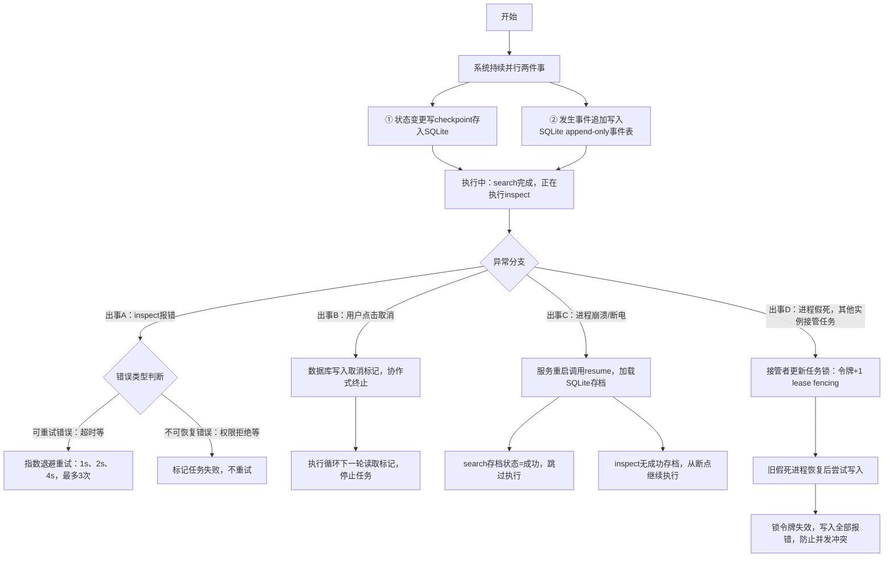

# S2 理解轨讲义：Durable 执行控制

> 范围：S2（V3 计划第 9 节）。只读代码、只写文档。
> 所有行号以 2026-09-24 的 `main` 工作区为准；引用前均已打开文件核对。
> 诚实声明：**本项目当前不是 LangGraph，也没有引入任何 LangGraph 依赖**。`app/durable/graph.py:1-7` 是自研 `StateGraph`（模块 docstring 自称 "Self-contained replacement for LangGraph"），节点是 plan step、边来自 `depends_on`、状态转移由显式合法转移表约束。除非 S2 阶段真实引入并验证，不得对外称 LangGraph。

---

## 1. 人话摘要（200 字内）

S1 已让真实两步 plan（evidence.search→evidence.inspect，参数绑定按 ADR-0003 从 checkpoint 解析）在 `/runs` 里跑通。S2 要证明这套执行**可恢复**：每个 step 每次状态变化都写 checkpoint（SQLite），每件事写 append-only 事件（SSE 数据源）；retry 只认 retryable_error，带指数退避；cancel 是协作式的（持久标志 + 内存 token）；每 run 一把 lease + fencing token，旧 owner 被接管后写什么都报错。现在最大的洞：plan 本体只在进程内存 `rt.plans`，重启后 `/resume` 直接 409；超时后挂死的工具线程只是被丢弃而非杀死；fencing 只拦工具触发、不拦每次写库。修完：真实 kill/restart 后 search 不重跑、inspect 续跑，全链路有 trace。

- 第一句："S1 已让真实两步 plan 在 /runs 里跑通。"。背景交代。S1 的成果：你发一句问题，/runs 能排出"search→inspect"两步计划，并且真的执行、真的查数据库。S2 是在这个能跑的东西之上做加固。这句没有新内容。S2 的唯一目标：跑到一半出事（报错、取消、进程被杀），系统能体面收场或接着跑，而不是丢了或乱套。
- 第二句："S2 要证明这套执行可恢复。"。S2 的唯一目标：跑到一半出事（报错、取消、进程被杀），系统能体面收场或接着跑，而不是丢了或乱套。
- 第三句（最长）："每个 step 写 checkpoint……写事件……retry 只认 retryable_error……cancel 是协作式……lease + fencing token……"



---

## 2. 修改前图（现状数据流，12 节点）

```text
 [1] POST /runs {"goal": str, "workspace": str}                (dict payload)
   │  app/api.py:844
   ▼
 [2] create_run(): rt.plans[run_id]=plan + workspaces[run_id]  内存 Dict（api.py:903-905）
   │  起 daemon 线程 _execute_plan_bg（api.py:906-907）
   ▼
 [3] DurableRunner.run(plan)                                   app/durable/runner.py:169-206
   │  输出: checkpoints.create_run 写 runs 表（state=pending, owner, config_fingerprint）
   │  leases.acquire → fencing_token=1；PENDING→RUNNING；run_started + lease_acquired 事件
   ▼
 [4] StateGraph.from_plan(plan) → topological_order()          app/durable/graph.py:117/135-149
   │  输出: list[str] step_id（depends_on 排序；环则 DurableError）
   ▼
 [5] 循环取 step：restored checkpoint 且 succeeded？           runner.py:318-331
   │  是 → results[step]=ToolResult(output=cp.output) + node_skipped 事件，continue
   │  否 → 查 cancel（token + runs.cancel_requested，runner.py:333）
   ▼
 [6] leases.validate(run_id, owner, fencing_token) ×2          app/durable/lease.py:101-117
   │  before_node 钩子夹在两次 validate 中间（runner.py:359-362）
   │  失败出口: LeaseFencingError → report fenced=True，不再写任何东西（runner.py:414-428）
   ▼
 [7] _execute_step: graph.transition(RUNNING) + _save_step     runner.py:441-442
   │  checkpoints 表 upsert：state=running, attempt=1；node_started 事件
   ▼
 [8] _resolve_and_invoke（ADR-0003，S1 已实现）                runner.py:522-578
   │  输入: step.arguments；从 load_checkpoints 取 succeeded 的 output 做绑定解析
   │  输出: resolved 字面量 arguments + binding_resolved 事件（只记形状/摘要）
   │  失败出口: runtime.binding_empty / binding_path_missing / binding_type_mismatch
   │            → TERMINAL_ERROR，inspect handler 调用 0 次，run FAILED
   ▼
 [9] _invoke_isolated: daemon 线程跑 registry.invoke           runner.py:580-620
   │  主线程轮询 cancel token（→ run.cancelled DENIED）与 deadline
   │  失败出口: 超时 → node.timeout RETRYABLE_ERROR（工具线程被遗弃，不被杀死）
   ▼
[10] ToolRegistry.invoke → handler(arguments, ctx)             app/control/registry.py:196-221
   │  输出: ToolResult；副作用工具走 ctx.ledger.execute_once（registry.py:142）
   │  失败出口: handler 异常 → tool.execution_error TERMINAL_ERROR（异常不外泄，:214-221）
   ▼
[11] backoff.decide(result, attempt, policy_allows)            app/durable/retry.py:59-69
   │  是 retryable 且 RetryPolicy.TRANSIENT_ONLY 且 attempt<3 → failed checkpoint
   │  + node_retried 事件 + 指数退避（可注入时钟）→ 回到 [7] attempt+1
   │  否则 → succeeded/failed checkpoint + node_completed/node_failed 事件
   ▼
[12] 收尾: _set_run_state(SUCCEEDED/FAILED) → runs 表          runner.py:396-402 / 373-394
   │  run_completed / run_failed 事件入 events 表（SSE 数据源）
   │  GET /runs/{id}/events 轮询该表做 SSE（api.py:1016-1062）
```

旁路说明：`rt.plans`（api.py:713）是**内存** Dict，restart 即丢；这是 resume 的隐形依赖（见第 4、5 节与第 9 条）。

## 3. 修改后图（T2 目标：新增控制点与失败出口）

以下全部为**目标，不是现状**（S2-2 等任务卡，见第 8 节）：

```text
 POST /runs
   │
   ▼
 [新增 CP1] plan 持久化（S2-2）：plan_json（含引用模板）随 runs 表或独立表落 durable.db，
   │          config_fingerprint 已存；workspace 已存 runs.workspace
   │  失败出口解除: 重启后 /runs/{id}/resume 不再 409（现状 api.py:1092-1098）
   ▼
 DurableRunner.run / resume
   │
   ▼
 [新增 CP2] 真实两步 plan 的状态序列冻结测试（S2-1）：TEACH-T01 经 /runs 的
   │          run/step 状态序列与事件序列钉进测试；非法转移与并发边界补负向用例
   │  失败出口: 任何表外转移 → IllegalTransitionError（graph.py:73-80，机制已有，覆盖面补）
   ▼
 执行循环（现状 [5]-[11]）
   │
   ▼
 [新增 CP3] 写路径 fencing（S2-6）：_save_step / events.append 前校验 fencing token，
   │          不只是工具触发前（现状仅 runner.py:359-362 两处）
   │  失败出口: stale owner 写 checkpoint/event 数 = 0（阶段门指标）
   ▼
 [新增 CP4] 超时线程收敛（S2-5）：node.timeout 后挂死的 daemon 工具线程有明确处置
   │  （现状: 线程被遗弃、结果靠"没人再读 holder"丢弃，runner.py:586-620）
   │  失败出口: 后台线程晚返回不得覆盖终态——由测试钉死而非靠巧合
   ▼
 [新增 CP5] SSE 续传合同测试（S2-8）：Last-Event-ID 重连后 seq 连续、无丢失无重复；
   │          重复连接不产生第二个 run
   ▼
 [新增 CP6] 真实进程 kill/restart smoke（S2-9）：子进程 SIGKILL 后恢复 TEACH-T01，
            search 不重跑（调用计数不增）、inspect 续跑；保存工具调用计数与事件序列
```

架构决策备忘（V3 第 9 节）：迁移 LangGraph 需先写 ADR 比较（现有 durable 能力、迁移收益、checkpoint 兼容、测试成本、简历真实性）；无明确净收益则**保留自研 StateGraph 并诚实命名**——当前无迁移计划。

## 4. 固定案例：TEACH-T01 逐步 I/O + 四张执行小图

案例原文（benchmarks/teaching_case.jsonl，S0 已冻结）：Transformer 两步组成问题，workspace=default。S1 后该问题经 `/runs` 产出真实两步 plan（S1 讲义第 4 节有逐步 I/O 形状，此处不再重复 goal/plan 层）。gold（ev-1467122274c2347e3ed99f4c）仍只许作验收锚点，不得写进任何运行参数。

本节聚焦 durable 层：s1-search **已成功**、s2-inspect **尚未开始或进行中**时进程死掉，逐步发生什么。

**崩溃前已落库的内容**（search 完成、inspect 刚开始的那一刻）：

| 存储 | 内容 |
|---|---|
| runs 表 | state=`running`，owner=`api-worker`，config_fingerprint=<16 位 hex>，cancel_requested=0 |
| checkpoints 表 | `s1-search`: state=succeeded, attempt=1, payload_json={output: {hits: [...]}, artifacts: []}；`s2-inspect`: state=running, attempt=1（若已启动；未启动则无行） |
| events 表 | seq 1 run_started → 2 lease_acquired → 3 node_started(s1-search) → 4 node_completed(s1-search, attempt=1) → 5 node_started(s2-inspect, resolved_arg_keys=[evidence_ids]) → 6 binding_resolved(count=N, digest=…)（若崩溃点在 handler 内） |
| 内存 | rt.plans、StateGraph._states、results dict——**全随进程消失** |

**恢复流程（逐步）**：

1. `POST /runs/{run_id}/resume`（api.py:1083）：从 runs 表读 record；查 `rt.plans.get(run_id)`——同进程内命中（**重启后 409，现状缺口，S2-2 目标**）。
2. `DurableRunner.resume`（runner.py:208-293）：重算 `config_fingerprint(plan, registry)`（runner.py:116-123，plan+registry catalog 的 sha256 前 16 位），与 record.config_fingerprint 比对，不符则 `CheckpointMismatchError`（除非 allow_config_mismatch，runner.py:228-229）。
3. `load_checkpoints` 读回全部 step checkpoint（checkpoint.py:198-217）；`restored_steps = [s1-search]`（仅 succeeded）。
4. `StateGraph.restore`（graph.py:121-133）：只保留 succeeded；s2-inspect 若持久化为 running（死进程的残留），**归一化为 pending**——"重建状态不是状态转移"，可合法重入。
5. `leases.acquire(..., force_takeover=True)`（api.py:797 调 resume 时强制接管）：fencing_token 递增，旧 token 作废。
6. `_set_run_state(record.state, RUNNING)`：run 级 `running→running` 就是 resume 边（graph.py:58-61 注释）。
7. 追加 `run_resumed` 事件（payload 含 restored_steps、from_checkpoints={s1-search: 1}、双指纹、新 fencing_token）+ `lease_taken_over` 事件（runner.py:268-284）。
8. 循环到 s1-search：checkpoint 命中 succeeded → 不调用 evidence.search，发 `node_skipped(checkpoint_hit)`，results 直接用 cp.output（runner.py:318-331）。**search 的工具调用计数保持 1，不重跑。**
9. 循环到 s2-inspect：无 succeeded checkpoint → 正常进入。绑定解析**从 checkpoint 的 s1-search output 重新做**（runner.py:551-558），结果与进程内必然一致（数据源不可变）；resolved 重过 inspect schema；调 evidence.inspect 真实 handler。
10. 成功 → succeeded checkpoint + node_completed + run_completed；SSE 客户端用断线前的 Last-Event-ID 重连，`after_seq` 之后的 seq 5、6… 原样补发（见第 8 条机制）。

此流程已被 `tests/durable/test_step_binding_runtime.py:182-198`（`test_crash_resume_resolves_identically`：crash 后 resume，calls==["s1-search", "s2-inspect"]，received 两次解析结果完全相同）与 `tests/durable/test_resume.py:40-50`（scenario d：s1_calls==1、s2_calls==2、run_resumed.payload.from_checkpoints=={"s1": 1}）钉死——但用的仍是 `reopen_stores` 模拟重启与 test 双注册工具，**真实生产 registry + 子进程 SIGKILL 的 smoke 是 S2-9 缺口**。

**四张执行小图**（事件简写：RS=run_started, LA=lease_acquired, NS=node_started, NC=node_completed, NR=node_retried, NF=node_failed, SK=node_skipped, RC=run_completed, RF=run_failed, RX=run_cancelled, RR=run_resumed, LT=lease_taken_over）：

```text
① 正常执行（两步 plan，attempt 均 1）
POST /runs ──► RS,LA ──► NS(s1) ──► [handler] ──► NC(s1,1)
   ──► SK?否 ──► NS(s2) ──► binding_resolved ──► [handler] ──► NC(s2,1) ──► RC
检查点轨迹: s1: running→succeeded(1)   s2: running→succeeded(1)   run: running→succeeded

② 超时（s2 的 handler 挂死，timeout_ms=50）
NS(s2) ──► 主线程 deadline 到 ──► node.timeout RETRYABLE_ERROR ──► s2: failed(1)
   ──► retry_policy=NONE（或 backoff 决定不retry）──► NF(s2) ──► RF
   ⚠ 挂死的 daemon 线程仍在跑，结果被遗弃（runner.py:596-620）；若 policy=TRANSIENT_ONLY
     则 NR + 退避后 s2: failed→running(2) 重入（graph.py:50 重试边），再超时则 NF+RF
检查点轨迹: s2: running→failed(1)→running(2)→failed(2)   run: running→failed

③ 取消（在 s1 完成、s2 未启动之间调用 POST /cancel）
/cancel ──► runs.cancel_requested=1 + 内存 token.set（runner.py:163-167）
   ──► 循环头检查发现（runner.py:333）──► _finalize_cancel（runner.py:656-682）
   ──► s2: pending→cancelled, （若有 s3 同理）──► run: running→cancelled ──► RX
若在 handler 内取消: token 轮询 → run.cancelled DENIED（runner.py:600-605）
   → _RunCancelledSignal → 同上 finalize；cancel 之后不再产生新工具调用（test_cancel.py:37-72）

④ 崩溃恢复（search 完成、inspect 进行中进程死掉）
NS(s1),NC(s1) 已落库；s2 停在 checkpoints.state=running(1)（或只有 NS(s2) 事件）
进程死 ──► runs.state 仍 =running（死 Worker 的"墓碑"）
resume ──► 指纹比对 ──► LT(token+1) + RR(restored=[s1-search]) ──► SK(s1, checkpoint_hit)
   ──► s2: running(死残留)→pending 归一化（graph.py:128-132）→running(1) 重入
   ──► binding_resolved(与崩溃前同 digest) ──► [handler] ──► NC(s2) ──► RC
不重跑: evidence.search 调用计数不增（checkpoint 命中即跳过，runner.py:318-331）
```

## 5. 状态流：run state / step state / checkpoint / event / log 五分

| 概念 | 存在哪 | 谁写 | 谁读 | 重启后 |
|---|---|---|---|---|
| **run state**（RunState 6 值） | durable.db `runs.state` 列（checkpoint.py:73-83）；执行期也缓存于 `checkpoints.get_run` | `_set_run_state`（runner.py:652-654） | SSE 关闭判定（api.py:1046-1048）、resume、API 快照（_run_snapshot, api.py:953-1004） | 保留——死进程的 `running` 是恢复入口 |
| **step state**（StepState 6 值） | **执行期内存** `StateGraph._states`（graph.py:100）；**镜像**在 durable.db `checkpoints.state` 列 | `graph.transition`（唯一入口，过 guard，graph.py:163-167）；镜像由 `_save_step` 每次状态变化 upsert | 执行循环、`unfinished_steps`（cancel 收尾）、restore | 内存丢；restore 只认 succeeded，其余归一化 pending（graph.py:121-133） |
| **checkpoint**（快照行：state+attempt+output+artifacts+error+config_fingerprint+created_at） | durable.db `checkpoints` 表，主键 `(run_id, step_id)`，**upsert 覆盖**（checkpoint.py:84-94, 159-196） | `_save_step`（runner.py:626-650）：start 和 completion 都写 | resume（load_checkpoints）、**绑定解析的数据源**（runner.py:551-558）、API 快照 | 保留——重试/恢复/幂等重放的唯一事实源 |
| **event**（14 种 EventType，events.py:21-35） | durable.db `events` 表，append-only，主键 `(run_id, seq)`，seq 每 run 单调（events.py:62-69, 73-92） | `events.append`（runner 全路径） | SSE（stream(after_seq)）、trace、测试断言事件序列 | 保留——不可变审计流 |
| **log**（`appendStreamEventLog`，api.py:17 引入） | `RADIANT_LLM_Logs/*.log` 纯文本 | 后台线程异常兜底（api.py:787/799/823） | 人 | 保留（文件），**机器不读它** |

关键区分：**checkpoint 是可变快照（upsert 覆盖，只剩最终状态），event 是不可变流水（每次尝试、每次跳过都留一行）**。恢复靠 checkpoint，解释/续传靠 event。retry 后 failed checkpoint 被 succeeded 覆盖，但 `node_retried` 事件永久记着那次失败。

## 6. 关键代码位置（5 处）

**① `app/durable/graph.py:43-80` STEP/RUN_TRANSITIONS + guard（状态机的宪法）**
输入：from/to StepState 或 RunState；输出：合法则更新、非法 raise `IllegalTransitionError`（errors.py:16-23）；副作用：仅内存 `_states`。要点：step 终态 {succeeded, cancelled}，run 终态同；`failed→running` 是 retry 重入边（graph.py:48-50）；`running→running` 是 resume 边（graph.py:58-61）；`succeeded→anything` 为空集——**成功不可撤回**。restore 绕过转移表（重建不是转移）并把死残留的 running/failed/waiting_review 归一化 pending（graph.py:121-133）。重要性：所有状态变化只有 `graph.transition` 一个入口，非法转移在内存层就被拒，SQL 层再补一道。

**② `app/durable/runner.py:430-520` _execute_step（retry 分类与 checkpoint 写入的唯一位置）**
输入：PlanStep + graph + run_id + token；输出：(ToolResult, attempts)；副作用：每 attempt 写 running/failed checkpoint、node_started/node_retried/node_completed/node_failed 事件；失败行为：成功→succeeded checkpoint 带 output+artifacts；失败→`backoff.decide`（retry.py:59-69）三分支——terminal（含 denied，retry.py:53）永不重试、policy 非 TRANSIENT_ONLY 不重试（reason=retry_policy_disabled）、attempt≥3 停（reason=attempts_exhausted）；`run.cancelled` 的 DENIED 特判转为 `_RunCancelledSignal`。重要性：retry ≠ resume 的分界点在此——retry 是**同进程同循环内**对 retryable error 的重试，走 `failed→running` 重入边；resume 是**新进程从 SQLite 重建**，只跳过有 succeeded checkpoint 的 step。

**③ `app/durable/runner.py:580-620` _invoke_isolated + `app/durable/lease.py:101-117` validate（并发安全的两个闸门）**
输入：step（timeout_ms）、lease(owner, fencing_token)；输出：ToolResult 或超时/取消特判；副作用：起 daemon 线程跑 `registry.invoke`；失败行为：deadline 到→`node.timeout` RETRYABLE_ERROR（**线程不被杀**，holder 结果无人再读）；token.cancelled→`run.cancelled` DENIED；fencing 在 before_node 前后各 validate 一次（runner.py:359-362），被接管后 raise `LeaseFencingError`，`_execute` 捕获后返回 `fenced=True` 的报告且**不再写任何东西**（runner.py:414-428）。重要性：lease+fencing 防的是"旧 owner 没死只是被分区/被接管，回来继续写 checkpoint、发事件、触发下一个工具"——validate 失败即停笔，保证单写者。诚实边界：validate 只拦工具触发点，`_save_step`/`events.append` 自身不查 fencing（S2-6 的 CP3）。

**④ `app/durable/runner.py:208-293` resume + `app/durable/checkpoint.py:84-94` checkpoints 表（恢复语义）**
输入：plan + owner? + force_takeover? + allow_config_mismatch?；输出：DurableRunReport（resume=ResumeInfo：resumed/restored_steps/双指纹/fencing_token）；副作用：run_resumed/lease 事件、重建 StateGraph、重跑无 succeeded checkpoint 的 step；失败行为：run 不存在→`RunNotFoundError`；指纹不符→`CheckpointMismatchError`；run 已终态→立即返回（reason=run_already_terminal，tools_executed=0，runner.py:235-260）。checkpoint 表存什么：**成功 ToolResult.output（与 artifacts 一起 JSON 进 payload_json）、attempt、失败时的 error dict、写入时的 config_fingerprint**——这是"恢复输入"的现行全部；**plan 本体不在表里**（在内存 rt.plans），这就是 S2-2 的目标缺口。

**⑤ `app/api.py:1016-1062` stream_run_events（SSE 断线续传）+ `app/api.py:683-727` RunRuntime.plans**
SSE 输入：`Last-Event-ID` header（字符串 seq）；输出：`text/event-stream`，每事件 `id: <seq>` + `event: <type>` + `data: <json>`；断线续传语义：`after_seq = int(Last-Event-ID)`（非法值回退 0，api.py:1029-1032），`stream(run_id, after_seq=seq)` 按主键序返回后续（events.py:94-99），轮询间隔 0.5s（api.py:670），run 进入 succeeded/cancelled/failed 即关闭（`_SSE_CLOSED_STATES`，api.py:668），30 分钟上限 + 15s keep-alive。RunRuntime.plans：内存 `Dict[str, ExecutionPlan]`（api.py:713），create_run 写入（api.py:903-905）、`/resume` 读取——**进程重启即丢**，resume_run 对内存缺失返回 409（api.py:1092-1098），只有 review 项的 plan_json（review_queue.db）能兜住 review 驱动的恢复。重要性：这是 S2-2 的头号债务——**durable 运行时的恢复入口依赖一个非 durable 的 map**；SSE 的续传正确性则依赖 events 表 (run_id, seq) 主键与单调 seq（append 竞争失败重算，events.py:76-91）。

## 7. 术语表（8 个）

- **run state / step state**：run 级 6 态（pending/running/succeeded/failed/waiting_review/cancelled）与 step 级 6 态，各自由转移表约束；step 态执行期住内存、镜像进 checkpoints 表，run 态住 runs 表。
- **checkpoint**：每 (run_id, step_id) 一行的**可变快照**（state/attempt/output/artifacts/error/config_fingerprint），每次状态变化 upsert；resume 与绑定解析的数据源。
- **event**：events 表**不可变**流水，主键 (run_id, seq)，seq 每 run 单调递增；审计、trace、SSE 的唯一来源。
- **lease / fencing token**：每 run 一把 (owner, token, expires_at)；每次 acquire token+1，旧 owner 的 token 立即作废，validate 不通过即 `LeaseFencingError`。防"被接管的分区旧 owner 继续写"。
- **retry**：同进程内对 `retryable_error` 的重试（须 RetryPolicy.TRANSIENT_ONLY，指数退避，≤3 次），走 failed→running 重入边。
- **resume**：从 SQLite checkpoints 重建 StateGraph，只重跑无 succeeded checkpoint 的 step；跨进程，先比 config_fingerprint。
- **幂等 ledger**：`PersistentIdempotencyLedger`（idempotency.py:23-69），按 idempotency_key 首次执行副作用并存结果，之后同 key 重放结果不再执行——**只管有副作用的工具**（report.export 类）；只读工具（evidence.search/inspect）天然幂等，不进 ledger，也不能拿它们的"重复不重复"当幂等证明（S2-7 红线）。
- **rt.plans**：api.py 进程内 run_id→ExecutionPlan 的内存 map；resume 的隐形依赖，重启即丢（S2-2 要消灭的债务）。

## 8. T2 变更清单（S2-T2 按 V3 第 9 节：S2-1 → S2-9）

**现状基线**（2026-09-24 实测）：`runtime/bin/python -m pytest tests/durable -q` → **51 passed**。

**各任务卡对应的现状与缺口**：

- **S2-1 状态机与非法转移测试**：转移表与 guard 已有（graph.py:43-80），`scenario_illegal_transition`（scenarios.py:294-313）与 test_state_machine.py 覆盖单测级。缺口：**真实两步 plan 经 /runs 的状态/事件序列未冻结**，并发边界用例少。
- **S2-2 持久化完整恢复输入**：**主要缺口**。run 级恢复输入（workspace、config_fingerprint、cancel 标志）已在 runs 表；**plan 本体只在 rt.plans 内存**，重启后 /resume 409（api.py:1092-1098）。目标：plan_json 落 durable.db（runs 表加列或新表），resume 不再依赖进程内 map（阶段门："恢复不依赖进程内 plan map"）。
- **S2-3 真实 search/inspect 经过 Runner**：S1 已实现绑定解析从 succeeded checkpoint 取数（runner.py:551-578）+ succeeded checkpoint 存真实 output。缺口：真实 adapter 的 crash-resume 仅 test 双注册工具验证过（test_step_binding_runtime.py:182-198），生产 registry 路径的恢复 smoke 属 S2-9。
- **S2-4 Typed retry**：已实现（retry.py 三分支 + test_retry.py 8 例全绿：terminal/denied/策略关/耗尽均不重试，attempt 与 classification 入事件）。缺口：对**真实工具链**（生产 evidence adapter 注入 retryable）的 retry 验证。
- **S2-5 Timeout 与 Cancel**：基本实现——超时→node.timeout retryable、cancel 协作式双通道（持久标志跨进程 + 内存 token 中断正在跑的 handler，test_cancel.py:125-149 验证跨 store 实例）。缺口：超时后 daemon 线程无收敛处置（被遗弃）；API 层"后台线程晚返回不得覆盖终态"无显式防护与测试。
- **S2-6 Lease 与 Fencing**：单测级完整（test_lease.py 6 例：冲突、接管 token 递增、过期、stale token、force）。缺口：fencing validate 仅工具触发前（runner.py:359-362），**写路径（_save_step/events.append）无 fencing**；生产 API 单 owner="api-worker"、接管只在 resume force_takeover。
- **S2-7 持久幂等**：已实现（PersistentIdempotencyLedger 换入 registry.ledger，runner.py:151-154；report.export 缺 key 在工具层 fail closed DENIED，registry.py:119-132；scenario c/e 验证重启+同 key 不重放副作用）。缺口：当前唯一受控写工具是 mock 的 report.export，**真实写工具不在首 slice**——S2-7 只能做到"受控写操作"级，且必须继续遵守"只读搜索不得冒充幂等证明"。
- **S2-8 SSE 断线续传**：基础版已有（Last-Event-ID→after_seq、终态关闭、30min 上限）。缺口：**无测试钉死 seq 连续/无丢失无重复**；"重复连接不启动第二个 run"无显式测试（SSE 只读所以天然安全，但要钉死）。
- **S2-9 真实进程 kill/restart smoke**：**缺口**。现有全部是 `reopen_stores` 模拟（conftest.py:83-89）或线程内 raise SimulatedCrash；没有真实子进程 SIGKILL → 重启服务 → 恢复 TEACH-T01 的端到端 smoke（含工具调用计数与事件序列存档）。

**预计修改文件**：`app/durable/checkpoint.py`（plan_json 持久化，S2-2）、`app/api.py`（resume 从库取 plan、SSE 测试钩子）、`app/durable/runner.py`（写路径 fencing、超时线程收敛，谨慎最小改）、`tests/durable/`（S2-1/5/6/8 合同测试）、新增 smoke 脚本/记录（S2-9）。

**禁止修改**：`benchmarks/teaching_case.jsonl`（冻结）、gold 相关断言、转移表的既有合法边语义（只能加测试不能改表除非 ADR）、既有 reason code 含义、tests/durable 51 基线不得降、不得把计划写成事实（本讲义同样适用）。

**将先写的失败测试（红→绿）**：

1. 重启（新 RunRuntime，rt.plans 空）后 `POST /runs/{id}/resume` 成功且 search 不重跑（当前红：409）。
2. 接管后旧 owner 尝试 `_save_step`/append 事件 → 被拒（当前红：无 fencing）。
3. node.timeout 后迟完成的 handler 结果不得出现在任何 checkpoint/事件（当前红：靠丢弃，无断言）。
4. SSE 带 Last-Event-ID=N 重连 → 收到的首条 seq=N+1 且 seq 全程严格递增无重复。
5. 非法转移全表扫描负向用例（对每个表外 (from,to) 断言 IllegalTransitionError）。

**Smoke 计划（S2-9）**：设 RADIANT_EVIDENCE_KB_DIR/EVIDENCE_DB，真实启动 API，POST /runs 跑 TEACH-T01；在 search 完成事件出现后 SIGKILL 服务进程；重启同库；resume；断言 evidence.search 调用计数不增、s2-inspect 完成、事件序列 […node_completed(s1), …, node_skipped, …, run_completed]、config_fingerprint 前后一致；存档请求/响应/trace/计数。

**回滚方式**：S2-2 是加列/加表，旧行为（内存 plan）保留为 fallback 路径即可逐 run 灰度；fencing 写入路径是纯增量校验；smoke 脚本独立目录，不改产品代码则零回滚成本。

## 9. 三件必须记住的事

1. **retry 是进程内的，resume 是跨进程的**：retry 只认 `retryable_error`（且要 RetryPolicy.TRANSIENT_ONLY、attempt<3），走 `failed→running` 重入边；resume 从 SQLite 重建 StateGraph，只跳 succeeded checkpoint 的 step。把"重试"说成"恢复"或反之，是面试露馅的第一处。
2. **checkpoint 是可变快照，event 是不可变流水；plan 两样都不是**：恢复输入=checkpoints 表+runs 表，但 plan 本体住 `rt.plans` 内存（api.py:713），重启即丢、/resume 409——durable 运行时的恢复入口依赖一个非 durable 的 map，这是 S2-2 必须消灭的头号债务。
3. **本项目不是 LangGraph**：`app/durable/graph.py` 是自研 StateGraph（转移表+拓扑排序+restore 归一化，零外部依赖）；lease/fencing 防的是"分区未死的旧 owner 继续写"，只读工具（evidence.search/inspect）天然幂等、不进 ledger，拿只读工具证明幂等是 S2-7 红线。

## 10. 自测题（折叠答案）

**Q1（数据流）**：TEACH-T01 在 s1-search 完成后、s2-inspect 进行中崩溃。resume 后哪些事件重发/新增、哪些 checkpoint 命中、evidence.search 会不会重跑？绑定解析的数据从哪来？

<details><summary>答案</summary>

事件：旧 seq 1-4（run_started/lease_acquired/node_started/node_completed s1）原样保留在 events 表；resume 追加 `run_resumed`（restored_steps=[s1-search], from_checkpoints={s1-search:1}）与 `lease_taken_over`（fencing_token 递增），随后循环里 s1-search 命中 succeeded checkpoint → 追加 `node_skipped(checkpoint_hit)`，s2-inspect 重跑 → node_started/binding_resolved/node_completed，最后 run_completed；seq 全程连续，SSE 用断线前的 Last-Event-ID 重连即无缝补发。checkpoint：s1-search 行原样命中（不重跑，工具调用计数保持 1）；s2-inspect 若持久化为 running（死进程残留），restore 时归一化回 pending（graph.py:128-132）再合法重入。绑定解析从 checkpoints 表 s1-search 的 payload_json.output 重新做（runner.py:551-558），不依赖任何内存结果，所以 resume 后 resolved 值与崩溃前必然一致（test_step_binding_runtime.py:182-198 钉死）。

</details>

**Q2（设计取舍）**：为什么 retry 只对 `retryable_error` 且要 `RetryPolicy.TRANSIENT_ONLY` 双重门？denied 为什么不能重试？

<details><summary>答案</summary>

状态三分：success / retryable_error / terminal（terminal_error 与 denied 都算 terminal，retry.py:47-53）。terminal_error 重试是浪费（永久错误再来一百次也一样）；**denied 重试是策略绕过**——Policy 已经判定这步不该执行，底层 runner 若自动重试就等于绕过了策略层，所以 retry.py:63-64 对 terminal 一律 `retry=False`。retry_policy 是 plan 级的第二重门：即使错误分类为 retryable，step 声明 RetryPolicy.NONE 就不重试（reason=retry_policy_disabled）——把"允不允许抖一抖"的决定权留在计划/策略侧，runner 只执行。再加 max_attempts=3 与指数退避（可注入时钟，离线确定性），retry 的语义被三重要素（分类×策略×次数）完全钉死。

</details>

**Q3（失败后果）**：/cancel 之后，一个正在挂死的工具 handler 会不会继续触发新工具调用？旧 worker 被 lease 接管后，它还能写 checkpoint 吗？

<details><summary>答案</summary>

cancel 是协作式双通道（runner.py:163-167）：持久标志 `runs.cancel_requested=1`（跨进程可见，test_cancel.py:125-149 验证过"worker 下线时下的 cancel，新 runner resume 也认"）+ 内存 CancelToken（`_invoke_isolated` 每 5ms 轮询，runner.py:599-605）。取消后：循环头在启动任何新 step 前检查双通道（runner.py:333、363），**cancel 之后不再产生新工具调用**（test_cancel.py:37-72 断言 invocations 停在 cancel 时刻）；正在跑的 handler 收到 `run.cancelled` DENIED 转 `_RunCancelledSignal`，收尾时未完成 step 全部 `pending/running/failed→cancelled`（runner.py:665-668）。被接管的旧 worker：fencing token 已递增，它下一次 `leases.validate`（在 before_node 前后，runner.py:359-362）即 raise `LeaseFencingError`，`_execute` 捕获后返回 `fenced=True` 且**停笔**——不写 checkpoint、不发事件、不触发工具（runner.py:414-428，test_lease.py:13-19 断言旧 owner validate 被拒、新 owner 跑到成功且 s1 不重复）。诚实边界：validate 只发生在工具触发点，若旧 worker 恰在两次 validate 之间写 `_save_step`，现行代码不拦（S2-6 的 CP3 缺口）。

</details>

## 11. 面试表达

**60 秒口述**：

"我在做一个 PDF 知识问答 Agent 的 durable 执行层。一条 plan 进来后，每个 step 的状态转移都过一张显式合法转移表——这是我自研的 StateGraph，不是 LangGraph——任何表外转移直接抛类型化错误。每个 step 每次状态变化都向 SQLite 写可变 checkpoint：状态、第几次尝试、成功输出、错误、当时的 config 指纹；同时写一条 append-only 事件，按 run 内单调 seq 编号，这就是审计 trace 和 SSE 的数据源。恢复分两种：retry 是进程内对 retryable error 的重试，带策略门和指数退避；resume 是跨进程从 checkpoint 重建，只跳过有成功快照的 step，先比对 plan 加工具目录的指纹防配置漂移。并发安全靠每 run 一把 lease 加 fencing token，旧 owner 被接管后 token 作废、写操作全部报错，保证单写者。有副作用的工具走持久幂等 ledger，同 key 重放结果不重复执行；只读工具天然幂等，不用 ledger 也不拿它冒充幂等证明。现在正在补：plan 本体持久化——现在它还在进程内存 map 里，重启后 resume 会 409——以及真实进程 kill/restart 的端到端恢复验证。"

**可以说**（S2 阶段门通过前，仅限现状已验证表述）：

- 自研 StateGraph + 合法转移表 + restore 归一化；run/step 双状态机。
- checkpoint（可变快照）与 event（不可变流水，seq 单调）双存储分离；retry 三重要素分类（状态×策略×次数）。
- 协作式 cancel 双通道（持久标志 + 内存 token）；lease + fencing token 单写者保证；持久幂等 ledger 换入生产 registry。
- SSE 按 Last-Event-ID 的 after_seq 断线续传（基础版已实现，合同测试是 S2-8 目标）。
- 步骤输出绑定从 succeeded checkpoint 解析，resume 后解析结果与进程内一致（test_step_binding_runtime.py 钉死）。

**暂时不能说**：

- "重启后 run 可恢复"——**现状 plan 在内存 rt.plans，重启后 /resume 返回 409**（api.py:1092-1098）；只能说"checkpoint/event/lease/幂等已持久化，plan 持久化是 S2-2 目标"。
- "超时能杀死挂死工具"——现状是遗弃 daemon 线程、结果靠丢弃（runner.py:596-620）。
- "每次写库都有 fencing 保护"——现状只拦工具触发点（runner.py:359-362）。
- "做过真实进程 kill/restart 恢复验证"——现状是 reopen_stores 模拟重启（S2-9 缺口）。
- **任何简历数字可追溯到 case/run/trace/commit**：SSE 续传、恢复零重跑、stale owner 写入数 0 等阶段门指标在完成对应任务卡与 smoke 前，不得写成系统成绩（未测值只能是 `not_measured`）。
- LangGraph、Hybrid Retrieval、Cross-Encoder、Memory 治理、多 Agent、完整回答生成链（S3/S4/S5/S6/S9）。
