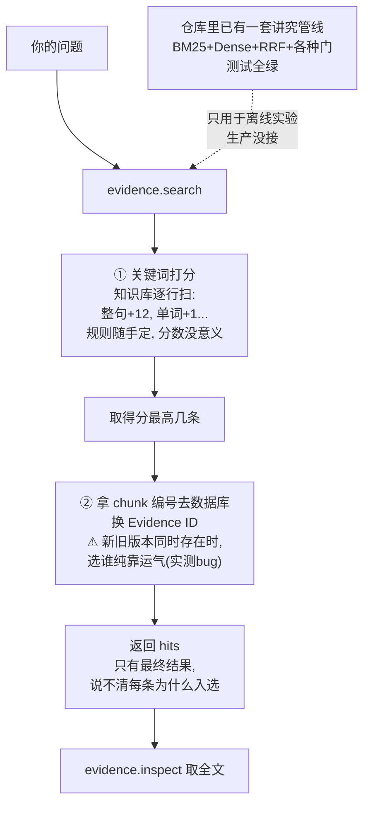
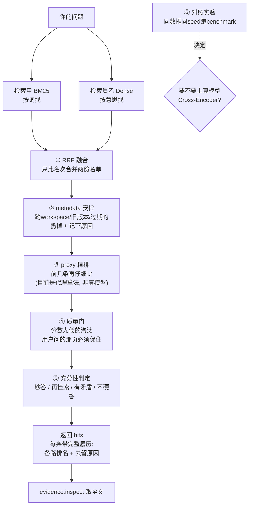

# S3 理解轨讲义：混合检索控制

> 范围：S3（V3 计划第 10 节）。只读代码、只写文档。
> 所有行号以 2026-09-24 的 `main` 工作区为准；引用前均已打开文件核对。
> 诚实声明（V3 第 3 节红线）：**S3 之前，当前生产检索是 JSONL 关键词检索 adapter，禁止称为 Hybrid Retrieval**；`app/retrieval/` 的 BM25+Dense+RRF 管线**真实存在但只服务离线消融实验与 eval harness，未接入生产 `evidence.search`**（生产 handler 见 `app/evidence/search_adapter.py:71-73`，仍是 `direct_jsonl_kb_search`）。**未跑真实 benchmark 前，rerank 只能称 deterministic token-overlap PROXY，禁止写 Cross-Encoder**（`app/retrieval/rerank.py:1-13` 文件头自己就是这么声明的）。

---

## 1. 人话摘要（200 字内）

生产 `evidence.search` 现在是"JSONL 关键词打分 + evidence store 两阶段解析"：对 KB 文件的每一行做加权关键词匹配取 top-N，再用 chunk_id 去 SQLite 换回真实 evidence_id。它不可解释（分数量纲随意）、不可评测（没有 gold 对照）、没有版本/workspace 门，且实测发现版本偏好逻辑实际未生效。S3 要把 `app/retrieval/` 已有的 BM25+Dense+RRF 管线接进生产工具链：两路召回、RRF 融合、metadata gate 记 drop reason、proxy rerank、相关性/anchor/充分性门，每条候选可追溯到各路排名与每个被丢弃的原因；最后在同数据同 seed 的 benchmark 上决定要不要真实 Cross-Encoder。修完：同一个问题，召回更稳、每条证据能解释"谁排的、为什么留/为什么丢"。

1. 摘要其实讲了三件事：现在怎么找的 → 现在有什么毛病 → 要换成什么。

2. 现在怎么找的：search 内部是两步——① 拿问题里的关键词，对知识库文件逐行打分（命中整句 +12 分、命中一个词 +1 分……规则是随手定的），取得分最高的几条；② 拿这几条的 chunk 编号去数据库换成 Evidence ID。

现在的三个毛病：

1. 分数意义：+12/+1 这种规则没有理论依据，不同问题的分数没法比，也没法评测"找得好不好"；
2. 没有安检：不查 workspace、不查版本、不查有效期，什么证据都可能混进来； . 有个实测 bug：同一 chunk 有新（现行）旧（已废弃 supersede）两个版本时，代码本想"优先用现行版本"，但这个逻辑实际没生效——现在命中哪个版本纯属排序巧合。

要换成什么：仓库里其实已经躺着一套讲究的检索管线（写好了、测试也全绿），但只用于离线实验，生产没接。S3 就是把它接进生产。这套管线用图书馆类比最好懂：

| 管线环节 | 图书馆类比 | 要点 |
|---|---|---|
| BM25 召回 | 检索员甲：**按词找**——"transformer"出现在哪些书里 | 罕见词更值钱；死在同义词/改写 |
| Dense 召回 检索员乙：**按意思找**——问题和书都变成向量比远近 | 能认出"说法不同但意思相近"；死在精确词/编号 |
| RRF 融合 | 合并两位的推荐名单，**只比名次不** | 甲第1+乙第3 vs 甲第2+乙第1，名次整体靠前者赢；奖励"多路互证" |
| metadata 过滤 | 安检：不合格的直接扔 | 跨 workspace / 已作废版本 / 过期 → 扔 + **记下原因**；必须在精排前 |
| proxy rerank | 精排：排最前的几条再仔细比 | 目前是 token 重叠代理算法，**不是真模型** |
| 相关性门（往下砍） | 质量门：分数太淘汰 | 三规则：绝对地板 `below_min_score`、相对地板（不到头名×比例）`below_relative_floor`、断崖裁剪（落差大从崖边切）`relative_drop_cut`；保底至少留1条 |
| 门（往上捞） | 质量门：真答案不能被挤掉 | 用户问的那页掉出前K → 强行换回前K，记 `anchor_protected`；必须在精排后 |
| 充分性判定 grader | 最后总评 | 四判：**够答 / 不够再去检索 / 材料互相矛盾 / 没材料宁可不答** |

背景一句话：这套管线**已写好、47 个测试全绿但只跑离线实验，生产没接**——S3 的活就是把它接进 `evidence.search`，并让每条证据都能回答"谁推荐的、排第几、为什么留下/为什么被丢"。



修改后结构：



---

## 2. 修改前图（现状数据流，11 节点）

```text
 [1] POST /runs {"goal": str, "workspace": str}                     (dict payload)
   │  app/api.py:844
   ▼
 [2] RulePlanner → ExecutionPlan（两步：evidence.search → evidence.inspect） (ExecutionPlan)
   ▼
 [3] DurableRunner 循环 → registry.invoke("evidence.search", arguments)  (dict arguments)
   │  生产默认 real handler：app/control/registry.py:241-250
   ▼
 [4] evidence_search_handler(arguments, ctx)                        app/evidence/search_adapter.py:54
   │  读 RADIANT_EVIDENCE_KB_DIR；缺失 → TERMINAL_ERROR evidence.kb_dir_missing（:56-63）
   │  读 RADIANT_EVIDENCE_DB（经 get_evidence_store，store.py:90-96）
   ▼
 [5] direct_jsonl_kb_search(kb_dir, query, max_hits=max(top_k*4,8)) app/utils/pdf_helpers.py:846-925
   │  输入: str query / int max_hits；输出: {"hits": [...], ...}
   │  惰性 import（:71 注释：pdf_helpers 拉入 chroma/torch 等重依赖，首调 80s+）
   ▼
 [6] resolve_kb_search_paths → [(kb_kind, Path)]（查询含 figure/table 等词时 visuals 优先）
   │  逐行 json.loads → _score_jsonl_record 打分 → 小顶堆保留 top max_hits（pdf_helpers.py:864-911）
   │  边类型: list[hit]，hit = {score: float, excerpt: str, document: langchain Document}
   ▼
 [7] 每个 hit 取 document.metadata（{source, document_id, chunk_id, page, doc_type, kb_file}）
   │  document_id 缺失时由 source 现算 make_document_id（adapter.py:43-46，sha1(source)[:16]）
   │  → store.query_evidence(workspace, document_id, limit=MAX_LIMIT=1000)，按 document 缓存（search_adapter.py:88-92）
   ▼
 [8] _index_by_chunk：chunk_id → evidence payload（search_adapter.py:40-51）
   │  意图：valid_to 为空的现行版本优先（:49-50）；实测偏好未生效（见第 6 节②）
   │  解析不出 → unresolved_count += 1，永不静默提升（:85-96）
   ▼
 [9] 组装 hits[{evidence_id, document_id, chunk_id, page, source, score, snippet}]，凑满 top_k 即止（:97-109）
   │  → ToolResult(output={hits, retrieval="kb_keyword+store_resolve", unresolved_count})
   ▼
[10] succeeded checkpoint → 绑定解析（ADR-0003）→ evidence.inspect(evidence_ids)
   │  inspect_adapter 按 workspace 隔离、报告 valid_from/valid_to 有效期状态
   ▼
[11] inspect ToolResult → 回答组装 / trace
```

旁路一：`app/retrieval/` 全套管线（bm25/dense/fusion/filters/gate/rerank/grader/pipeline/experiment）**已在仓库内**并被 `app/eval/adapters.py:305-313`、`app/verification/experiment.py:62-63` 引用，但**没有任何生产代码路径从 `evidence.search` 进入它**。

旁路二：Chroma 路径真实在线但属于**旧链**——`app/radiant_llm.py:1480/1573` 把 `local_vector_store` 作为旧 chatbot 的持久目录，`app/utils/pdf_helpers.py:1795-1832` rebuild/加载它；baseline 产物里 `artifacts/baseline/m0-20260922/output/local_vector_store/chroma.sqlite3` 真实存在。**旧链用它，S1-S3 的工具链不用它**；`app/retrieval/dense.py` 只是薄包装它做实验。

---

## 3. 修改后图（T2 目标：新增控制点与失败出口）

以下全部为**目标，不是现状**（S3-1~S3-8 任务卡，见第 8 节）：

```text
 POST /runs（TEACH-T01）
   │
   ▼
 [新增 CP1] 统一索引源（S3-2/S3-3）：BM25 索引与 dense 映射都从 EvidenceStore 的
   │          非 degraded text evidence 构建（bm25.py:18-53 / dense.py:29-43），
   │          不再直接读 KB JSONL；chunk_id→evidence_id 映射单点维护
   │  失败出口: 现行版本优先逻辑修正后仍解析不出 → unresolved，不得静默提升
   ▼
 recall 双路（S3-3）：BM25Index.query（bm25.py:62-86）∥ DenseRetriever.query（dense.py:101-128）
   │  dense: sim=1/(1+L2 distance)（dense.py:114），映射失败保留 unmapped: 前缀不丢（:108-110）
   │  失败出口: RADIANT_VECTOR_STORE 未设 → RuntimeError（dense.py:73-76）；
   │            probe 无 mappable hit → 实验中止拒测垃圾指标（experiment.py:183-190）
   ▼
 [新增 CP2] RRF 融合 k=60（S3-3）：score=Σ1/(k+rank)，source_ranks 留痕（fusion.py:65-106）
   ▼
 [新增 CP3] metadata gate（S3-4）：workspace/version/authority/modality/as_of/degraded
   │          过滤，每个 drop 记 reason（filters.py:26-83）；在 prompt 前执行
   │  失败出口: no_evidence_record / workspace_mismatch / document_version_mismatch /
   │            expired / degraded——全部带原因进 trace
   ▼
 proxy rerank（S3-3 wiring，S3-8 决策）：token-overlap PROXY 重排 head top_n，
   │  pre_rerank 排名留痕，trace 标 proxy_notice（rerank.py:84-109 / pipeline.py:144-146）
   ▼
 [新增 CP4] 相关性门 + anchor 门（S3-5）：绝对地板/相对比例/断崖裁剪（gate.py:50-100）；
   │          authority 加权 + anchor pin 进 protect_top_k（gate.py:115-166）
   │  失败出口: anchor 匹配项被挤出门外 = gate 漏检（benchmark 锚点页命中可测）
   ▼
 [新增 CP5] 充分性 grader（S3-5）：enough / retrieve_more / conflict / abstain
   │  （grader.py:42-93）；abstain/retrieve_more → 不硬答，conflict → 显式报告
   ▼
 ToolResult 带全链路 trace（各路排名、RRF 分、gate reason、grader verdict）
```

顺序理由（gate 与 rerank 谁先谁后）：现行管线顺序是 **recall → fusion → metadata filters → rerank → relevance/anchor gates → grader**（pipeline.py:113-167）。metadata 过滤必须在 rerank **前**——版本/workspace/有效期不对的证据是确定性垃圾，先丢最便宜，且 rerank 只有 top_n 个位置，不能让垃圾占座、更不能让 rerank 把越权证据重新抬上来；相关性/anchor/充分性门必须在 rerank **后**——它们判断的是最终排序与分数形态（相对地板、断崖、pin 窗口位置），rerank 会重排，先 gate 等于白 gate。

架构决策备忘（S3-8）：是否引入真实 Cross-Encoder **先 benchmark 再决定**；无净收益则写"不采用"ADR。当前仓库内没有任何真实 reranker 实现（`build_reranker` 只认 `token_overlap_proxy`，传别的 type 直接 ValueError，rerank.py:74-81）。

---

## 4. 固定案例：TEACH-T01 逐步 I/O

案例原文（benchmarks/teaching_case.jsonl，S0 已冻结）：*"What two main components does the Transformer architecture consist of? Answer with the PDF name, page number and Evidence ID."*，workspace=default。gold（`ev-1467122274c2347e3ed99f4c`，page 1，chunk `e8a365c1d8815226:p1:c2`）只许作验收锚点，不得写进任何运行参数。

**现状逐步 I/O**（2026-09-24 实测：baseline 产物复制到 /tmp 后跑真实 `evidence_search_handler`，top_k=3）：

1. 入参 `arguments={query: <上句>, top_k: 3}`；`workspace = arguments.workspace_id or ctx.workspace = "default"`（search_adapter.py:67）。
2. 环境检查：`RADIANT_EVIDENCE_KB_DIR` 指向含 `01_chunks_kb.jsonl` 的目录（search_adapter.py:56-63）。
3. 第一阶段检索：`direct_jsonl_kb_search(working_directory=kb_dir, query, max_hits=12)`（`max(top_k*4, 8)`，search_adapter.py:73）。查询解析：小写 token 去停用词得 terms（`pdf_helpers.py:656-664`，本例 terms 含 transformer/architecture/consist 等；what/does/page/pdf 等 55 个停用词被剥，pdf_helpers.py:361-381）；引号短语与 `figure N/page N/section x` 模式得 phrases（:667-689）。
4. 打分（`_score_jsonl_record`，pdf_helpers.py:727-843）：可搜索文本 = 文件名+正文+chunk_id+title（:743-756）；整句命中 +12、短语每条最多 +5、每个词命中 +1、词覆盖率再加 matched/len(terms)（:764-780）、查询含页码且记录同页 +2.5、文件名出现在查询里 +2、kb 文件顺序衰减 ≤0.6（:788-799）。检索完按 dedupe_key 去重、堆取 top max_hits（:893-911）。
5. 第二阶段解析：hit metadata 给出 `document_id=e8a365c1d8815226`、chunk_id；按 document 查 store（`query_evidence(workspace, document_id, limit=1000)`，store.py:262-310），`_index_by_chunk` 得 evidence payload。
6. 输出（实测）：

```json
{"query": "...", "unresolved_count": 0, "retrieval": "kb_keyword+store_resolve",
 "hits": [
  {"evidence_id": "ev-1467122274c2347e3ed99f4c", "document_id": "e8a365c1d8815226",
   "chunk_id": "e8a365c1d8815226:p1:c2", "page": 1, "score": 4.1, "snippet": "The dominant sequence transduction models ..."},
  {"evidence_id": "ev-05000e823428a56ba8f0dc94", ..., "page": 2, "score": 2.933},
  {"evidence_id": "ev-112e09770c70254959c180f9", ..., "page": 2, "score": 2.933}]}
```

状态 `success`，首次调用 latency 86s（惰性 import torch/chroma 的代价，search_adapter.py:69-71 注释已知）。

**必须知道的实测发现**：rank 1 解析出的是 gold ID，但查库可知该 ID 属于**已 supersede 的版本** `v-891411cca8dc-e56f6c`（valid_to 非空）；现行版本 `v-5e60d67805bb-e56f6c` 对同一 chunk 的 evidence_id 是 `ev-e19c20c09b654a816cd9fd3a`。`_index_by_chunk` 的"现行版本优先"（search_adapter.py:49-50）实际没生效——原因见第 6 节②。当前命中 gold 是**排序巧合**，不是版本控制生效；这正好演示了 S3-2 要修的问题（teaching_case.jsonl 也注明 gold 已 supersede、禁止静默换答案）。

**T2 目标 I/O 形状**（同一问题过 RetrievalPipeline，pipeline.py:101-167）：trace 含 `recall_bm25`/`recall_dense`（latency、候选数、top_scores）、`fusion`（method=rrf, rrf_k=60）、`filters`（in/out + 每条 dropped 的 reasons）、`rerank`（enabled、proxy_notice）、`gates`（relevance_dropped、anchor_protection）、`grader`（四 verdict 之一）、`final`（每条 Candidate 的 source_ranks 全留痕）→ 组装成同样的 hits 结构返回，但每条多带"各路排名 + 被 gate 的兄弟候选及原因"。

---

## 5. 状态流：内存 / SQLite / Chroma / trace 四分

| 概念 | 存在哪 | 谁写 | 谁读 | 重启后 |
|---|---|---|---|---|
| **KB JSONL**（01_chunks/02_visuals/03_metadata，行 = dict） | 文件系统（RADIANT_EVIDENCE_KB_DIR） | 上游 Visual-Parser（M0 产物已冻结） | 现状检索逐行流式读（pdf_helpers.py:864-889）；adapter 摄取时读（adapter.py:157-159） | 保留——现状检索的**唯一索引源**（问题所在） |
| **EvidenceStore**（documents/evidence/ingest_state 三表，payload 列存整份 JSON） | SQLite（RADIANT_EVIDENCE_DB，store.py:81-96） | `ingest_directory`/`ingest_parsed`（store.py:191-252）；supersede 只 UPDATE 列不改 payload（store.py:151-161, 313-316） | `query_evidence`（store.py:262-310）、`get_evidence`（:312-323）、API /evidence /documents（api.py:573-624） | 保留——多版本并存（baseline 实测 357 text 行 = 3 版本 × 119 chunk，现行版 active=1 仅 1 个） |
| **Chroma 向量库**（embedding + chunk metadata） | `local_vector_store/chroma.sqlite3`（RADIANT_VECTOR_STORE，dense.py:21-26） | 旧链 rebuild_vector_store（pdf_helpers.py:1795-1832）；旧链与 dense 实验读 | **现状生产检索不读它** | 保留——dense recall 的数据源，与 evidence store 是**两套身份系统**，靠 chunk_id 桥接 |
| **trace / metrics**（管线每 stage 的 latency、分数、drop reason、config_fingerprint） | 实验产物 metrics.json + cases/*.json（experiment.py:229-249） | RetrievalPipeline.run 现场构建 dict（pipeline.py:105-167） | eval harness、paired_diff、人 | 文件保留；现状生产路径**没有**这种 trace（ToolResult 只有最终 hits） |

关键区分：**现状检索没有"检索状态"可回放**——分数在堆结构里算完即弃，只剩最终 hits；`app/retrieval/` 的 trace 是内存 dict 随 run 产出，可落盘但尚未进生产。degraded 证据默认不进 BM25 索引（bm25.py:45）、默认被 store 查询排除（store.py:292-293）、默认被 filters 丢弃（filters.py:31-32）——三层同语义。

---

## 6. 关键代码位置（5 处）

**① `app/utils/pdf_helpers.py:727-843` `_score_jsonl_record`（现状打分机制）**
输入：一条 KB JSONL record + 解析好的 terms/phrases/pages + allowed_sources + 文件顺序号；输出：{score, record_type, excerpt, document(langchain Document), dedupe_key} 或 None（不相关）；副作用：无（纯函数）；失败行为：score≤0 且无词/短语/整句命中 → 返回 None 被跳过（:801-802），allowed_sources 不匹配 → None（:739-740）；重要性：**这是"检索质量"现状的全部定义**——加法式启发分，量纲随意（+12/+5/+2.5/+1/≤0.6），无 IDF、无词频饱和、无长度归一，不同查询的分数不可比；命中 metadata 只有 source/page/document_id/doc_type/kb_file/chunk_id(或 figure_id/title/authors)（:807-826），**没有 workspace、版本、有效期**——metadata gate 在现状里无从谈起。

**② `app/evidence/search_adapter.py:40-51` `_index_by_chunk` + `app/evidence/store.py:302, 313-316`（Evidence ID 对齐的版本偏好漏洞）**
输入：某 document 的全部 evidence payload（`query_evidence` 返回，**含已 supersede 的旧版本行**，该查询无 valid_to 过滤）；输出：chunk_id → payload 单映射；副作用：无；失败行为：chunk_id 缺失/查无 → 调用方 unresolved_count++；重要性：`:49-50` 的意图是"已带 valid_to 的让位给现行版本"，**但 payload JSON 里的 valid_to 恒为写入时的 NULL**——supersede 只 UPDATE 列、不回写 payload（store.py:151-161，get_evidence 的注释 :313-316 明说"Column values are authoritative"），而 `_index_by_chunk` 读的是 payload。于是偏好分支永不触发，谁排在 `ORDER BY document_id, page, evidence_id`（store.py:302）前面谁赢——TEACH-T01 命中 gold 纯属 `ev-1467...` 字典序最小。这是 S3-2（统一 ID 映射）要消灭的"对齐靠巧合"。

**③ `app/retrieval/fusion.py:65-106` `rrf_fuse`（RRF 融合）**
输入：{source: [Candidate, ...]}（每路已按分排序、rank 从 1 起）；输出：按 fused 分降序的 Candidate 列表，每人 `source_ranks` 合并保留各路原始 rank/score（:89）、`raw_score=fused 分`（:105）；副作用：原地改 Candidate.rank；失败行为：无异常路径——空列表天然得空；确定性 tie-break = (-fused分, 最优单路 rank, evidence_id)（:97-100），**与输入 dict 顺序无关**（test_fusion.py:33-38 钉死）；重要性：融合不比较 BM25 分与 dense 相似度的量纲（两者根本不可比），只比较排名——这是对"异构分数"最稳的合并方式，也是 trace 可解释性的来源（每条候选能回答"BM25 排第几、dense 排第几"）。

**RRF 手算示例**（k=60，三候选 X/Y/Z；BM25 排名 X=1, Y=2；Dense 排名 Y=1, Z=2, X=3。每出现一路加一次 1/(60+rank)）：

```text
X: 1/(60+1) + 1/(60+3) = 1/61 + 1/63 = 0.016393 + 0.015873 = 0.032266  → 第 2
Y: 1/(60+2) + 1/(60+1) = 1/62 + 1/61 = 0.016129 + 0.016393 = 0.032522  → 第 1
Z: 1/(60+2)           = 1/62           = 0.016129                    → 第 3
最终顺序: Y > X > Z
```

读法：Y 与 X 都两路在榜，Y 靠更靠前的组合（1+2 对 1+3）胜出，但 0.032522 对 0.032266 只差 0.000256——**k=60 把头部差异压得很平**，RRF 奖励的是"多路互证"而非"一路独大"；单路命中的 Z 只有一半分上下。验算：`python3 -c "print(1/61+1/63, 1/62+1/61, 1/62)"` → 与上面一致（已独立复算）。

**④ `app/retrieval/pipeline.py:101-167` `RetrievalPipeline.run`（阶段顺序 + trace 的唯一定义）**
输入：question + 可选 anchor（生产应来自请求上下文，benchmark 才用 gold_anchor，gate.py:15-18 注释明确）；输出：trace dict（question/config_fingerprint/stages/final/grader_verdict）；副作用：无 I/O（retriever 已注入），全程内存计算；失败行为：`use_bm25=True` 但未注入索引 → RuntimeError（:79-80），dense 同理（:89-90）；重要性：**gate 与 rerank 的顺序就锁死在这**：fusion(:116-121) → filters(:130) → rerank(:139) → relevance gate → anchor gate → final_top_k 截断(:150-152) → grader(:161)。A0-A4 消融阶梯（:174-198）同代码同语料逐档加件，是 S3-7 对照实验的现成脚手架。

**⑤ `app/retrieval/experiment.py:89-134` `evaluate_case` + `aggregate`（指标定义）**
输入：trace + relevant set（由 gold_anchor 经 docname_map 解析出的该页全部 evidence_id，:66-79）；输出：per-case {first_relevant_rank, rr(=1/rank), recall@k=hits/|rel|, anchor_hit@k, ndcg@k(binary gain), latency} 与聚合 {recall@5/20, anchor_hit@5/20, mrr, ndcg@20, p50/p95, grader_verdicts 分布}；副作用：写 metrics.json、每 case trace 文件、paired_diff（:229-249）；失败行为：**probe 无 mappable hit 直接 RuntimeError 中止**（:183-190），拒绝在坏向量库上测出垃圾指标；重要性：指标口径的现行唯一实现——所有简历数字必须能回溯到它产出的 metrics.json，多 seed 方差与 p50/p95 是 S3 阶段门的强制项。

**六个指标各回答什么问题（一句话一个）**：

- **Recall@K**：相关证据在前 K 条里被找到了几成——"找得全不全"（experiment.py:102-104）。
- **MRR**：第一个相关证据排名的倒数均值——"最相关那条排得靠不靠前"（:99-101, 128）。
- **nDCG**：相关证据排得越靠前贡献越大，对理想排序归一化——"排得好不好"（含位置权重，:106-111）。
- **Anchor Hit@K**：gold 页上至少一条证据进没进前 K——"用户问的那一页被保住了没有"（:105）。
- **HR（Hallucination Rate，论文式口径）**：回答里无证据支持的内容占比——"回答有多忠实"，越低越好；judge-based，本项目 not_measured（docs/EVAL_HARNESS.md:61）。
- **CoP（Context Precision，论文式口径）**：送进模型的上下文里真正相关的比例——"材料有多干净"，语义档需 judge/人审，本项目零实现（docs/BASELINE.md:51）。

---

## 7. 术语表（8 个）

- **BM25**：词法检索——按词匹配、带 IDF（罕见词更值钱）与长度归一的排序函数；`rank_bm25.BM25Okapi` 实现（bm25.py:13）。强在精确词与术语，死在同义词/改写与 OOV。
- **Dense（向量）检索**：把 chunk 与问题都嵌入成向量，按 L2 距离取最近；强在语义相近的词（"six layers"≈"stack depth"），死在精确词/编号对齐与"语义相近但答非所问"。
- **RRF（Reciprocal Rank Fusion）**：只按各路排名融合：总分 Σ 1/(k+rank)，k=60 弱化头部差异（fusion.py:14, 88）。分数量纲不同的两路才能合。
- **Candidate**：管线里一条候选证据（types.py:19-57），携带 evidence_id、score（恒高优）、raw_score（原始量纲留痕）、source_ranks、filter_reasons/gate_notes——**可解释性的载体**。
- **Gate（过滤器 vs 门）**：filters 是 metadata 硬过滤（workspace/version/有效期/authority/modality/degraded，filters.py）；gate 是分数/位置级软裁（相关性地板、断崖、anchor pin，gate.py）。前者回答"该不该出现"，后者回答"配排多前"。
- **Anchor**：目标锚点——用户在问的那个具体位置（某文档某页/某 figure/某 section，gate.py:103-112）。**Anchor competition**：top-K 是固定窗口，词法打分偏爱含高频通用词的"宽泛高分 chunk"，材料（chunk/来源）越多，竞争者越多，真正答问的那一页越容易被挤出窗口——所以"材料越多越崩溃"：答案不缺证据，缺的是证据在窗口里的位置；不报错、引用错页，是最安静的检索失败。
- **Evidence ID 对齐**：chunk_id（上游解析产物）→ evidence_id（store 主键，`workspace|document_version|locator` 的 sha256 前 24 位，models.py:66-70）的映射问题；一个 chunk_id 在多版本下对应多个 evidence_id，选谁是 S3-2 的核心。
- **Sufficiency grader**：充分性判定（grader.py:42-93）——enough（够答）/retrieve_more（不足，继续检）/conflict（同页高分内容互斥，显式报告）/abstain（无可用的，不硬答）。

---

## 8. T2 变更清单（S3-T2 按 V3 第 10 节：S3-1 → S3-8）

**现状基线**（2026-09-24 实测）：`runtime/bin/python3.12 -m pytest tests/retrieval -q` → **47 passed**（全部 8 个测试文件）。注意：这 47 个是**结构/行为合同测试**，不是检索质量证据（见第 9 条与必答点 9）——语料是 conftest 里 7 行合成样本（tests/retrieval/conftest.py:25-58），dense 是手工给定排名的 FakeDense（test_pipeline.py:8-21），没有任何断言拿真实 gold 对照排序；检索质量只能在冻结语料 + 冻结 case + 多 seed 的 benchmark（S3-7）上测量。

**各任务卡对应的现状与缺口**（全部为目标，不是现状）：

- **S3-1 冻结 baseline 与失败 case**：现状只有 `artifacts/retrieval/m4-20260922` 实验产物与 retrieval_cases.jsonl；缺"当前关键词 adapter 的正式 baseline 指标 + 失败 case 清单"存档（artifacts/control-v3/S3/baseline.txt 证据包格式按 V3 第 6.2 节）。先量现状再动算法。
- **S3-2 统一 chunk/Evidence ID 映射**：`build_chunk_to_evidence_map`（dense.py:29-43）与 `_index_by_chunk`（search_adapter.py:40-51）是**两套各自为政的映射**，后者版本偏好已实测失效（第 6 节②）。目标：单一映射函数，现行版本（列级 valid_to）确定性强，supersede 偏好写测试钉死。
- **S3-3 接入 BM25+Dense+RRF**：管线代码齐全（pipeline.py），但生产 `evidence.search` 未接入（registry.py:241-250 仍指 `evidence_search_handler`）。目标：search_adapter 换成/包一层 RetrievalPipeline，trace 保存各路排名与最终排名；rerank 先用 proxy 并标 proxy_notice。
- **S3-4 metadata gate**：filters.py 已实现且每 drop 带 reason（filters.py:26-83），但未进生产路径。目标：workspace/ACL（authority_level 即现状的 ACL 粒度）/version/active（as_of 有效期窗口）gate 在 prompt 前执行，reason 全进 trace。
- **S3-5 相关性/anchor/充分性门**：gate.py 与 grader.py 已实现，默认 enabled=False（gate.py:34/43）。目标：按 benchmark 调参后启用；不足走 retrieve_more/abstain，**不硬答**；conflict 显式报告。
- **S3-6 高竞争/多来源失稳 case 重现**：anchor competition 的逐层变化（recall→fusion→filters→rerank→gates 每层候选增减）目前无工具输出，目标：选 retrieval_cases.jsonl 中竞争最激烈的 case 出逐层 diff。
- **S3-7 对照实验**：A0-A4 预设已就位（pipeline.py:174-198），目标：关键词 adapter vs Dense vs Hybrid(RRF) vs Gated **同数据、同 seed、同 top-k** 跑全量，报 Recall@K/MRR/nDCG/Anchor Hit + p50/p95 + 多 seed 方差。
- **S3-8 Cross-Encoder 决策**：**先 benchmark 再决定**；当前 `build_reranker` 只认 proxy（rerank.py:74-81）。若引入须真实加载模型并跑同条件对照；无净收益则写"不采用"ADR。任何情况下，未加载真实模型前 trace 与简历都不得出现 Cross-Encoder。

**预计修改文件**：`app/evidence/search_adapter.py`（接入管线，S3-3）、`app/retrieval/dense.py`/`bm25.py`（映射统一，S3-2）、`app/retrieval/pipeline.py`（生产化默认值）、`app/control/registry.py`（版本号/描述）、`tests/retrieval/`（S3-2 映射测试、gate 顺序合同测试）、新增 baseline 存档（S3-1）。

**禁止修改**：`benchmarks/retrieval_cases.jsonl` 与 teaching_case.jsonl（冻结）、gold 相关断言、KB 产物与 evidence.db 的 M0 冻结内容、`app/utils/pdf_helpers.py` 的打分语义（S3-1 要量的就是它；管线包装它、不重写它——S1 起的老规矩）、tests/retrieval 47 基线不得降、不得把计划写成事实。

**将先写的失败测试（红→绿）**：

1. 同一 chunk_id 存在 supersede 新旧版本时，映射函数必返回现行版本行（当前红：字典序随机赢）。
2. `evidence.search` handler 输出的 hits 每条携带 `source_ranks`（bm25/dense 各路 rank），且 retrieval 字段不再是 `kb_keyword+store_resolve`（当前红：无此字段）。
3. 越 workspace / 已过期版本的候选进入 filters 后必带对应 reason 且不进 final（管线级单测已有 filters 覆盖；缺"经 handler 端到端"的）。
4. grader 判 abstain 时下游不得继续组装答案（当前红：无该链路）。
5. RRF 与 k 值、输入顺序无关（已有 test_fusion.py:33-38，保留为回归）。

**Smoke 计划**：RADIANT_EVIDENCE_KB_DIR + RADIANT_EVIDENCE_DB 指向 baseline 副本，RADIANT_VECTOR_STORE 指向 baseline 的 local_vector_store，对 TEACH-T01 跑生产 handler 与管线版各一次；断言 hits 含真实 evidence_id/page、trace 含全部 stage、unresolved_count 与 mappable 比例落档（smoke-request/response/trace 按 V3 第 6.2 节进 artifacts/control-v3/S3/）。

**回滚方式**：search_adapter 的接入走新 handler/新工具版本号（现状 `evidence.search/2`），registry feature flag 可切回旧 handler；管线各 gate 默认 enabled=False 即天然回滚点；零 schema 变更。

---

## 9. 三件必须记住的事

1. **生产检索 ≠ 仓库里的检索**：`evidence.search` 现在是 JSONL 关键词打分 + store 两阶段解析（`retrieval="kb_keyword+store_resolve"`）；BM25+Dense+RRF+gate 管线真实存在但只跑离线实验。**在 S3 阶段门通过前，对任何人不得把前者叫 Hybrid Retrieval**（V3 第 3 节红线）。
2. **chunk_id→evidence_id 的现行版本偏好实测失效**：supersede 只 UPDATE 列不回写 payload（store.py:313-316），`_index_by_chunk` 读 payload 的 valid_to（恒 NULL），偏好分支是死代码；TEACH-T01 命中 gold 是 `ORDER BY evidence_id` 字典序巧合。S3-2 之前，"解析到哪个版本"是随机的。
3. **rerank 只有确定性 PROXY，没有 Cross-Encoder**：`TokenOverlapReranker` 是自估 IDF 的 token 重叠（rerank.py:37-71），存在的唯一目的是无模型下载环境下量 rerank 阶段的 wiring；S3-8 之前简历与 trace 都不得写 Cross-Encoder。

---

## 10. 自测题（折叠答案）

**Q1（数据流）**：TEACH-T01 走现状 handler，从 query 到 ToolResult 经过了哪两阶段？unresolved_count 什么时候加？为什么 rank 1 解析出的是已 supersede 的 gold 版本 ID？

<details><summary>答案</summary>

两阶段（search_adapter.py:73-109）：① `direct_jsonl_kb_search` 在 KB JSONL 上按加权关键词打分（整句 +12、短语 +2~5、词命中 +1、覆盖率、同页 +2.5 等，pdf_helpers.py:764-799）取 top `max(top_k*4,8)`，产出带 metadata 的 hit；② 用 metadata 的 (document_id, chunk_id) 去 EvidenceStore 换 evidence_id（按 document 缓存的 `query_evidence`，limit=1000）。unresolved_count 在两个时刻加：hit 缺 document_id 或 chunk_id（:85-87）、store 里查不到该 chunk（:94-96）——只计数，永不静默提升或编造 ID。supersede 失效的原因：`_index_by_chunk` 想按 payload 的 valid_to 偏好现行版本（:49-50），但 supersede 只 UPDATE 列、payload JSON 里的 valid_to 恒为写入时的 NULL（store.py:151-161, 313-316），偏好分支永不触发；`query_evidence` 无版本窗口过滤（store.py:278-293），三行版本谁排在 `ORDER BY document_id, page, evidence_id` 前谁赢——`ev-1467...` 字典序最小所以赢了，纯属巧合。

</details>

**Q2（设计取舍）**：为什么 metadata filter 必须在 rerank 之前，而相关性/anchor gate 必须在 rerank 之后？反过来会发生什么？

<details><summary>答案</summary>

顺序锁在 pipeline.py:113-161。filters 在前：workspace/版本/有效期/authority 不匹配是**确定性垃圾**——先丢最省钱；且 rerank 只重排 head top_n（rerank.py:93），垃圾占座会挤掉好候选，rerank 还可能把越权证据重新抬上来（它只看 query-content 重叠，不懂 ACL）。gates 在后：相关性地板/相对比例/断崖（gate.py:65-85）与 anchor pin（gate.py:141-166）判断的是**最终分数与位置**——rerank 会整体重排（pre_rerank 排名留痕，rerank.py:94-96），先 gate 后 rerank 等于 gate 的结论被推翻，trace 里的 drop reason 也对不上最终顺序。grader 最后（pipeline.py:161），因为它对"留下的集合"下充分性结论，必须在一切裁剪完成之后。

</details>

**Q3（失败后果）**：dense 命中映射不回 evidence_id、anchor 证据被挤出 top-K、grader 判 abstain，三种情况各自系统表现是什么？哪一种是"安静的错误"？

<details><summary>答案</summary>

① dense 映射失败：候选保留 `unmapped:<chunk_id>` 前缀**不被静默丢弃**（dense.py:108-110），但后续 filters 查不到 evidence 记录会被 `no_evidence_record` 理由丢掉（filters.py:29-30）——响亮失败。② anchor 被挤出：没有任何报错，top-K 里全是"看起来像答案"的宽泛高分 chunk，答案引用错页/错材料，benchmark 上表现为 Anchor Hit 掉、同页 conflict 增——**这是安静的错误**，只能靠 anchor gate 的 pin（gate.py:141-166）与 Anchor Hit 指标抓到。③ grader abstain：无任何候选存活时判 abstain（grader.py:51-54），设计语义是**不硬答**；现状风险是生产链没有"听 grader 的话"这一环（S3-5 要接的）。三者共同教训：检索系统的失败大多不抛异常，所以每个丢弃都必须带 reason、每个判决都必须进 trace。

</details>

---

## 11. 面试表达

**60 秒口述**：

"我在给一个 PDF 知识问答 Agent 做检索控制升级。现状是 JSONL 关键词检索：对解析产物逐行做加权关键词打分，再用 chunk_id 去 SQLite evidence store 换回带版本身份的真实 evidence_id——两阶段，只读，解析不出的计数不编造。问题有三个：分数量纲随意、不可评测、没有版本和 workspace 门——我们实测发现版本偏好逻辑实际没生效，同一 chunk 三个版本谁命中靠排序巧合。仓库里已经有一套 BM25 加 Dense 双路召回、RRF 排名融合、metadata 过滤、相关性门、anchor 保护和充分性判定的管线，每步都留痕、每个丢弃都带原因。我的工作是把这套离线管线接进生产工具链：统一 chunk 到 evidence 的 ID 映射，按 metadata、版本、有效期过滤，RRF 只比排名不比分数量纲，不足就 retrieve_more 或 abstain 不硬答。rerank 目前只是确定性的 token 重叠代理，用来量 wiring；真实 Cross-Encoder 要等同数据同 seed 的 benchmark 对照后决定，没收益就写不采用的架构决策记录。"

**可以说**（S3 阶段门通过前，仅限现状已验证表述）：

- JSONL 关键词检索 + evidence store 两阶段解析的生产 adapter（`retrieval="kb_keyword+store_resolve"`，unresolved 计数不静默提升）。
- BM25/Dense/RRF/filters/gates/grader 管线已实现且单测全绿（47 passed），A0-A4 消融阶梯可复跑；dense 侧 L2 距离到相似度的单调变换与 unmapped 不静默丢弃的处理。
- 实测发现 supersede 版本偏好失效（payload 与列级 valid_to 不一致）这一真实缺陷，并定位到具体行。
- 指标口径已实现：Recall@K/MRR/nDCG/Anchor Hit + p50/p95 + paired diff（experiment.py）；HR/CoP 属 judge-based，当前 not_measured。
- RRF 手算与 k=60 的阻尼作用（本讲义第 4/6 节）。

**暂时不能说**：

- "Hybrid Retrieval 已上线"——**生产检索仍是 JSONL 关键词 adapter**，管线未接入 evidence.search；只能说"管线已实现并通过单测，接入是 S3-3 目标"。
- "Cross-Encoder Rerank"——只有 deterministic PROXY（rerank.py:1-13 自我声明；build_reranker 只认 proxy）；任何数字与表述都要等 S3-8。
- "检索质量提升 X%"——benchmark（S3-7）未跑，一切质量数字都是 not_measured；47 个单测通过只证明结构与行为合同，不证明检索质量。
- "HR/CoP 达到某水平"——HR（Hallucination Rate，论文式 (13) 口径）与 CoP（Context Precision，语义+数值保真，论文式 (10)-(12)）需 judge/人审，仓库内零实现（docs/BASELINE.md §2.7、docs/EVAL_HARNESS.md），论文的 CoP/CiP/CiH/HR/ViR 数字是上游成果，永远不得写成本项目成绩。
- LangGraph、Memory 治理、多 Agent、完整回答生成链（S4/S5/S6/S9）。
