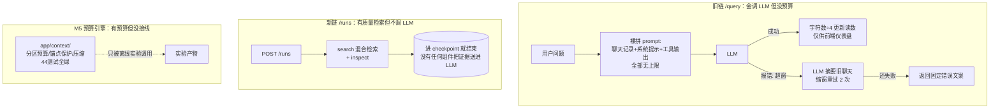
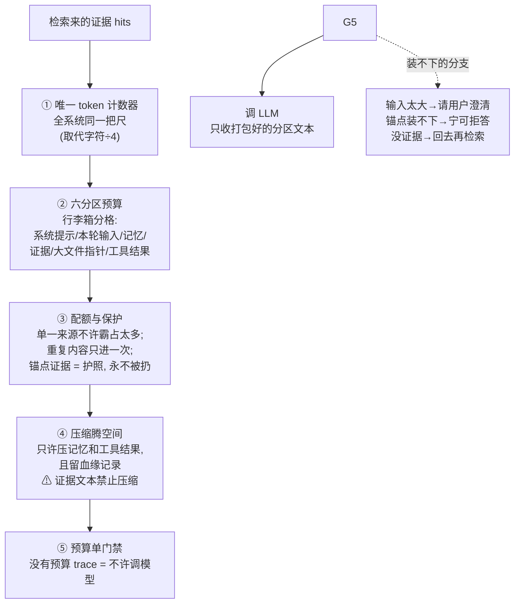

# S4 理解轨讲义：上下文预算控制

> 范围：S4（V3 计划第 11 节）。只读代码、只写文档。
> 所有行号以 2026-09-24 的 `main` 工作区为准；引用前均已打开文件核对。
> 诚实声明（V3 第 4 节红线）：**截至今日，仓库里不存在"检索结果进入 LLM 回答"的生产链路**——`/runs` 控制链（S1-S3 建设）到 `evidence.search → evidence.inspect` 为止，全链无任何 LLM 调用；唯一真实调用 LLM 的是旧链 `/query → convchain_api`，其上下文组装仍是"字符估算 + 阈值告警 + 报错后压缩"。`app/context/`（M5 产物）已交付分区预算引擎、统一 token counter、pin 保护选择器、两级压缩与 artifact 隔离，并通过压力实验，**但 `app/context/__init__.py:1-6` 自己声明"radiant_llm.py is deliberately NOT wired to this yet"**——它只服务离线实验与 eval harness。S4-T2 要做的是把"预算前置"接到真实 LLM 调用前；本讲义中一切 ContextPackage 表述均为目标，不是现状。

---

## 1. 人话摘要（200 字内）

S4 控制"什么、多少、以什么形态进 LLM 窗口"。现状三段各管一截：旧链调 LLM 但只用 `chars//4` 粗算、超窗靠报错后压缩补救；新链检索结果不进 LLM；M5 的 `app/context/` 预算引擎已实现未接线。修完：每次调用模型前先产出有分区预算、来源/模态配额、锚点不可挤、丢弃带原因、可回放 trace 的 ContextPackage，超预算调用前决策，不等报错。

**三种"省 token / 防超窗"机制的差异（必答点 1）**：

| | 旧链字符估算 | 旧链溢出后压缩 | 预算前置（S4 目标） |
|---|---|---|---|
| 谁做 | `update_context_usage`，`radiant_llm.py:669-682` | `convchain_api` 的 BadRequestError 分支，`:2142-2205` | `ContextEngine.assemble`（库已存在，`engine.py:155-268`，**未接线**） |
| 什么时候做 | 调用**后**（`:2223`，回答成功才更新读数）；阈值只驱动 UI 告警（`:684-720`） | API **报错后**（匹配 `"context_length_exceeded"` 等串，`:2145-2150`） | 调用**前**，无预算 trace 不得调模型（S4-T2 第 5 条） |
| 怎么做 | `total_chars // 4` 估算（`:676`），只覆盖 system+memory+input+skill_context | LLM 摘要旧会话轮 + `_keep` 窗口 2→1 递减重试（`:2158/:2172-2190`） | 六分区配额 + pin 保护选择 + 两级压缩（lineage）+ 隔离指针 |
| 失败时表现 | 读数失真（不含 scratchpad 工具结果与 evidence），超窗照样发生 | 已浪费一次报错调用的延迟/费用；重试再败才返回错误文案（`:2199-2205`）；压缩不保证锚点证据保留 | 分支化失败：`clarify`（用户输入过大）/`abstain`（锚点超配额，宁拒答不丢锚点）/`retrieve_more`，全部带 reason 进决策记录 |


---
好。先给 S4 定位：

> **S1 通、S2 稳、S3 准，S4 管的是"找来的证据怎么装进 LLM 的脑子里"**——LLM 的上下文窗口就那么大，装什么、装多少、装不下时扔什么，S4 要在**调用模型之前**全安排好。

## 人话摘要翻译

摘要第一句就点破了现状的尴尬——**系统里三段各管一截，谁也帮不上谁**：

| 段落 | 现状 | 问题 |
|---|---|---|
| 链 `/query` | 真的调 LLM，但 token 用量靠"字符数÷4"瞎估，超窗了等 API 报错再压缩补救 | 会调模型，**没有预算** |
| 新链 `/runs`（S1-S3 建的） | 有高质量检索（混合检索+各种） | 有预算意识，**但结果根本不进 LLM**——链到 inspect 就结束了 |
| `app/context/` 预算引擎（之前 M5 做的） | 六分区预算、锚点保护、压缩，44 个测试全绿 | 有预算引擎，**但没接线**——生产代码没人调它 |

**S4 的活 = 把三段接成一条链：检索来的证据 → 先过预算引擎打包 → 再调M。** 核心原则是"**先预算、后调用**"——装不下在调用前就知道、就决策，而不是等报错。

摘要里那张三种机制对比表，用机场行李类比最好懂（LLM 窗口 = 行李箱）：

| | 旧链字符估算 | 旧链溢出后压缩 | S4 预算前置（目标） |
|---|---|---|---|
| 类比 | 用手掂掂行李多重 | 到机场被拦下了，当场开箱扔东西再托运一次 | 在家就按分区称好重，超重的东西提前决定不带 |
| 什么时候 | 调用**后**才更新读数 | API **报错后**才动作 | 调用**前**，没预算单不许调模型 |
| 怎么算 | 字符数÷4（对 LaTeX 文档能低估 36%） 让 LLM 把旧聊天记录摘要一遍，还不行就再缩窗口重试 | 真 tokenizer 计数，六个分区各有配额 |
| 失败表现 | 读数漏算了工具结果（真正撑爆窗口的东西）；超窗照样发生 | 已浪费一次报错的 API 调用费；压缩不保证关键证据还在 | 装不下时分支处理：输入太大→请用户澄清 / 锚点装不下→宁可拒答 / 没证据→回去再检索 |

## 修改前图（现状：三条互不相干的线）



## 修改后图（目标：先预算、后调用）



为什么是这个顺序：**先决定"谁有资格占预算"（③），再压缩腾空间（④）**——不然会把本来该整条扔掉的东西浪费一次压缩；门禁放最后⑤），它是 S4 和旧链最本质的区别：**旧链的预算是报错后的补救，S4 的预算是调用许可证**。

## 三条红线（不能吹过头的）

1. **预算引擎还没接线**。44 个测试全绿只证明库本身对，生产链没有任何地方调它。S4 完成前不能说"每次调用前都有预算 trace"。
2. **证据文本永远不许压缩改写**。证据的价值在于逐字可核对（引用、页码），改写了引用就失真——只能整条留或整条扔（扔要记理由）。任何"压缩证据省 token"的方案直接违规。
3. **省 token 多 ≠ 答得好**。M5 实测：关掉锚点保护时 token 节省率最高（0.942），但关键证据保留率跌到 0.267——**扔得越狠越省，而最贵的锚点往往先被扔**。所以 S4 的成绩单看锚点保留率+答案质量"，不看节省率。

---

## 2. 修改前图（现状数据流，12 节点）

```text
 [1] POST /query {"query": str}                                   (dict)   app/api.py:340-352
   │  wait_for_model_ready → cb.convchain_api(query)
   ▼
 [2] convchain_api 组装输入                                        radiant_llm.py:2077
   │  + _retrieve_session_context: 会话旧轮 fuzzy+cosine 检索块 prepend
   │    (str; 每轮响应截 600 字符 :2042-2043；检索失败静默吞掉 :2050-2051)
   │  + _memory_summary_note prepend（用户点过"Summarize memory"才有，:2102-2107）
   ▼
 [3] build_skill_context(query) → skill_context                   (str)    radiant_llm.py:1052-1080
   │  字符预算截断：preset char_budget 16_000/24_000（radiant_skill_loader.py:104-105），
   │  超预算块切尾加 "...[truncated]..."（skill_core.py:235-242）——第二处字符估算
   ▼
 [4] ChatPromptTemplate.from_messages                             radiant_llm.py:1356-1363
   │  [MessagesPlaceholder chat_history(k=8 窗口, :642-647)]
   │  + system(prompt_content) + system(skill_context) + system(runtime_context)
   │  + human(input) + [agent_scratchpad]        (list[Message]，无任何 token 预算)
   ▼
 [5] ai_assistant_agent.invoke(payload) → ReAct 循环               radiant_llm.py:1243-1254
   │  工具输出原文进 agent_scratchpad，无大小上限、无隔离、无配额
   ▼
 [6] LLM 调用（ChatOpenAI / Grace vLLM）
   ├── 成功 ─▶ [7] update_context_usage(chars//4, :2223 调用/:676 估算) → response 返回
   └── openai.BadRequestError ─▶ [8] 串匹配超窗错误(:2145-2150)
        ▼
        summarize_chat_history：LLM 把旧轮压成 memory note(:812-846)，
        _keep 缩窗(:853-854)；keep_last 2→1 逐档重试(:2172-2190)
        ▼ 仍失败
      [9] 返回 {"error": "Query exceeded model context limits..."} (:2199-2205)

[10] GET /context-usage（旁路读数） api.py:414-420 → get_context_usage_payload(api.py:400-411
     → radiant_llm.py:684-720)：输出 usage_percent/limit_tokens/status/advice——
     唯一的"上下文用量"出口，数据源就是 [7] 的字符估算，不含 evidence/scratchpad。

[11] POST /runs（新链，S1-S3） api.py:844-919：router→planner→guard→policy→DurableRunner
     → evidence.search（hybrid BM25+Dense+RRF+gate，search_adapter.py:65-103）
     → evidence.inspect（inspect_adapter.py:29-65）→ checkpoint/trace 结束。
     **全链无 LLM 调用**（registry 四个 handler 均为非 LLM，registry.py:274-328）。

[12] app/context/ 预算引擎（旁路，M5）：engine/selector/compressor/isolate/tokenizer
     全套存在，仅被 context.experiment 与 eval harness（eval/adapters.py:389-466）引用；
     生产两条链都不 import 它（__init__.py:1-6 自述未接线）。
```

关键读法：**进 LLM 的那条链没有预算**（节点 4-5：prompt 是占位符拼接，scratchpad 无上限），**有预算的那套库不进 LLM**（节点 12），**有质量检索的那条链不调 LLM**（节点 11）。S4 的全部工作就是把这三段接成一条"先预算、后调用"的链。

---

## 3. 修改后图（T2 目标：新增控制点与失败出口）

以下全部为**目标，不是现状**（S4-T2 六项任务，V3 第 11 节；逐项现状缺口见第 8 节）：

```text
 检索候选（/runs 的 hybrid hits 或旧链工具结果）
   │  (hits[{evidence_id, document_id, chunk_id, page, source, score, snippet}],
   │   hybrid_search.py:168-178 的真实形状)
   ▼
 [新增 CP1] 唯一 token counter 入口（S4-T2-1）：全链路只经 TokenCounter 计数
   │  （tokenizer.py:95-102 tiktoken o200k 优先 / 标定启发式回退），
   │  冻结 ContextPackage/ContextItem 契约：每条内容带 partition、tokens、
   │  source、modality、lineage（Evidence ID / source span / artifact pointer）
   ▼
 [新增 CP2] 六分区预算（S4-T2-2）：system / active_turn / memory / evidence /
   │  artifact / tool_result + response_reserve（budgets.py:28-46 默认布局）；
   │  BudgetConfig.validate 拒绝配额总和超窗（budgets.py:68-78）
   │  失败出口: active_turn 超配额 → clarify（换占位符+drop 记录，不静默截断，
   │            engine.py:172-181）
   ▼
 [新增 CP3] 配额与锚点层（S4-T2-3）：source/modality quota（防单一来源/模态
   │  挤占，现状仅有 per-page 上限 selector.py:139-141，source/modality 维度是缺口）；
   │  anchor pinning：pinned 证据先入场、永不被挤，超配额则 overflow→abstain
   │  （selector.py:130-136）；dedup（同 chunk 多版本/多车道重复）；
   │  neighbor expansion（相邻 chunk 补上下文）
   │  失败出口: 每个被舍弃项进 decision.drops 带 reason（engine.py:198-201）
   ▼
 [新增 CP4] 递归压缩（S4-T2-4，仅 memory/artifact/tool_result，
   │  compressor.py:212-227 对 evidence 抛 EvidenceCompressionError——语义红线）：
   │  规则级 → LLM 递归级（深度≤3）→ 硬截断兜底，每步进 CompressionLineage；
   │  压缩后仍保留 Evidence ID / source span / artifact pointer 的引用关系
   │  失败出口: 压缩仍超 → abstain；大 tool result → 隔离为 artifact pointer
   │            （isolate.py:64-79，内容寻址+哈希校验 resolve）
   ▼
 [新增 CP5] 预算 trace 门禁（S4-T2-5）：ContextDecision（decision/reasons/
   │  drops/compressions/pointers/usage，engine.py:66-87）落 trace；
   │  **没有预算 trace 不得调用模型**——这是"预算前置"的强制点
   ▼
 LLM 调用（只收 AssembledContext.text，分区标记 [SYSTEM]/[ACTIVE TURN]/
   [MEMORY]/[EVIDENCE]/[ARTIFACTS]/[TOOL RESULTS]，engine.py:238-253）
   ▼
 [S4-T2-6] 真实小型多 PDF + 单独标记的 pseudo-source 压力对照
   （复用 context.experiment 的 pseudo-source 方法学，experiment.py:12-37）
```

**为什么是这个顺序**：配额/pin/dedup（CP3）必须在压缩（CP4）前——先决定"谁有资格占预算"，再对可压缩分区腾空间，否则会把本该整条丢弃的内容浪费一次压缩；隔离（大输出落盘）在一切之前（engine.py:167-169），因为它是纯收益操作（指针 stub 远小于原文）；预算 trace 门禁（CP5）在最后、模型调用前，这是 S4 与旧链最本质的区别：**旧链的"预算"是一次报错后的补救动作，S4 的预算是调用许可本身**。

---

## 4. 固定案例：TEACH-T01 逐步 I/O

案例原文（benchmarks/teaching_case.jsonl，S0 冻结）：*"What two main components does the Transformer architecture consist of? Answer with the PDF name, page number and Evidence ID."*，workspace=default。gold 只作验收锚点，不写进任何运行参数。

**现状逐步 I/O（/runs 新链，到 inspect 为止，无 LLM）**：

1. `POST /runs {"goal": <上句>, "workspace": "default"}`（api.py:844-919）：rule router 判 TOOL_CALL → planner 出两步计划（evidence.search → evidence.inspect）→ guard/policy 通过 → 后台线程跑 DurableRunner（api.py:906-907, 782-791）。
2. `evidence.search` handler（search_adapter.py:41）：`top_k` 钳制 1..20（:53）；`RADIANT_EVIDENCE_SEARCH_MODE` 默认 auto（:56-63）→ 先试 hybrid 车道（:65-103）：
   - BM25（零分候选剔除）与 Dense 双路召回 recall_k=max(20, top_k*4)（hybrid_search.py:109, 116-124）；
   - RRF k=60 融合（:125）；metadata filters（workspace/degraded）+ 相关性门 min_score_ratio=0.5（:134-140）；
   - 充分性 grader；判 retrieve_more 时**一次**有界扩召回（recall_k×2 上限 80），不静默填充（:145-153）；abstain 则 hits 置空（:155-159）。
3. 输出形状（ToolResult.output，search_adapter.py:81-95）：

```json
{"query": "...", "retrieval": "hybrid_bm25_dense_rrf", "unresolved_count": 0,
 "hits": [{"evidence_id": "ev-...", "document_id": "...", "chunk_id": "...:p1:c2",
           "page": 1, "source": "...", "score": 0.032266, "snippet": "<前240字符>"}],
 "lanes": {"bm25": [...], "dense": [...], "fused": [...]},
 "rrf_k": 60, "recall_k": 20, "index_fingerprint": "<sha256前16>",
 "gate": {"workspace": "default", "dropped_count": N, "dropped": [...]},
 "sufficiency": "enough|retrieve_more|conflict|abstain",
 "sufficiency_reasons": [...], "retrieve_more": false}
```

   （hits 单条形状见 hybrid_search.py:168-178：snippet 只是内容前 240 字符；`score` 是 RRF 融合分。）hybrid 不可用时回退关键词车道，`retrieval="kb_keyword+store_resolve"` 并带 `hybrid_fallback_reason`（search_adapter.py:105-159）。
4. 绑定解析后 `evidence.inspect(evidence_ids)`（inspect_adapter.py:29-65）：逐条 `store.get_evidence`；workspace 不匹配→**整个调用 DENIED**（fail closed，:43-51）；输出 `{"evidence": [完整记录含 content/source_span/valid_from/valid_to...], "not_found": [...], "mock": false}`（:62）。
5. **链路到此结束**：结果进 checkpoint 与事件流，没有任何组件把 evidence 拼进 prompt 或调用 LLM。

**旧链 /query 的逐步 I/O（同一问题，真实调 LLM）**：query+目录提示拼成 `tool_query`（radiant_llm.py:2088-2095）→ prepend 会话检索块（:2097-2100）→ prepend 压缩记忆 note（:2102-2107）→ skill_context 按字符预算构建（:2119）→ 四样填入 ChatPromptTemplate 占位符（:2133-2141 配合 :1356-1363）→ agent.invoke。**注意：这条链里 evidence 根本不来自 /runs 的检索**——模型靠自己 ReAct 调 PDF 工具，工具输出原文进 agent_scratchpad，无预算、无 pin、无 dedup、无 trace。

**T2 目标 I/O 形状**（同一问题）：hits 映射为 `EvidenceItem`（evidence_id/content/page/score/authority_level/pinned，selector.py:42-52；gold 锚点标 `pinned=True`）→ `ContextEngine.assemble(system, active_turn, memory, evidence, tool_results, artifacts)`（engine.py:155-163）→ 输出 `AssembledContext{text, partitions, evidence, selection, decision}`（engine.py:90-97, 255-268），其中 `decision.to_dict()` 给出：decision（五分支之一）、reasons、drops（每项 partition/item_id/reason/tokens）、compressions（每条 input/output sha256+method+token 前后值）、pointers（uri+sha256+summary）、usage（逐分区 token 数）。**预算 trace 存在且 decision 允许时，才许可 LLM 调用。**

---

## 5. 状态流：内存 / SQLite / 文件 / trace 四分

| 概念 | 存在哪 | 谁写 | 谁读 | 重启后 |
|---|---|---|---|---|
| **会话记忆**（ConversationBufferWindowMemory k=8；`_memory_summary_note`；`_prev_session_summary`） | 仅内存（radiant_llm.py:642-658） | convchain 每轮自动写；`summarize_chat_history` 改 `_keep` 缩窗（:853-854） | prompt 组装时经 `chat_history` 占位符进 LLM | **丢失**（但 JSONL 会话文件在，load_session 可回填，:1831+） |
| **context_usage_percent**（字符估算产物） | 仅内存（:620） | `update_context_usage`（:2223 成功后调用） | `/context-usage`（api.py:414-420）、stream final 帧（api.py:545-546） | 归零——**它从来不是账本，只是仪表** |
| **会话 JSONL + index.json**（含 summary） | 文件系统 session dir | 每轮追加；summarize 回写 index summary（:856-865） | `_retrieve_session_context` fuzzy+cosine 检索（:2024-2032） | 保留——跨会话记忆的现状载体 |
| **EvidenceStore**（多版本证据） | SQLite（RADIANT_EVIDENCE_DB） | 摄取；supersede 只 UPDATE 列 | evidence.search/inspect；M5 实验经 `load_text_evidence` 读 | 保留——S4 输入材料的源 |
| **M5 决策记录 / 压力实验产物**（ContextDecision、metrics.json、REPORT.md、artifact_store 文件） | `artifacts/context/m5-20260922/`（真实存在） | context.experiment / eval harness | eval、人 | 保留——**但生产链不产生这种 trace**（现状缺口） |
| **durable run 状态**（runs/checkpoints/events） | SQLite（durable.db） | DurableRunner | /runs API、resume | 保留——S4 预算 trace 应挂到同一 run 的 trace 体系（trace.py:15-17 已预留 context layer 适配） |

关键区分：旧链的"压缩"改的是**内存窗口**（`_keep` 缩窗）+ **内存 note**，JSONL 原文不动（:848 注释明说 NEVER touched）；S4 的压缩将产出**带 lineage 的新内容对象**（input/output 哈希可溯源），两者不可混为一谈。

---

## 6. 关键代码位置（5 处）

**① `app/radiant_llm.py:669-682` `update_context_usage`（现状唯一的"token 计数"）**
输入：memory 全部消息 + `prompt_content` + 当前输入 + skill_context；输出：无返回，写 `self.context_usage_percent`；副作用：仅改内存读数；失败行为：任何异常→读数归零（:681-682），即"估不出就当没用"；重要性：**这是旧链全部预算智能的源头**——`total_chars // 4`（:676）对 LaTeX 重的 M0 语料低估约 36%（tokenizer.py:28-31 有对照标定），且分母 `context_limit_tokens=128_000` 硬编码（:619）；更致命的是分子不含 agent_scratchpad（工具结果）与任何 evidence——ReAct 循环里真正撑爆窗口的东西根本没被计数。它驱动三个阈值：soft 55% / recommend 70% / auto 85%（:575-577），全部只产生 UI 文案（:692-717），不拦截调用。

**② `app/radiant_llm.py:2077-2223` `convchain_api`（旧链 prompt 组装 + 溢出补救的实际机制）**
输入：query 字符串；输出：{query, response, intermediate_steps, reasoning_events, ...}（:2258-2267）；副作用：写 reasoning_events、更新会话索引（:2256）、成功后更新用量读数（:2223）；失败行为：分三层——agent 未就绪→`{"error": "No model initialized..."}`（:2085-2086）；`openai.BadRequestError` 且错误文本含四种超窗标记之一（:2145-2150）→ 调 `summarize_chat_history(keep_last_turns=2)`（:2158，另一次 LLM 调用 :825-830）→ `chat_memory._keep` 按 2→1 递减重试至多两次（:2172-2190）→ 全败返回固定错误文案（:2199-2205）；重要性：**这是"溢出后压缩"的全部**——它在已经付出一次失败调用的代价后才动作，压缩对象是"会话记忆"这一个分区，对 evidence/工具结果/system 不做任何事，不保留任何锚点语义，也不留预算 trace。注意它匹配的是**错误字符串**，不同模型/网关的错误文案一变就漏判。

**③ `app/api.py:400-420` `/context-usage`（唯一的用量出口，及其盲区）**
输入：无；输出：`{usage_percent, limit_tokens, warn, compress, soft_prompt, recommend_summary, auto_compress, status, advice, can_summarize, memory_messages}`（radiant_llm.py:708-720）；副作用：调用即触发一次 `update_context_usage` 重估（:685）；失败行为：`cb` 缺方法时退回简化 payload（api.py:404-411）；重要性：前端环形用量指示和"Summarize memory"按钮都靠它——**用户看到的"上下文用量"只是 system+memory+input+skill 的字符估算**，evidence、scratchpad、压缩后实际进模型的 token 数都不在图上。S4 的预算 trace（逐分区 usage，engine.py:209-222）是这个端点的替换数据源。

**④ `app/context/engine.py:155-268` `ContextEngine.assemble`（M5 已存在的预算前置引擎，未接线）**
输入：system / active_turn / memory（str 或 list）/ evidence（EvidenceItem 序列）/ tool_results / artifacts；输出：`AssembledContext`（text+partitions+selection+decision，:255-268）；副作用：唯一 I/O 是大输出落盘（经注入的 ArtifactStore，:123-137），其余纯内存计算；失败行为即五分支（优先级序，:224-236）：pinned 超 evidence 配额→`abstain`（**锚点仍在装配结果中，绝不丢 pin**，:202-207）；用户输入超配额→`clarify`（换显式占位符+drop 记录，不静默截断，:172-181）；无证据→`retrieve_more`（:230-232）；有压缩/舍弃/隔离→`compress`；否则 `assemble`。重要性：**S4 想要的行为 80% 已经在这 268 行里**——逐分区 usage（:209-217）、无静默截断（每 drop 带 reason，:198-201）、evidence 只整条留/整条弃（经 selector 与 compressor 红线）。缺口在：EvidenceItem 契约未含 source/modality 维度（quota 无从实施）、无 dedup/neighbor expansion、没有任何生产代码调它。tests/context 44 个测试钉住了这些行为（2026-09-24 实测 `PYTHONPATH=app runtime/bin/python3.12 -m pytest tests/context -q` → 44 passed）。

**⑤ `app/evidence/search_adapter.py:65-103` + `app/evidence/hybrid_search.py:85-207`（S4 输入材料的真实形状）**
输入：{query, top_k, workspace_id?}；输出：第 4 节 JSON 形状——hits（evidence_id/page/score/snippet）+ lanes 三路排名 + gate drop 明细 + sufficiency verdict；副作用：进程内索引缓存（按 evidence-id 指纹失效，hybrid_search.py:68-82）；失败行为：向量库缺失→typed `HybridSearchUnavailable`，auto 模式记 fallback_reason 回退关键词车道（search_adapter.py:72-76, 158-159），hybrid 模式直接 TERMINAL_ERROR；grader 判 abstain→hits 置空（hybrid_search.py:155-159）；重要性：**这是 ContextPackage 的 evidence 分区原料**——已经带 lineage（lanes/gate/sufficiency）但**不带 token 计数、不带全文**（snippet 仅 240 字符，:176），S4-T2 的映射层要按 evidence_id 取回 content 并计数。同时注意 sufficiency=abstain 时 ContextEngine 会收到空 evidence → `retrieve_more` 分支，两个"不足"信号需要在接线时对齐语义。

---

## 7. 术语表（8 个）

- **ContextPackage**：LLM 调用前组装好的"上下文包裹"——分区内容 + 每条目的 token 数、来源、模态、lineage + 决策记录。**现状不存在此契约**（S4-T2-1 要冻结 ContextPackage/ContextItem）；库里最接近的是 `AssembledContext`（engine.py:90-97）。
- **唯一 token counter 入口**：全系统所有"这段文字几个 token"都经同一个 `TokenCounter` 回答（tokenizer.py:69-105；进程级默认实例 :132-138）。重要性：预算、选择、压缩、trace 必须用同一把尺，否则配额在两套估算法之间漏风——现状旧链用 `chars//4`（radiant_llm.py:676）、M5 库用 TokenCounter、skill 用字符预算，三把尺并存。
- **分区预算（partition budget）**：把窗口按用途切成 system/active_turn/memory/evidence/artifact/tool_result 六区加 response_reserve，各有配额（budgets.py:28-46 默认 128k 布局）；超配是一等可检查状态（BudgetUsage.margin/is_over，budgets.py:115-140），不是一个总百分比。
- **Source/Modality quota**：单一来源（某个 PDF）或单一模态（text/figure/table）最多占 evidence 预算的固定比例，防止一个高产来源把别的来源全挤出去。**现状缺口**：selector 只有 per-page 上限 2 条（selector.py:139-141），没有来源/模态维度——S4-T2-3 新增。
- **Anchor pinning**：用户在问的那个具体位置（gold 页/锚点证据）标 `pinned=True` 后**不可被配额挤掉**——先入场先占预算；连它都装不下就 overflow→abstain 拒答，绝不静默丢锚点（selector.py:130-136）。
- **Dedup**：同一条内容只进一次上下文——同一 chunk 的多版本（S3-2 已用列级现行版本映射解决检索侧）、多车道召回重复（RRF 对同 evidence_id 天然合一）、近重复 chunk（per-page cap 部分覆盖）三层；内容哈希级 dedup 是 S4-T2-3 项。
- **Neighbor expansion**：命中 chunk 的相邻 chunk（同页前后段）一并考虑，避免断章取义式碎片进上下文。**现状完全无此机制**（grader 的 retrieve_more 是查询级扩召回，不是 chunk 邻居，hybrid_search.py:148-153）——S4-T2-3 项。
- **Artifact pointer**：大对象落盘、上下文里只留指针 stub（uri+sha256+大小+160 字符摘要+原 token 数，isolate.py:29-44）；`resolve` 读回时校验哈希（:81-90）。与内联正文的取舍见第 9 节必答点 9。

---

## 8. T2 变更清单（S4-T2 按 V3 第 11 节：六项）

**现状基线**（2026-09-24 实测）：`PYTHONPATH=app runtime/bin/python3.12 -m pytest tests/context -q` → **44 passed**（8 个测试文件）。注意：需要 `PYTHONPATH=app`，因为 tests/context/conftest.py 不像 tests/retrieval/conftest.py:7 那样自带 sys.path 注入（观察记录，非修改项）。M5 压力实验产物在 `artifacts/context/m5-20260922/`（metrics.json + REPORT.md + artifact_store），报告见 docs/CONTEXT_BUDGET.md:131-162。

**各任务卡对应的现状与缺口**（全部为目标，不是现状）：

- **S4-T2-1 ContextPackage/ContextItem 契约 + 唯一 token counter**：缺口——无冻结契约（`AssembledContext`/`EvidenceItem` 是 M5 库内数据结构，evidence 项缺 source/modality 字段）；生产侧 token 计数仍是 `chars//4`（radiant_llm.py:676）。目标：契约落 app/context（或新模块），`TokenCounter` 成为唯一入口，`RADIANT_TOKENIZER_BACKEND` 可控（tokenizer.py:136-137）。
- **S4-T2-2 六分区预算**：缺口——BudgetConfig/BudgetUsage 已实现且校验完备（budgets.py:68-78），但无人调用；旧链阈值 55/70/85 硬编码且只管 memory。目标：调用前逐分区记账，usage 进 trace。
- **S4-T2-3 source/modality quota + anchor pinning + dedup + neighbor expansion**：缺口——pin 与 per-page cap 已在 selector（:121-152）；**source/modality quota、内容级 dedup、neighbor expansion 三者均无实现**。目标：selector 扩展配额维度与去重， neighbor 扩展在 hits→EvidenceItem 映射层做（需按 source_span 取相邻 chunk）。
- **S4-T2-4 递归压缩保留 lineage**：缺口——两级压缩与 lineage 已实现（compressor.py:184-210），LLM 递归级靠注入 callable（:164-181），**生产侧没有注入真实 summarizer**（测试用 stub，conftest.py:28-37）；压缩后保留 Evidence ID/source span/artifact pointer 的引用关系需要契约级保证（当前 lineage 只记整段哈希）。evidence 红线已有测试钉死（test_engine.py:122-130）。
- **S4-T2-5 接入真实回答 LLM 前；无预算 trace 不调模型**：缺口——生产链没有任何 ContextEngine 调用点；接入面有两个候选：旧链 convchain_api（替换 :2133-2141 的裸 invoke）与/或新链在 /runs 计划里加"回答"节点。决策点：先接哪条，T2 开工时按最小侵入定。trace 挂 trace.py 已预留的 context layer（trace.py:15-17, 36）。
- **S4-T2-6 真实小型多 PDF + pseudo-source 压力对照**：缺口——真实语料仍只有 1 篇文档 119 chunk（experiment.py:14-18 说明）；pseudo-source 方法学与产物已存在但结论注明是下界（CONTEXT_BUDGET.md:110-129）。目标：真实多 PDF 小集 + 单独标记的 pseudo-source 对照，指标含 token ratio、gold/visual retention、答案质量（S4 阶段门）。

**预计修改/新增文件**：`app/context/`（契约、selector 配额扩展、engine 接线面）、`app/radiant_llm.py`（convchain_api 接入预算组装，替换字符估算）、`app/api.py`（/context-usage 换数据源）、新增 hits→EvidenceItem 映射层（`app/evidence/` 或 `app/context/`）、`tests/context/`（配额/dedup/neighbor/接线合同测试）、`app/observability/trace.py`（context trace 落盘接线）。

**禁止修改**：`benchmarks/teaching_case.jsonl`、`benchmarks/context_cases.jsonl`（冻结，tests/context/test_benchmark_cases.py 校验其结构）、gold 相关断言、`artifacts/baseline/` 与 `artifacts/context/m5-20260922/` 冻结产物、tests/context 44 基线不得降、evidence 语义红线不得破（任何"压缩证据文本省 token"的方案直接违规）、不得把计划写成事实。

**将先写的失败测试（红→绿）**：

1. convchain_api 在调用 LLM 前产出预算 trace（decision+usage），无 trace 不发起模型调用（当前红：无此机制）。
2. 同一 chunk 多版本 + 多车道重复的候选进入组装后只出现一次，且被去掉的重复带 dedup reason（当前红：无 dedup）。
3. 单一来源候选超过 source quota 时被截留并带 reason，锚点 pinned 项不受 quota 影响（当前红：无 source quota）。
4. 递归压缩后的 memory/tool_result 文本仍能通过 lineage 回溯到原 Evidence ID/artifact pointer（当前红：lineage 只有整段哈希）。
5. evidence 分区内容逐字节等于原文（已有 test_engine.py:122-130，保留为回归）。

**Smoke 计划**：baseline 副本（RADIANT_EVIDENCE_DB / RADIANT_EVIDENCE_KB_DIR / RADIANT_VECTOR_STORE 指 artifacts/baseline/m0-20260922）对 TEACH-T01 跑一次接入后的回答链；断言：调用前有 ContextPackage trace（decision/usage/drops 全字段）、gold evidence_id 在 evidence 分区、token 计数来自 TokenCounter（backend 落档）；证据包按 V3 第 6.2 节进 `artifacts/control-v3/S4/`。

**回滚方式**：接入点走 feature flag（仿 registry 的 RADIANT_EVIDENCE_*_REAL 模式，registry.py:241-264），flag 关=恢复旧裸 invoke 路径；`app/context` 为纯增量库，零 schema 变更；旧 `update_context_usage` 保留作 UI 兜底读数。

---

## 9. 三件必须记住的事

1. **三段各管一截，没有一处"调用前预算"**：会调 LLM 的旧链（convchain_api）只有 `chars//4` 事后估算和报错后压缩；有质量检索的新链（/runs）不调 LLM；有预算引擎的库（app/context）不进生产。S4 的本质是把这三段接成"先预算、后调用"的一条链——对外只能说"M5 库已实现并通过 44 单测与压力实验，接线是 S4-T2 目标"。
2. **证据文本永远不被压缩改写**：`compress_partition("evidence", ...)` 直接抛 `EvidenceCompressionError`（compressor.py:216-220）——证据只能整条留或整条弃（带 reason）；压缩只作用 memory/artifact/tool_result 且必带 lineage。锚点 pin 宁可触发 abstain 拒答也不丢（selector.py:130-136，test_engine.py:77-87 钉死）。
3. **token 节省率不等于质量**：M5 实验里 pin 关、100 sources 时 token 节省率高达 0.942，但 gold 保留率跌到 0.267——"省得多"和"答得对"可以反向（CONTEXT_BUDGET.md:133-162）。S4 的评价指标是 gold/visual retention、答案质量与崩溃区间对照，token ratio 只是成本指标。

---

## 10. 自测题（折叠答案）

**Q1（数据流）**：TEACH-T01 分别走 /runs 与 /query，两条链各自在哪一步停、evidence 各以什么形态出现（或不出现）？旧链超窗时系统按什么顺序做什么？

<details><summary>答案</summary>

/runs：router→planner→evidence.search（hybrid：BM25+Dense→RRF k=60→metadata/相关性 gate→sufficiency grader，不足时一次有界扩召回）→ evidence.inspect（workspace fail-closed）→ **停在 checkpoint/trace，无 LLM**；evidence 以 hits（evidence_id/page/score/240 字符 snippet）+ 完整 inspect 记录形态存在（hybrid_search.py:168-178, inspect_adapter.py:62）。/query：evidence **不出现**——模型 ReAct 自己调工具，工具输出原文进 agent_scratchpad；prompt 是 chat_history+三个 system 占位+human+scratchpad 的裸拼接（radiant_llm.py:1356-1363）。超窗顺序：API 抛 BadRequestError → 错误文本匹配四种超窗标记（:2145-2150）→ LLM 摘要旧会话轮成 memory note（:2158, 实际摘要调用 :825-830）→ `_keep` 窗口按 2→1 递减重试至多两次（:2172-2190）→ 全败返回错误文案（:2199-2205）。注意用量读数只在**成功后**更新（:2223）。

</details>

**Q2（设计取舍）**：为什么"预算前置"优于"溢出后压缩"？为什么 evidence 分区被禁止压缩，而 memory 可以被递归压缩？

<details><summary>答案</summary>

预算前置在调用前就知道装不下并做决策（压缩/收窄/abstain），失败成本是一次本地计算；溢出后压缩要先付一次失败 API 调用的延迟与费用，再付一次 LLM 摘要调用，且补救只作用于 memory 一个分区——evidence 和工具结果照爆（radiant_llm.py:2142-2205）。它还依赖错误文案串匹配，模型一换就漏。前置的另一收益是**归因**：每个丢弃在发生时就带 reason 进 trace（engine.py:198-201），事后补救无法回答"锚点什么时候丢的"。evidence 禁压是语义红线（compressor.py:216-220）：证据的价值在于逐字可核对（引用、页码、原文 span），改写后 citation 失真且无法审计，所以只允许整条留/整条弃；memory 是会话摘要性内容，本来就是派生物，递归压缩（规则→LLM 递归≤3 层→硬截断兜底）配合 input/output 哈希 lineage（compressor.py:200-209）保持可溯源，风险可控。

</details>

**Q3（失败后果）**：pin 关闭时 100 个来源涌入会发生什么？为什么 token 节省率此时反而更高？无预算 trace 直接调模型会丢掉什么？

<details><summary>答案</summary>

M5 实测（pseudo-source 下界，CONTEXT_BUDGET.md:148-162）：pin 关时 gold 保留率先被 per-page cap 钉在 0.4（同页 5 条 gold 最多进 2 条——设计行为但稀释锚点），25 sources 起出现间歇性事实丢失（高分近义干扰挤出承载事实的 gold chunk），100 sources 时 1/3 rep gold 全灭（0.267±0.189）；pin 开则 1→100 sources 全程 gold 保留 1.000。节省率反而更高（0.942 vs pin 开 0.939）是因为丢弃本身就在"省 token"——**节省率度量的是扔掉了多少，不度量扔掉的是什么**；把最贵的锚点扔了最省 token。所以 S4 指标必须是 retention + 答案质量 + 崩溃区间对照。无预算 trace 直接调模型则丢掉：每个丢弃的 reason（无法解释锚点去向）、逐分区 usage（无法定位哪个分区撑爆）、决策分支记录（无法区分"该 clarify 却硬答"）、压缩 lineage（无法回溯原文）——即现状旧链的状态：唯一线索是 reasoning_events 里几行内存日志。

</details>

---

## 11. 面试表达

**60 秒口述**：

"我在给一个 PDF 知识问答 Agent 做上下文预算控制。问题背景是'材料越多越崩溃'：检索回来的证据多了以后，真正答问的那一页会被高分但宽泛的 chunk 挤出上下文窗口，答案引用错页而且不报错。现状是系统里三段各管一截：调 LLM 的老链只用字符数除以四粗算 token，超窗靠 API 报错后再压缩会话记忆补救；新建设的检索链有混合检索和门控但结果不进 LLM；而我此前里程碑交付的上下文预算引擎——六分区 token 配额、锚点证据 pin 保护永不被挤、证据文本禁止语义压缩的红线、两级压缩带 lineage、大输出隔离成带哈希校验的 artifact 指针——通过了四十四项单测和一百个伪来源的压力实验，但还没接进生产。S4 的工作就是把它接到真实模型调用前：冻结 ContextPackage 契约和唯一 token counter，加来源和模态配额、去重、邻居扩展，并且强制没有预算 trace 不得调模型。评价不用 token 节省率——实验里节省率最高的情况恰恰是锚点全丢的情况——而用锚点保留率、答案质量和崩溃区间对照。"

**可以说**（现状已验证表述）：

- 旧链上下文机制的实际实现：`chars//4` 估算、55/70/85 阈值、BadRequestError 后 LLM 摘要+缩窗重试（行号见第 6 节①②）；/context-usage 端点的数据源与盲区。
- `app/context/` M5 库：六分区预算、TokenCounter（tiktoken 优先+标定启发式回退及误差表）、pin 保护选择器、两级压缩+lineage、artifact 隔离（内容寻址+哈希校验）、五分支决策；44 单测全绿、压力实验产物在 `artifacts/context/m5-20260922/`。
- 压力实验结论（pseudo-source 方法学、pin 开/关对照、失败 onset 区间、节省率≠质量的实测证据），并主动说明 pseudo-source 是下界、answer 代理指标的污染风险（CONTEXT_BUDGET.md:110-129）。
- /runs 链检索输出的真实形状（lanes/gate/sufficiency 全留痕）与"全链无 LLM"的事实。

**暂时不能说**：

- "ContextPackage 已上线/每次调用前都有预算 trace"——契约未冻结、引擎未接线，S4-T2 才是实现轨；只能说"库已实现并验证，接入是 S4-T2 目标"。
- "source/modality quota、dedup、neighbor expansion 已实现"——三者均无实现（现状只有 per-page cap 与 RRF 天然合一）。
- "token 节省 X% 带来质量提升"——节省率与质量无因果，且现有数字全部来自 pseudo-source 实验，真实多 PDF 对照是 S4-T2-6。
- "回答链已接检索证据"——/runs 到 inspect 为止，旧链不吃 /runs 的 hits；任何"端到端 RAG 回答"表述都要等 S4-T2-5。
- Memory 治理、claim 引用、视觉证据（S5/S6/S7 后续阶段）。
