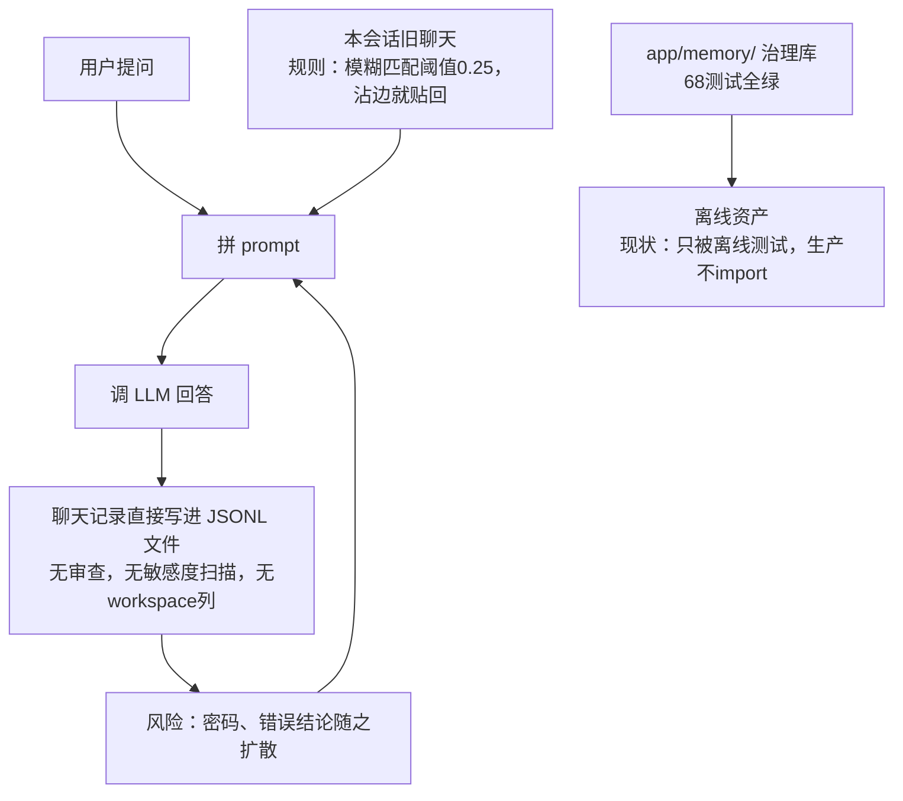
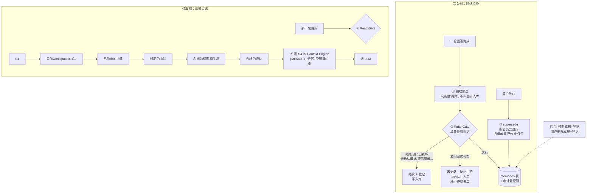

# S5 理解轨讲义：Memory 治理控制

> 范围：S5（V3 计划第 12 节）。只读代码、只写文档。
> 所有行号以 2026-09-24 的工作区为准；引用前均已打开文件核对。
> 现状验证：`runtime/bin/python -m pytest tests/memory -q` → **68 passed**（2026-09-24）。
> 诚实声明（V3 第 4 节红线；2026-09-28 S10 更新）：**`app/memory/` 治理库已完整存在并已接线**——召回侧经 `context.assemble`（`app/context/assemble_adapter.py`）注入 ContextPackage 的 memory 分区；写入侧有两条受控路径：显式 `POST /memories`（S5-2），以及回答被 verifier accept 后自动写 session 摘要 + evidence_pointer（S10，`app/memory/candidates.py` → 默认拒绝的 Write Gate；user_fact/decision 仍需人工确认，禁止自动提升）。**本讲义写作时（2026-09-24）的原始声明是「只有测试与 eval harness 引用 `app/memory`」——该现状描述已被 S5-2/S5-3/S10 接线取代，保留此句以示口径演进。**旧链 `/query → convchain_api` 的记忆仍是 JSONL 会话文件 + k=8 窗口，无 gate。

---

## 1. 人话摘要（200 字内）

S5 把"聊天历史文件"升级为可治理 Memory。现状是两层脱节：生产链的记忆只是 JSONL 会话文件加 k=8 滑动窗口，旧轮靠 fuzzy 匹配直接贴回 prompt，谁都能写、永不失效、不知来源；而 `app/memory/` 里已有一套离线治理库——写入必须过 Write Gate（默认拒绝）、召回必须过 Read Gate（workspace/TTL/superseded/主题过滤）、替换只走 supersede、全程审计——但它没接线。修完用户能看到：模型不再"记住"未经你确认的事，过期和作废的记忆不再混入回答，每次写入/拒绝/删除都可查。

好。S5 的定位一句话：

> **S3 管"查来的资料准不准"，S4 管"装进脑子时装多少"，S5 管的是"模型自己的事后记忆"**——聊天中产生的"记住我的偏好""上次那个参数"这类东西，谁能写、谁能读、什么时候过期、改口了怎么办。

## 人话摘要翻译

核心还是那句熟悉的话：**治理库已经写好了（68 个测试全绿），但没接线**。现状生产的"记忆"非常原始：

| 现状（未接线）问题 | 说明 |
| ---- | ---- |
| 聊天记录就是 JSONL 文件 + 最近 8 轮窗口 | **谁都能写**：模型/用户说什么都直接落盘，无审查 |
| 旧对话靠模糊匹配贴回 prompt（阈值低到0.06~0.25） | **谁都能读**：话题稍沾边就串，别的会话、别的 workspace 的原文直接混进来 |
| 没有过期概念 | **永不失效**：三年前"本周先用单机部署"还在影响回答 |
| 改口就是再写一条 | **新旧并存互相矛盾**，或静默覆盖丢历史 |
| 无审计 | 回答不出"这条记忆哪来的" |


摘要里的两条具体泄漏路径值得记住（都是当前代码事实）：

1. **跨会话串味**：你在会话 A 说了句"临时密码是 X"→ 无审查写进 A 的聊天文件 → 你在会话 B 问"上次那个参数"→跨会话搜索工具扫**所有**会话文件 → A 的原文（含密码）直接贴进 B 的 prompt。全程没有"这条能不能给别的会话看"的概念。
2. **跨 workspace 泄漏**：会话文件里**根本没有 workspace 这一列**，所以搜索时想按 workspace 过滤都做不到——甲项目的聊天记录可以直接进乙项目的上下文。（对照：证据库和治理库都有 workspace 列，泄漏恰恰发生在最老旧的聊天路径。）

修完后的样子，用**档案室**类比（现在是本谁都能乱写乱复印记事本）：

| 机制 | 档案室类比 |
|---|---|
| Write Gate（写入闸） | 入库接待员：所有东西只是"**提案**"，默认拒绝；11 条拒收规则（无来源/是密钥/确认的偏好/置信度太低……） |
| Read Gate（读取闸） | 借阅员四查：是不是**你部门**的 → 是不是**已作废**的 → 是不是**过期**的 → 和你问的**话题相关**吗 |
| supersede（替换） | 改档案**永不涂改原件**：新档案过审入库，旧档案盖"已作废"章保留备查 |
| conflict（冲突） | 新旧说法打架时不自作主张：没确认的**反问用户**，已确认的**进人工审核队列** |
 memory_audit | 出入库登记簿：每次写入/拒绝/作废/删除都有记录可查 |
| evidence_pointer | 参考资料只能**引用编号**，不许复印进个人档案（证据库才是权威，复制出的副本不会跟着失效） |

### 修改前图（现状：一本没人管的记事本）




## 修改后图（目标：档案室）



## 三条红线

1. **治理库没接线**。68 个测试全绿只证明库本身对；生产的记忆仍是 JSONL + 模糊直贴，无闸、无 workspace、无 TTL、无审计。S5 完成前不能说"记忆已治理"。
. **证据只能引用指针、不能复制成记忆**。证据库是带版本和有效期的权威；复制一份成"用户事实"后，原件作废了副本不会跟着失效，陈旧结论就永久残留。代码已把这条路封死。
. **默认拒绝 + 永不静默覆盖**。候选永远只是候选；用户偏好/决策必须带"用户确认"才能入库；冲突只走反问/人审/supersede 三条路。

一个教学点：固定案例 TEACH-T01 的正确记忆行为是**什么都不写**"——它只是查了个资料，没有什么需要记住的。如果系统"勤快"地把回答存成事实，Write Gate 会用 `evidence_as_user_fact`（把证据当用户事实）和 `missing_user_confirmation`（未经确认）两条理由拒掉。

---

## 2. 修改前图（现状数据流，12 节点）

```text
 [1] POST /query {"query": str}  /  POST|GET|DELETE /sessions*        (dict)
     app/api.py:340 / api.py:438-481
   │
   ▼
 [2] convchain_api(query)                                     radiant_llm.py:2077
   │  ① _retrieve_session_context：同会话旧轮 fuzzy+TF-IDF 检索块直接 prepend
   │     (str; threshold=0.25, top_k=4; radiant_llm.py:2009-2068 → session_store.py:246-327)
   │  ② _memory_summary_note prepend（用户点过"Summarize memory"才有）
   │     (str; radiant_llm.py:2103-2107)
   ▼
 [3] ChatPromptTemplate：[MessagesPlaceholder chat_history] + system + human
     (list[Message]; radiant_llm.py:1357)
   │  chat_history ← ConversationBufferWindowMemory(k=8)  (list[BaseMessage])
   │     radiant_llm.py:642-647，底层是 TruncatedJSONLChatMessageHistory
   ▼
 [4] LLM 调用 → 回答                                           (str)
   │
   ▼
 [5] JSONL 追加落盘：每轮 human/ai 两行，无 gate、无敏感度扫描
     (json line; session_store.py:63-74 add_message)
   │
   ▼
 [6] index.json：会话元数据 {id,title,turn_count,updatedAt[,summary]}
     (dict; session_store.py:105-133；summary 由 radiant_llm.py:856-864 写入，
     无 provenance/TTL/workspace)
 
 [7] search_past_sessions 工具（agent 自主调用，跨会话唯一入口）
     tools/session_tools.py:29-89 → search_all_sessions（session_store.py:332-391）
     扫描共享目录下全部会话：threshold=0.10、summary 预过滤 0.06，
     **无 workspace 字段、无 ACL、无排除规则**（仅排除当前会话 id）
 
 [8] POST /memory/summarize → summarize_chat_history          api.py:423-436
     LLM 把旧轮压成 note 存内存 + index.json（radiant_llm.py:763-875）
 
 [9] evidence.db（SQLite，独立权威）                            app/evidence/store.py
     evidence/documents 表带 workspace_id、valid_from/valid_to；
     与 [5][6] 之间**没有任何指针或一致性机制**
 
[10] durable.db /runs 控制链（S1-S4）：trace 含 [MEMORY] 行仅是日志字符串
     （radiant_llm.py:2114-2118），不是治理事件
 
[11] app/memory/ 治理库（离线旁路，M6）：models/write_gate/read_gate/store/
     supersede/metrics 全套存在，仅被 tests/memory 与 eval/adapters.py 引用；
     生产链不 import（__init__.py:8-9 自述）
 
[12] Context Engine 的 memory 分区（S4 产物）：assemble(memory=...) 形参存在
     （engine.py:159），生产调用方不传 → memory 分区实际为空
```

### 关键读法一：跨会话串味路径（必答点 5a，全部是当前代码事实）

1. 用户在会话 A 说"我测试用的临时密码是 X"或某次工具输出含错误结论 → 无 gate 直接写入 `A.jsonl`（节点 5，`session_store.py:63-74`）。
2. 之后用户在会话 B 问"上次那个参数是多少？" → agent 自主决定调用 `search_past_sessions`（节点 7，`tools/session_tools.py:36-46` 的 tool 描述明确允许）。
3. `search_all_sessions`（`session_store.py:332-391`）扫描共享目录下**所有**会话，只用 fuzzy 0.06 预过滤 + 0.10 阈值——A 的原文（含密码/错误结论）以 `[PAST SESSION CONTEXT]` 文本块贴进 B 的 prompt（`session_tools.py:69-88`）。
4. 全程没有 workspace 判断、没有敏感度扫描、没有 TTL、没有"这条能不能给别的会话看"的概念。**低阈值 fuzzy 匹配（0.06/0.10）意味着话题稍沾边就会串**。

同会话内还有一条更隐蔽的：节点 2① 的旧轮注入 threshold=0.25（`session_store.py:251`），早期轮次的任何内容都可能在后续问题里被 fuzzy 命中贴回，注入失败还被静默吞掉（`radiant_llm.py:2050-2051`）。

### 关键读法二：跨 workspace 泄漏路径（必答点 5b）

1. 会话存储根本没有 workspace 概念：`get_session_dir()` 只认一个全局目录（`session_store.py:19-30`，env `RADIANT_LLM_SESSION_DIR` 或 logs 同级目录）；`index.json` 条目和 JSONL 行里都没有 workspace 字段。
2. 旧链的"工作区"只是 `selected_directory` 拼进 query 文本的 `" | Working directory: ..."` 后缀（`radiant_llm.py:2088-2092`），纯提示、非隔离边界；`/sessions*` 端点（`api.py:438-481`）也不带任何 workspace/租户参数。
3. 于是：ws-A（工作目录甲）产生的会话与 ws-B 的会话躺在同一目录；用户/ agent 在 ws-B 触发跨会话搜索时，`search_all_sessions` 无法按 workspace 过滤——**ws-A 的会话原文可直接进入 ws-B 的上下文**。
4. 对照：evidence 层（`evidence/store.py:326` 强制 `workspace_id = ?`）与 memory 层（`memory/store.py:215` 强制 `workspace = ?`，`read_gate.py:68-73`）都有 workspace 列——**泄漏发生在旧聊天路径，恰恰因为它缺这一列**。S5 治理库 MEM-14 用例（`benchmarks/memory_cases.jsonl` 第 14 行）冻结了"同名实体双 workspace 零泄漏"的目标行为，但它测的是离线库，不是生产会话路径。

---

## 3. 修改后图（T2 目标：新增控制点与失败出口）

以下为**目标，不是现状**。库代码已存在（离线），"→ 接线"指 S5-T2 把控制点接到生产链：

```text
 回答完成（旧链 convchain_api / 新链 /runs）
   │  (turn{question, answer, evidence_ids, session_id, workspace_id})
   ▼
 [C1 候选提取] 只产出 MemoryCandidate —— 提案，永不可直接入库
   │  (MemoryCandidate JSON; models.py:73-96)
   ▼
 [C2 Write Gate] evaluate(candidate, store)                     write_gate.py:126-205
   ├─ REJECT(reasons=[...]) ──────────▶ 审计拒绝事件，不入库        【失败出口 1：默认拒绝】
   ├─ CONFLICT_CLARIFY ───────────────▶ 反问用户"以哪个为准？"      【失败出口 2】
   ├─ CONFLICT_REVIEW ────────────────▶ 人工审核队列，绝不静默覆盖  【失败出口 3】
   └─ ALLOW ──▶ store.put（memories 表 + memory_audit 写事件）      store.py:130-161
        ▲
 用户确认/改口 ──▶ supersede(old_id, candidate)                  supersede.py:17-52
        （新值仍须过 C2 全部规则；旧行只标记 superseded，保留审计）
 
 查询组装（Context Engine 前）
   │  (ReadQuery{workspace, text, namespace?, top_k, min_relevance})
   ▼
 [C3 Read Gate] recall(store, query)                            read_gate.py:66-85
   │  过滤：workspace 相等 → 排除 superseded → 排除过期 → 主题相关度 ≥0.1 → top_k
   ├─ 空结果 ──▶ memory 分区为空进 ContextPackage（正常出口；不回退到 JSONL 原文）
   └─ hits (list[MemoryRecord]) ──▶ [C4 Context Engine].assemble(memory=hits)
                                      engine.py:159,186-188,241-242（预算/压缩/[MEMORY] 段）
 
 后台/运维：
 [C5] cleanup_expired：过期 active 记录真删 + 审计               store.py:182-197
 [C6] 用户删除：真删行 + 审计快照（软失效=superseded，真删除=delete） store.py:174-180
 [C7] 指标：write_precision / recall@k / stale_hit / leakage 必须达标  metrics.py:27-76
```

### Write Gate 拒绝规则明细（必答点 3a，全部已在 `write_gate.py:126-205` 实现并冻结于 MEM-01～12）

| # | reason code | 规则（代码行） | 冻结用例 |
|---|---|---|---|
| 1 | `missing_provenance` | 无 run/session/确认任一来源（`:140-141`） | MEM-08 |
| 2 | `missing_write_reason` | 写入理由为空（`:143-144`） | — |
| 3 | `readonly_namespace` | skills/skill_library/policy 命名空间只读（`:146-147`，名单 `:45`） | MEM-10 |
| 4 | `evidence_as_user_fact` | user_fact 带 evidence_id = 把证据正文当用户事实（`:149-153`） | MEM-04 |
| 5 | `evidence_pointer_missing_target` | evidence_pointer 必须指 evidence_id（`:155-159`） | — |
| 6 | `low_confidence` | 置信度 < 0.5（`:161-162`，阈值 `:47`） | MEM-09 |
| 7 | `secret_detected` | 密钥/口令模式，确认了也拒（`:53-59, 166-167`） | MEM-07 |
| 8 | `personal_requires_confirmation` | 手机号/身份证/邮箱未确认（`:61-65, 168-169`） | — |
| 9 | `prompt_injection` | "记住："/"ignore previous instructions" 等 11 个中英模式，未确认即拒（`:67-79, 171-172`） | MEM-05/06 |
| 10 | `missing_user_confirmation` | user_fact/decision 必须确认标志+确认 id（`:49-51, 174-176`） | MEM-02/03 |
| 11 | `duplicate_value` | 同 workspace+subject 已有相同 active 值（`:190-195`） | MEM-11 前置 |
| — | 冲突不拒也不写 | 同 subject 不同值：未确认→`CONFLICT_CLARIFY`，已确认→`CONFLICT_REVIEW`（`:196-203`） | MEM-11 |

### Read Gate 过滤规则明细（必答点 3b，`read_gate.py:66-85`）

1. **workspace 相等**：`store.list_records(workspace=...)`（`store.py:237-239`）——跨 workspace 召回为 0；
2. **排除 superseded**：`include_superseded=False`（`read_gate.py:72`）——作废旧值永不进默认召回；
3. **排除过期**：`is_expired(now)` 覆盖 TTL 与 valid_to（`read_gate.py:74`，`models.py:142-148`）——stale hit = 0；
4. **主题相关度**：查询有文本时，token 重叠（subject 权重 2×）≥ `min_relevance=0.1` 才返回（`read_gate.py:40-46, 76-82`）——同 workspace 跨会话话题串味被过滤；
5. **top_k=5 截断**（`:49-57, 82`）；只读 namespace（skills/policy）**可读**——只读限制的是写，不是读（`:11-12` 注释）。

---

## 4. 固定案例：TEACH-T01 逐步 I/O

TEACH-T01（`benchmarks/teaching_case.jsonl`）："What two main components does the Transformer architecture consist of? Answer with the PDF name, page number and Evidence ID." gold：`ev-1467122274c2347e3ed99f4c`（Transformer 论文 p1，encoder/decoder）。注意该 case 的 `slice_boundaries.out_of_scope` 明确包含"写长期 Memory"——**TEACH-T01 的正确记忆行为是"什么都不写"**，这本身就是 Write Gate 的教学点。gold 只用于验收断言，不作为运行参数。

逐步（经过 S5 目标链时各控制点的输入/输出形状）：

1. **回答完成 → C1 候选提取**。输入：`{question, answer(含 encoder/decoder/ev-1467...), evidence_ids:["ev-1467..."], session_id, workspace_id:"default"}`。
   - 若候选提取器"勤快"地把回答存成事实，产出：
     ```json
     {"category":"user_fact","subject":"Transformer 组成","value":"encoder 和 decoder（见 ev-1467...）",
      "workspace":"default","confidence":0.9,
      "provenance":{"origin":"model","source_session_id":"sess-x","evidence_id":"ev-1467122274c2347e3ed99f4c"},
      "write_reason":"回答中给出的事实","user_confirmed":false}
     ```
2. **C2 Write Gate**。输出：
   ```json
   {"outcome":"reject","reasons":["evidence_as_user_fact","missing_user_confirmation"],"record":null}
   ```
   ——证据内容即使用户确认了也只能是指针（MEM-04 冻结）；未确认的模型推断一律拒（MEM-02 冻结）。
3. **唯一合法的写入形态**（若系统确实要留痕）：
   ```json
   {"category":"evidence_pointer","subject":"Transformer 组成证据指针","value":"见证据 ev-1467...（第 1 页）",
    "provenance":{"origin":"model","source_session_id":"sess-x","evidence_id":"ev-1467122274c2347e3ed99f4c"},
    "write_reason":"以指针形式引用外部证据"}
   ```
   → `{"outcome":"allow","record":{"memory_id":"mem-...","status":"active",...}}`（MEM-12 冻结此形状）。
4. **下一轮提问 → C3 Read Gate**。输入 `ReadQuery{workspace:"default", text:"Transformer 结构", top_k:5}` → 输出 `list[MemoryRecord]`（按相关度排序，过期/作废/异 workspace 已被过滤）；该列表作为 `memory=` 进 Context Engine 的 `[MEMORY]` 段（`engine.py:241-242`），受 memory 分区预算约束。
5. **落盘对照**：这一轮问答原文仍进 `JSONL`（chat history，节点 5）——**它从来不是 MemoryRecord**；evidence 正文仍在 evidence.db，memory 里只有指针。

---

## 5. 状态流：四类记忆边界 + 10 条样例判定

### 5.1 四类对象分别住在哪里（现状）

| 类别 | 住哪 | 生命周期 | 治理现状 |
|---|---|---|---|
| **chat history**（一轮轮问答原文） | 文件 `RADIANT_LLM_Sessions/*.jsonl`（`session_store.py:63-74`）+ 内存 k=8 窗口视图（`radiant_llm.py:642-647`） | 随会话文件永存，删除会话才消失（`radiant_llm.py:1921-1932`） | 无任何 gate/TTL/provenance |
| **session summary**（压缩笔记/会话摘要） | 内存 `_memory_summary_note`（`radiant_llm.py:849`，重启即失）+ `index.json["summary"]`（`:856-864`） | 永存于 index，无 TTL | 无 provenance、无确认、写 index 失败静默吞（`:857-865`） |
| **long-term memory**（MemoryRecord） | 【目标】SQLite memories 表 + memory_audit（`store.py:36-66`）；默认路径 env `RADIANT_MEMORY_DB`，否则 `:memory:`（`store.py:29,70-73`）——持久化路径是 T2 待定项 | TTL/valid_to 过期清理；supersede 软失效；delete 真删 | 库已存在，未接线 |
| **evidence**（检索证据正文） | evidence.db（`evidence/store.py`），带 workspace_id、document_version、valid_from/valid_to | 按文档版本关闭有效期（supersede），旧版本可查询 | 已治理（S2-S3），是权威来源 |
| （旁路）MemoryCandidate、`_prev_session_summary` | 只在内存 | 候选评估后即弃；`_prev_session_summary` 是**死字段**——`new_session` docstring（`radiant_llm.py:1791-1794`）声称自动摘要并注入 preamble，实际只赋值 None（`:1812, 1835`），从未注入 | 文档漂移实例 |
| （旁路）run trace `[MEMORY]` 行 | trace/推理日志 | 仅展示字符串（`radiant_llm.py:2114-2118`），不是审计事件 | 治理审计在 memory_audit 表 |

### 5.2 十条具体样例逐条判定（必答点 1）

| # | 样例 | 判定 | 理由（代码/用例依据） |
|---|---|---|---|
| 1 | 用户说"记住我用 DeepSeek 作为默认模型" | **user_fact 候选，先不入库** | "记住："命中注入模式（`write_gate.py:68`）；user_fact 必须用户确认+确认 id（`:174-176`，MEM-02）。正确做法：弹确认，确认后带 confirmation id 写入 |
| 2 | 一轮问答原文（TEACH-T01 的问与答） | **chat history** | 进 JSONL（`session_store.py:63-74`）；teaching case 明确"写长期 Memory"out_of_scope |
| 3 | "Summarize memory" 产生的压缩笔记 | **session summary** | 存 `_memory_summary_note` + index.json（`radiant_llm.py:849,856-864`）；语义上属 MemoryCategory.SESSION（`models.py:29`），但现状无 TTL/provenance |
| 4 | 检索到的 evidence 正文（Transformer p1 段落） | **evidence，memory 里只能是 evidence_pointer** | `write_gate.py:149-159` 强制；MEM-04/MEM-12 冻结 |
| 5 | 系统 prompt（system_prompt_radiant_llm.yml 内容） | **不应入库** | 属策略上下文，对应只读 namespace（skills/policy，`write_gate.py:45`）；MEM-10 冻结"模型试图写技能库被拒" |
| 6 | 工具输出原文（evidence.search 返回的 JSON） | **不应入库** | run 级临时产物，归 ContextPackage 的 tool_result 分区/trace；不是稳定事实 |
| 7 | 用户确认"数据库选型用 PostgreSQL" | **long-term memory（decision）** | 确认后 ALLOW；未确认则 `missing_user_confirmation`（MEM-03）；临时决策应带 ttl_seconds（MEM-13） |
| 8 | 模型猜测"用户可能在写周报"（置信度 0.2） | **不应入库** | `low_confidence`（<0.5 阈值，`write_gate.py:47,161-162`；MEM-09） |
| 9 | 用户粘贴的 API key `sk-AbCd...`，且点了确认 | **不应入库（确认了也不行）** | `secret_detected` 优先级高于确认（`write_gate.py:166-167`；MEM-07） |
| 10 | 会话元数据 `{title, turn_count, updatedAt}` | **运行时簿记（Origin.SYSTEM 语义），不是用户事实** | 存 index.json；删除会话时随文件消失且无审计（`radiant_llm.py:1921-1932`）——治理缺口之一 |

### 5.3 为什么 evidence 不能复制为用户事实（必答点 2）

1. **权威来源唯一**：evidence.db 是带 `workspace_id`、`document_id/document_version`、`valid_from/valid_to` 的权威（documents/evidence 两表 schema，`evidence/store.py:28-60`）。复制成 user_fact 后产生**第二份无版本副本**——原件被 supersede（`_insert_bundle` 里 `UPDATE ... SET valid_to=?`，`:151-160`）时副本不会跟着失效，陈旧结论以"用户事实"身份永久残留且无法追溯。
2. **两套 supersede 语义不兼容**：evidence 按文档版本关闭有效期窗口（列为准，payload 不改，`:346-347`）；memory 按单条记录 `superseded_by` 标记（`memory/store.py:163-172`）。复制的内容两边都管不到。
3. **workspace 隔离链断裂**：evidence 查询强制 `workspace_id = ?`（`evidence/store.py:326`）；复制时若 workspace 抄错或召回时不带 workspace，S3 建好的隔离就被旁路。
4. **代码已强制**：`evidence_as_user_fact` 拒绝（`write_gate.py:149-153`），只放行带 evidence_id 的 `evidence_pointer`（`:155-159`）——**引用可以，复制不行**，与 TEACH-T01 第 2、3 步一致。

---

## 6. 关键代码位置（5 处）

**① `app/memory/write_gate.py:126-205` — `WriteGate.evaluate`**
输入：`MemoryCandidate` + 可选 `store`；输出：`WriteDecision{outcome, reasons[], record?, conflicting_with?}`；副作用：无（纯判定，写入在 `attempt_write:208-222`）；失败行为：fail-closed——任何规则违反都 REJECT 且收集全部 reason，冲突永不自动覆盖；重要性：整个 S5 的"默认拒绝"闸门，11 条规则全在这里，MEM-01～12 冻结其行为。

**② `app/memory/read_gate.py:66-85` — `ReadGate.recall`**
输入：`store` + `ReadQuery{workspace, text, subjects, namespace?, top_k=5, min_relevance=0.1}`；输出：`list[MemoryRecord]`；副作用：无；失败行为：无匹配/全过期 → 空列表（正常，不报错）；重要性：默认召回的四道过滤（workspace/superseded/过期/主题）保证 stale hit=0、跨 workspace 泄漏=0、话题串味被压掉。

**③ `app/memory/store.py:130-197` — `put / mark_superseded / delete / cleanup_expired`**
输入：MemoryRecord 或 id + reason/actor；输出：record / None / 删除的 id 列表；副作用：SQLite 写 + `memory_audit` 追加（`_audit:114-126`，含全量 JSON 快照）；失败行为：重复 id 抛 `MemoryStoreError`（`:158-159`），`get` 未命中抛 `KeyError`（`:205`）；重要性：可审计性（"每次写入/拒绝/覆盖/删除可查"的阶段门）全部落在这张审计表。

**④ `app/utils/session_store.py:332-391` — `search_all_sessions`（现状反例）**
输入：共享会话目录 + query；输出：带分数的跨会话命中列表；副作用：无写，但结果直接进 prompt；失败行为：无任何隔离——无 workspace 列、无 ACL、阈值低至 0.06/0.10；重要性：它就是§2 两条泄漏路径的汇合点，也是 S5-T2 必须用 Read Gate 替换/包住的现状代码。

**⑤ `app/radiant_llm.py:2009-2068` + `:2098-2107` — 旧轮检索注入点（现状反例）**
输入：当前 query；输出：`[RETRIEVED CONTEXT]` 文本块 prepend 到 agent 输入；副作用：reasoning log 追加 `[MEMORY]` 行；失败行为：检索异常被静默吞掉（`:2050-2051`），无 gate、无敏感度过滤、阈值 0.25；重要性：S4 留下的 Context Engine `memory=` 形参（`engine.py:159`）与此处是同一个语义位——T2 要把"JSONL 原文直贴"换成"Read Gate 召回的 MemoryRecord"。

---

## 7. 术语表（8 个，各附"缺了会怎样" = 必答点 4）

1. **Write Gate**：写入闸门，所有记忆只能以 MemoryCandidate 提案、过闸才落库，默认拒绝。缺了：模型随口一句"记住："就永久落盘（MEM-05/06 的攻击面）。
2. **Read Gate**：召回闸门，workspace/作废/过期/主题四道过滤后才给上下文。缺了：旧值、过期决策、别的 workspace 的内容直接进 prompt（§2 两条路径的现状）。
3. **namespace**：记忆的逻辑分区（default/skills/policy），skills 与 policy 只读。缺了：模型能给自己写技能/改策略（MEM-10 场景）。
4. **ACL**：访问控制——谁能读/写哪个 namespace/workspace。现状只有 workspace + 只读 namespace + sensitivity 三个近似物，**没有角色级 ACL，是已知缺口**（S5-T2 第 3 项）。缺了：任何调用方都能召回全部记忆。
5. **TTL**：`ttl_seconds`/`valid_to`，过期后默认召回排除、cleanup 真删（`models.py:142-148`，`store.py:182-197`）。缺了："本周先用单机部署"这类临时决策三年后还在影响回答（MEM-13）。
6. **supersede**：唯一授权的旧值替换路径——新值过闸、旧行标记保留审计，永不原地覆盖（`supersede.py:17-52`）。缺了：要么静默覆盖丢历史，要么新旧两值并存互相矛盾。
7. **conflict（冲突审核）**：同 workspace+subject 不同值时，未确认→`CONFLICT_CLARIFY`（问用户），已确认→`CONFLICT_REVIEW`（人工队列）（`write_gate.py:196-203`）。缺了：后写覆盖先写，用户改口无法安全表达。
8. **provenance**：来源轨迹（origin + run/session/confirmation id 至少其一，`models.py:52-70`）。缺了：无法回答"这条记忆哪来的"，`missing_provenance_ratio` 不再是 0，审计链断（MEM-08）。

---

## 8. T2 变更清单（S5-T2 按 V3 第 12 节：7 项）

### 8.1 tests/memory 已有覆盖与缺口（必答点 6）

已有（68 项全绿，2026-09-24）：`test_write_gate.py` 17 函数（11 条拒绝规则 + 两种冲突结局）；`test_read_gate.py` 5（话题串味过滤/无关查询零召回/排序/只读 namespace 可读/top_k）；`test_supersede.py` 5；`test_ttl_and_delete.py` 6（TTL/valid_to/清理保历史/真删带审计）；`test_workspace_isolation.py` 4（双 workspace 零泄漏）；`test_metrics.py` 1（六个指标）；`test_memory_cases.py` 2（17 条冻结 benchmark 参数化驱动全栈）。

缺口：
- **无任何生产链接线测试**：`app/memory` 不被 `radiant_llm.py`/`api.py`/`context` 引用，没有 API 级跨会话、跨 workspace 用例（S5-T2 第 6 项要补）；
- **无 ACL 测试**：模型层根本没有 ACL/角色字段（`models.py:104-122` 只有 sensitivity）；
- **旧聊天路径零治理覆盖**：JSONL/index.json/`search_all_sessions` 的行为没有任何治理断言；
- **冲突审核无下游**：`CONFLICT_REVIEW` 之后没有审核队列/解决端点的测试；
- Read Gate 相关度是纯 token 重叠，无真实 embedding/LLM 场景测试。

### 8.2 七项任务（全部为目标，不是现状）

| # | 任务（V3 §12） | 预计修改/新增文件 |
|---|---|---|
| 1 | 冻结 MemoryRecord、namespace、生命周期与 provenance 契约 | `app/memory/models.py`（补 ACL 字段后冻结）、新 `docs/` 契约节 |
| 2 | 回答后接 Write Gate，默认 deny；确认偏好/决策才写，模型猜测进 review/deny | `app/radiant_llm.py`（回答完成钩子 + 确认流）、`app/api.py`（`/memory/confirm` 类端点） |
| 3 | Context Engine 前接 Read Gate，执行 workspace/namespace/TTL/ACL/topic 过滤 | `app/context/assemble_adapter.py:94`（memory=recall 结果）、旧链注入点 `radiant_llm.py:2098-2107` |
| 4 | supersede + conflict review，禁止静默覆盖 | `app/api.py`（review queue 端点）、`app/memory/supersede.py`（接线） |
| 5 | 软失效/真删除边界 + 审计事件 | `app/memory/store.py`（接线 + 持久化路径决策：`store.py:29` 默认 `:memory:` 需改） |
| 6 | 真实 API 跨会话、跨 workspace 测试 | `tests/api/`（新增）、`benchmarks/memory_cases.jsonl`（追加 API 级用例） |
| 7 | 跑 write precision、Recall@K、stale hit、pollution、contamination、leakage 指标 | `app/eval/adapters.py:833-837`（run_memory_layer 扩展进阶段门） |

**禁止修改**：`benchmarks/teaching_case.jsonl`；`app/evidence/store.py` 的 supersede 语义（只对照不动）；`app/memory/write_gate.py` 已冻结的 11 条规则阈值（除非先加失败测试再走合同流程）。
**先写的失败测试**：API 级"ws-A 写入的记忆在 ws-B 召回为空"；"未确认偏好在回答后不落库"；"`Summarize memory` 笔记过期后不注入"。
**smoke**：真实服务起 `/query` 两轮 + 跨会话搜索一次，断言 prompt 中无未过闸内容、memory_audit 有对应事件。
**回滚**：`app/memory` 是独立库，断开接线即回到现状；memory.db 文件可直接删除（审计在库内，随库删除需先导出）。

---

## 9. 三件必须记住的事

1. **治理库已存在但没接线**：`app/memory/` 全套 + 68 项测试 + 17 条冻结用例都是离线资产；生产链的"记忆"仍是 JSONL + k=8 窗口 + fuzzy 直贴，无 gate、无 workspace、无 TTL、无审计。S5-T2 的本质是接线与补 ACL，不是从零造库。
2. **evidence 只能指针不能复制**：evidence.db 是带版本/有效期/workspace 的权威；复制成用户事实会产生永不失效的副本，`write_gate.py:149-159` 已把这条路封死。
3. **默认拒绝 + 永不静默覆盖**：候选永远只是候选；user_fact/decision 必须带用户确认 id；同 subject 冲突只走 clarify/review/supersede；每次写、拒、覆盖、删除都进 memory_audit。

---

## 10. 自测题（折叠答案）

**Q1（数据流）**：用户在会话 B 问"上次那个端口是多少"，agent 调用 `search_past_sessions` 命中会话 A 的原文。按现状代码，这段原文经过哪些函数、在哪几个点本可以被治理却没有任何过滤？

<details><summary>答案</summary>
`tools/session_tools.py:29-89`（tool）→ `session_store.py:332-391`（`search_all_sessions`，0.06 摘要预过滤 + 0.10 阈值）→ 结果格式化为 `[PAST SESSION CONTEXT]` 贴进 prompt（`session_tools.py:69-88`）。可治理而缺失的点：写入会话 A 时（`session_store.py:63-74`，无 Write Gate/敏感度扫描）；存储时（JSONL/index.json 无 workspace/TTL 列）；召回时（`search_all_sessions` 无 workspace/ACL 过滤，仅排除当前会话）；注入时（`radiant_llm.py:2098-2107`，无 Read Gate）。
</details>

**Q2（设计取舍）**：为什么冲突时选择 `CONFLICT_CLARIFY`/`CONFLICT_REVIEW` 而不是"新值覆盖旧值"或"直接拒绝"？

<details><summary>答案</summary>
覆盖会丢历史且让后到的（可能是注入/误听）值静默胜出；直接拒绝则用户正常改口（vim→emacs）无法表达。clarify/review 把"以哪个为准"的决定权交还给信息的真正权威——用户（未确认时反问）或人审（已确认却冲突时进队列）；真要替换走 supersede，旧值标记保留、全程可审计（MEM-11/MEM-15 冻结）。代价是多一轮交互，换来零静默覆盖。
</details>

**Q3（失败后果）**：如果 S5-T2 只接了 Write Gate、忘了把旧链的 `_retrieve_session_context` 和 `search_past_sessions` 换成 Read Gate，会出现什么？

<details><summary>答案</summary>
"写入干净、读侧漏"的半截治理：新记忆都过了闸，但 JSONL 原文仍经 0.25/0.10/0.06 低阈值 fuzzy 直贴进 prompt（`radiant_llm.py:2098-2107`、`session_store.py:332-391`）——同样的串味/泄漏内容绕过 MemoryRecord 体系从后门进上下文，阶段门"串味率 0、泄漏数 0"实测仍不达标，且因为写入侧已"看起来治理了"，问题更难被发现。
</details>

---

## 11. 面试表达

**60 秒口述**："这个项目的记忆层我做的核心判断是'记忆是治理问题不是存储问题'。现状聊天历史是 JSONL 文件加滑动窗口，旧轮用模糊匹配直接贴回 prompt——谁都能写、永不失效、跨会话跨工作区没有隔离。我设计的是四层：所有写入只能是候选、过 Write Gate 才落库，十一条拒绝规则默认 deny，用户事实和决策必须带确认 id；召回过 Read Gate，workspace、作废、过期、主题四道过滤；替换只走 supersede，旧值标记保留永不覆盖；所有写、拒、删进审计表。证据和记忆严格分离——检索证据只能以指针形式被记忆引用，因为证据库才是带版本和有效期的权威。冲突不自动解决，未确认的反问用户、已确认的进人审。验收指标是写入精确率、Recall@K、stale hit 和跨 workspace 泄漏为零。"

**可以说**：四层边界（chat history/session summary/long-term memory/evidence）的判定逻辑；Write Gate 十一条规则与 fail-closed 设计；supersede 与 conflict review 的取舍；evidence-pointer-only 的理由；`app/memory` 库与 17 条冻结用例、68 项测试的存在与设计（它们已在仓库中且全绿）。

**暂时不能说**：生产链已启用该治理（未接线，`__init__.py:8-9` 自述）；已有角色级 ACL（模型无此字段，是 T2 任务）；已有真实 API 跨会话/跨 workspace 测试（T2 第 6 项）；memory 持久化部署形态已确定（默认 `:memory:`，路径决策未做）。
