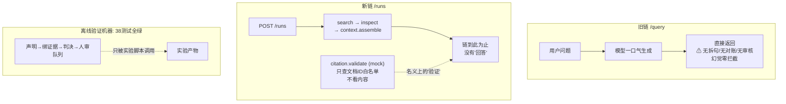
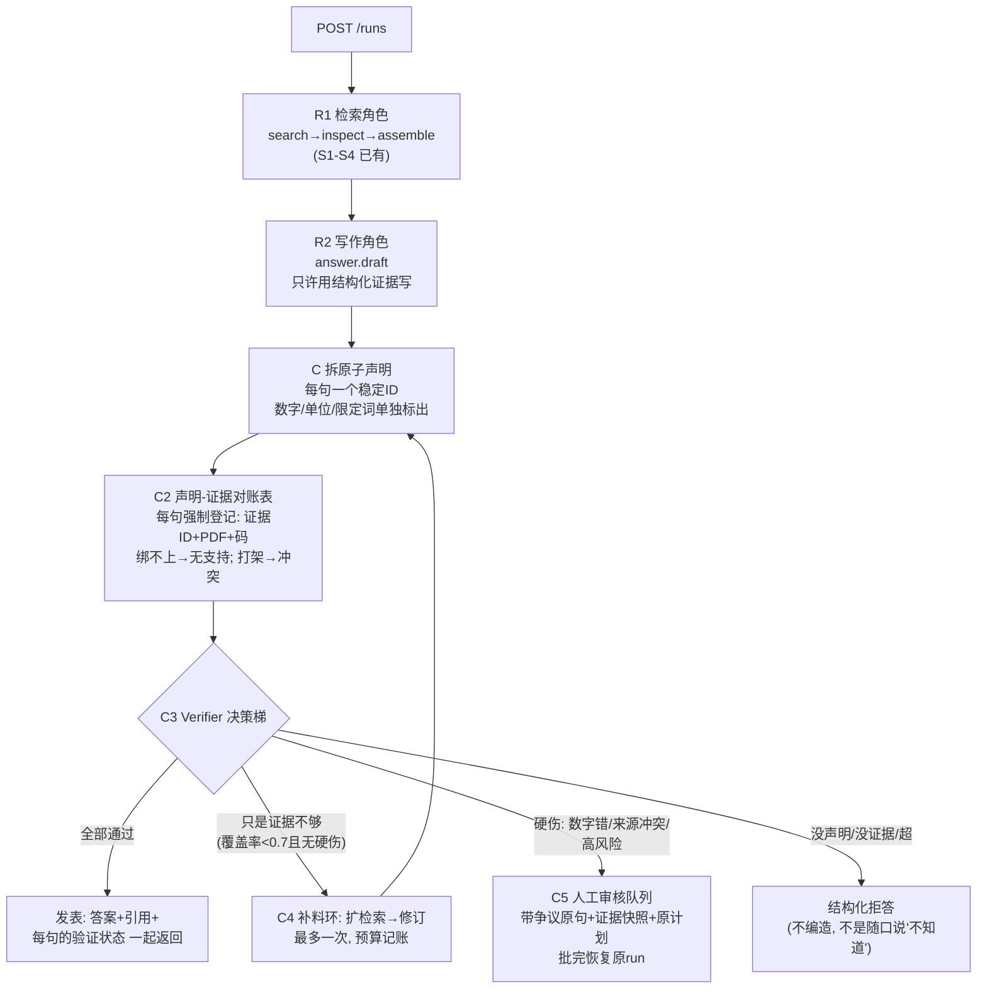

# S6 理解轨讲义：Claim、引用、受控角色协作与人工审核

> 范围：S6（V3 计划第 13 节）。只读代码、只写文档。
> 所有行号以 2026-09-24 的工作区为准；引用前均已打开文件核对。
> 现状验证：`PYTHONPATH=app runtime/bin/python -m pytest tests/verification -q` → **38 passed**；全量 `tests`（含 `tests/api`）→ **534 passed**（2026-09-24）。
> 诚实声明（V3 第 4 节红线）：**M7 验证机器已完整存在但只在离线/实验路径上运行**——`app/verification/` 的 claims（原子声明抽取）、claim_map（Claim-Evidence Map）、verifier（验证决策）、review（SQLite 人工审核队列）四个模块加 38 个测试全绿，`app/verification/experiment.py` 用它们跑过完整的 B0–B3 对照实验（Draft→Claim→Evidence→Verify→有界重检索→Review→resume 原 run）；**但生产 `/runs` 控制链止于 `context.assemble`，注册表（`app/control/registry.py:287,303,312,327,346`）里没有任何回答生成工具，`citation.validate` 是只查 doc_id 白名单的 mock**；旧链 `/query → convchain_api` 在 `app/radiant_llm.py:2258-2267` 把 Agent 一次生成的文本直接 return，全程无 claim、无验证、无审核。S6-T2 要做的是把已验证的离线机器接成生产的受控工作流；本讲义工整区分【现状】与【目标】。

---

## 1. 人话摘要（200 字内）

S6 把"问一句、模型一口气答完直接返回"改成有界的 Draft→Claim→Evidence→Verify→Revise/Review 工作流。现状是两层脱节：离线侧已有一套可运行的验证机器——把回答拆成原子声明、逐条绑证据、给出 commit/重检索/拒答/人审决策，还有能恢复原 run 的审核队列——但它只活在实验脚本和测试里；生产链上 `/runs` 只走到证据组装就停了，没有"回答"这一步，唯一的引用校验工具是 mock。修完用户能看到：每条回答都带引用和逐条验证状态，数字错、来源冲突、证据不足的答案不会被静默返回，而是被修订、拒答或送进人工审核。

---
好。S6 的定位一句话：

> **S3 找对资料、S4 装好上下文、S5 管好记忆，S6 管最后一步：模型写出来的回答，每一句是不是真的有证据撑腰。** 这是"出"这一步的质量门。

## 人话摘要翻译

摘要讲的还是熟悉的模式：**验证机器已经造好（38 个测试全绿、实验也跑过），但没接生产**。现状两段脱节：

| 现状 | 问题 |
|---|---|
| 旧链 `/query`：模型一口气写完直接返回 | 全程无检查——幻觉没有任何拦截点 |
| 新链 `/runs`：走到"证据组装"就停了 | **连"回答"这一步都还没有**；注册表里唯一叫"验证"的工具 mock，只查"文档 ID 在不在白名单"，从不看内容 |
| 离线侧：完整的验证机器（拆声明→绑证据→出判决→人审队列） | 只活在实验脚本和测试里 |

摘要里最重要的区分，也是整个 S6 的核心判断：

> **挂了引用 ≠ 声明被支持（citation ≠ claim support）**

- **citation**：答案旁边挂的"出处标签"（PDF 名、页码、Evidence ID）——只说明"这句话旁边挂了个来源"，**标签可以是假的或张冠李戴**；
- **claim support**：把回答拆成一句一句的原子声明，**逐条拿证据内容对账**——数字对不对、单位对不对、限定条件对不对。

"引用齐全但内容没被支持"恰恰是最常见的幻觉形态看着有出处，其实出处里没这句话。S6 的全部机器就是为堵住这个通道。

## 用编辑室类比理解这套工作流

| 环节 | 编辑室类比 |
|---|---|
| Draft（起草） | 记者写稿只允许用结构化证据写，不许凭记忆聊天 |
| Claim 抽取 | 把稿子拆成**一句句可独立判真假的话**（原子声明），并把数字、单位、限定词单独标出来——模型漂移最爱藏在这三类小词里（比如问题问"**两个**组成部分"，答案只说一个或加成三个都是错） |
| Claim-Evidence Map | 事实核查表：每句话强制登记"依据哪条证据、哪个 PDF、第几页"，绑不上证据的标"无支持"，两条证据打架的标"冲突" |
| Ver 判决 | 总编按**决策梯**下结论，四种动作：通过发表 / 证据不够→**回去补料（最多一次）** / 有硬伤→**送人工审核** / 没证据→**拒答**| ReviewQueue | 送审单：带着争议原句、证据快照、原始计划，人批完后**原来那个 run 接着跑**，不是重开一个 |

两个设计原则值得单独记住：

1. **"最多补一次料"是结构限制，不是求模型自觉**。循环计数器和预算都在 Runner 的状态里，模型没有"再来一轮"的自由——无限循环在结构上不可能出现。
2. **先判"错"再判"缺"**。证据互相矛盾（错）时直接送人审——补再多料也化解不了矛盾；只有证据不足（缺）才去补料。顺序反了会浪费唯一一次补料机会，还可能让模型"调和"两个冲突来源编出第三个数。

## 修改前图（：写完全文直接出网）



## 修改后图（目标：五段受控工作流）



注意三个角色（检索/写作/验证）**不是三个自由聊天的 Agent**——它们是同一个执行计划里的普通步骤节点，共享的是结构化数据（不是任意长对话），每一步都过同一套状态机、预算、权限和 trace。这就是"受控角色协作"和"多 Agent 自由聊天"的区别## 三条红线

1. **验证机器没接生产**。38 个测试全绿只证明机器本身对；生产 `/runs` 还没有回答步骤，`/query` 一次生成直接返回。S6 完成前不能说"生产已经过验证"。
2. **工具名叫 validate ≠ 系统有验证**。现在注册表里的 `citation.validate` 是 mock，只查白名单。引用齐全 ≠ 声明被支持。
3. **"有界"必须是结构属性**。"最多补一次料"写在状态机里，不是写在 prompt 里求模型自觉。任何"让模型自己决定要不要再来一轮"的设计都违背 S6 目标。

一个诚实的边界：四种判定里 **supported / unsupported / conflict 已实现"超范围"（out-of-scope）还没有**——它在枚举里声明了但代码从不产出，是 T2 要补的。

---

## 2. 修改前图（现状数据流，12 节点）

```text
旧链（一次生成直接返回）：
 [1] POST /query {"query": str}                                  (dict)
   │
   ▼
 [2] convchain_api(query)                             radiant_llm.py:2077
   │  拼 session 旧轮 + memory note + skill context     (str)
   ▼
 [3] AgentExecutor 一次 LLM 调用 → result["output"]     (str)
   │  无 claim 抽取、无证据绑定、无验证、无审核
   ▼
 [4] return {"response": ...}                         radiant_llm.py:2258-2267
     （markdown 格式化后直接出网；幻觉无任何拦截点）

新链 /runs（止于证据组装，无回答步骤）：
 [5] POST /runs {"goal","workspace"}                  api.py:991  (dict)
   │
   ▼
 [6] RuleRouter → RulePlanner → SchemaGuard → PolicyEngine
     (ExecutionPlan: steps/budgets/risk; S1 产物)
   ▼
 [7] DurableRunner（S2/S3 状态机）                     api.py:703-711
   │  require_review=_step_needs_review（仅 external/high_risk 步骤触发）
   ▼
 [8] evidence.search → [9] evidence.inspect → [10] context.assemble
     (ToolResult.output JSON; registry.py:287,303,346；真实 adapter)
     ── 链到此为止：没有 answer.draft / answer.finalize 步骤 ──

 [11] citation.validate（注册表内唯一"验证"工具）       registry.py:101-111,312-325
      Mock：claims 参数只数个数（"claims_checked": len(...)），
      doc_ids 只比对 _MOCK_DOCS 白名单，从不检查声明内容

 [12] M7 验证机器（离线旁路，全绿但未接生产）
      app/verification/{claims,claim_map,verifier,review}.py
      调用方只有：tests/verification（38 项）、
      experiment.py（B0–B3 对照实验）、eval/adapters.py:962 _run_answer_cases
      ── 生产 API 的 ReviewQueue 存在（api.py:712,1265-1304），
      但 _maybe_enqueue_review 入队时 claims=[] evidence_snapshot=[]
      （api.py:918-926），即队列为"空壳"：能 pause/resume run，不携带争议内容
```

### 关键读法一：citation（引用标注）≠ claim support（声明被证据支持）（必答点 1）

- **citation** 是回答文本里的*标注/指针*：`[p1]`、`evidence_id`、PDF 名——它只说"这句话旁边挂了一个来源"。现状里它有两种形态：旧链 Agent 自由文本里随手写的引用（无任何校验）；新链 `citation.validate` mock（registry.py:104-111）只回答"这些 doc_id 在不在白名单里"，`claims` 参数进函数后只被 `len()` 数了一次。**两种都不检查"声明内容是否真的被来源支持"**。
- **claim support** 是*逐条声明与证据内容的对账*：把回答拆成原子 claim，每条 claim 在证据池里找绑定，数字、单位、限定条件逐项核对（claims.py → claim_map.py → verifier.py 三步），产出 supported/unsupported/conflict 判定。citation precision（`app/eval/metrics.py:81-89` cip）量的是"挂的引用有多少有效"，HR（metrics.py:98-105 hr）量的是"声明有多少不被支持"——**引用齐全而声明 unsupported 是常态，这正是只有 citation 没有 support 检查时的幻觉通道**。

### 关键读法二：生产链上"验证"一词目前是名不副实的

注册表里名义上的验证工具 `citation.validate`（registry.py:312-325）description 自述 "Mock: validate claims against cited documents"，handler 在 registry.py:101-111：`unsupported = [d for d in doc_ids if d not in known]`——它验证的是 doc_id 的*存在性*，不是 claim 的*真值*。真正的验证器 `Verifier`（verifier.py:73-227）存在于 `app/verification/`，但生产 `/runs` 与 `/query` 两条链都不 import 它。

---

## 3. 修改后图（T2 目标：新增控制点与失败出口）

以下为**目标，不是现状**。离线机器已存在，"→ 接线"指 S6-T2 把控制点接进生产 `/runs` 链；所有节点仍是同一个 ExecutionPlan 里的 PlanStep，由同一 DurableRunner 状态机、同一 Budgets、同一 Policy、同一 EventStore trace 控制：

```text
 POST /runs（回答类 goal）
   │  (ExecutionPlan{steps, budgets, policy})
   ▼
 [R1 Retriever 角色节点] evidence.search/inspect → context.assemble
   │  (ToolResult.output: evidence[{evidence_id,page,document_id,content}])
   ▼
 [R2 Writer 角色节点] answer.draft（新增真实工具）
   │  (str draft；输入只允许结构化证据，不允许任意对话历史)
   ▼
 [C1 原子声明抽取] split_claims(draft)               claims.py:198-225
   │  (SplitResult{claims[{claim_id,text,claim_type,numbers,units,entities}], splitter})
   ▼
 [C2 Claim-Evidence Map] map_claims(claims, evidence) claim_map.py:197-206
   │  强制绑定 evidence_id/page（T2 补 span）；degraded 证据跳过
   │  (ClaimMap{bindings[{status, evidence_id, page, confidence, reason}], coverage})
   ▼
 [C3 Verifier / Citation-Scope Grader]               verifier.py:138-227
   │  (VerificationDecision{action, supported, unsupported, conflicts,
   │   reason_codes, coverage, numeric_accuracy})
   ├─ commit ──────────────────────────────▶ [answer.finalize] 返回答案+引用+逐条 claim 状态
   ├─ retrieve_more（仅当 coverage<0.7 且无硬失败）─▶ [C4 有界环：最多一次]
   │      扩池重检索 → revise（重新生成/修订）→ 回 C1 再审一次
   │      预算：token/tool_calls/wall_time 记账可见，用尽即出环  【失败出口 1：预算耗尽→人审/拒答】
   ├─ human_review（冲突/数字单位条件错/高风险+unsupported）─▶ [C5 ReviewQueue]
   │      入队携带真实 claims/evidence_snapshot/plan_json        【失败出口 2】
   │      approve/edit → resume 原 run；reject → cancel+resume → cancelled
   └─ abstain（无 claim / 无证据 / 超范围）─▶ 结构化拒答，不编造  【失败出口 3】
```

### 受控角色协作 vs "多 Agent 自由聊天"（必答点 7）

- **受控角色**（目标，M7 实验臂已示范形状，experiment.py:244-274）：Retriever/Writer/Verifier 是同一个 ExecutionPlan 里的普通 PlanStep——`kb.search`→`answer.draft`→`answer.finalize`（experiment.py:258-274）。它们**共享结构化状态**（ToolResult.output、ClaimMap、VerificationDecision），不共享任意长对话；每一步都过 DurableRunner 的状态机、Budgets（experiment.py:273：`max_tokens=100_000, max_tool_calls=10, max_wall_time_ms=600_000`）、Policy 风险门（`answer.finalize` 标 Risk.EXTERNAL 触发 review gate，experiment.py:281）、统一 EventStore trace。角色可拆分，但没有任何一个角色能绕过状态机自行循环。
- **多 Agent 自由聊天**的本质区别在于：消息是自由文本、轮次无界、状态不可重放、预算无处可记。S6 的约束——"同一状态机、预算、Policy、trace"（V3 §13 S6 目标）——正是把这四点全部收编进 S1-S3 已有的控制面。

### 有界反思 vs 无限循环（必答点 5）

现状代码里唯一已经存在的"反思环"在实验臂 B2（experiment.py:419-424）：`decision.action is RETRIEVE_MORE` 时把证据池从 top_k=5 扩到 top_k=10 **重新验证一次（不重新生成）**，`retrieval_rounds` 记 2 封顶，之后无论结果如何都 resume。T2 的目标是把它升级为"最多一次 retrieve→revise 环"：环的入口只允许 `retrieve_more` 一种 verdict，环的次数写死在状态机里（不是写在 prompt 里求模型自觉），环的每一步消耗都进 Budgets 记账——**无限循环在结构上不可能出现，因为循环计数器和预算都是 Runner 的状态，不是 LLM 的选择**。

---

## 4. 固定案例：TEACH-T01 逐步 I/O

TEACH-T01（`benchmarks/teaching_case.jsonl`）："What **two** main components does the Transformer architecture consist of? Answer with the PDF name, page number and Evidence ID." gold：`ev-1467122274c2347e3ed99f4c`（Transformer 论文 p1），expected_facts `["encoder","decoder"]`。gold 只用于验收断言，不作为运行参数。

逐步（经过 S6 目标链时各控制点的输入/输出形状；形状来自现有离线机器的真实模型）：

1. **R1 Retriever**。输入 `{question}` → 输出 `evidence:[{evidence_id:"ev-1467...", page:1, document_id:"e8a365c1d8815226", content:"...encoder...decoder..."}]`（形状同 experiment.py:212-220 的 search handler）。
2. **R2 Writer**。输入 = 问题 + 上一步结构化证据（不是任意聊天）→ 输出 draft 字符串，例如："The Transformer consists of an encoder and a decoder [p1, ev-1467...]."
3. **C1 原子声明抽取**（必答点 2）。输入 draft → 输出：
   ```json
   {"claims":[{"claim_id":"cl-<sha1前12位>","text":"The Transformer consists of an encoder and a decoder",
    "claim_type":"relational","sentence_index":0,"numbers":[],"units":[],"entities":["Transformer"]}],
    "splitter":"rule"}
   ```
   **atomic claim** 是不可再拆、可独立判真假的单条声明——"consists of an encoder and a decoder" 是一条 relational claim（`consist` 命中关系标记，claims.py:63-67,123-133）。
   **数字/单位/限定词为什么是验证要点**：生成模型最容易漂移的恰恰是这三类"小词"。本例问题里的 "**two**" 就是限定词——答案若只说 "an encoder" 或加成 "encoder, decoder and a tokenizer"，事实数就错了；gold 用 `expected_facts:["encoder","decoder"]` + failure mode FM-4（事实缺失即 fail）冻结这一点。数字同理：`test_verifier.py:59-64` 冻结了 "31.7 BLEU"（证据是 28.4）必须判 unsupported；单位同理（`test_verifier.py:67-76`：证据无 BLEU 单位时判 unit mismatch）。抽取器把 `numbers/units/entities` 显式落成字段（claims.py:30-37），就是为了验证器能逐项对账，而不是靠"读起来差不多"。
4. **C2 Claim-Evidence Map**（必答点 3）。形状（claim_map.py:29-48）：
   ```json
   {"bindings":[{"claim_id":"cl-...","claim_text":"...","claim_type":"relational",
     "status":"supported","evidence_id":"ev-1467122274c2347e3ed99f4c","page":1,
     "document_id":"e8a365c1d8815226","authority_level":"primary",
     "confidence":0.31,"reason":"token overlap above threshold","candidate_ids":["ev-1467..."]}],
    "coverage":1.0,"supported":["cl-..."],"unsupported":[],"conflicted":[]}
   ```
   强制字段链：**claim_id/type + numbers/units → evidence_id/document_id(source)/page**。注意现状缺口：`ClaimBinding` 有 `page` 但**没有 span（证据内偏移区间）字段**——V3 §13 T2 第 2 项要求"强制 Evidence ID/source/page/span"，span 是 T2 要补的 schema 变更，不得写成现状。
5. **C3 Verifier**（必答点 4、6）。逐条 `_check_claim`（verifier.py:86-135）：绑定 unsupported → `verify.unsupported_claim`；conflicted → `verify.source_conflict`；numeric/unit claim 的数字必须字面出现在绑定证据里，单位同理；entities 全不在证据里 → `verify.condition_mismatch`（防止"数字对但条件错"，如对 base model 的 27.3 张冠李戴到 big model）。TEACH-T01 全部通过 → `action="commit"`，`reason_codes=["verify.ok"]`。
   **四种 verdict 的判定语义**：
   - **supported**：claim 绑定了 overlap 过阈值的证据，且数字/单位/条件全部一致（claim_map.py:183-195 + verifier.py:104-135）。
   - **unsupported**：没有任何证据过 overlap 阈值（claim_map.py:127-136），或绑定的最佳证据里 claim 的数字缺失（claim_map.py:160-181）——"找不到支持"与"证据里没有这个数"都算。
   - **conflict**（代码中为 `conflicted`）：前两名证据都 overlap 良好，最佳证据含 claim 关键数字，而第二名证据在同一个数字槽位上带着不同的值（claim_map.py:90-114，如 28.4 vs 29.1，`test_claim_map.py:75-93` 冻结）。
   - **out-of-scope**：claim 超出语料/切片可回答范围，系统应明确说"超出范围"而非硬答。**现状代码没有此 verdict**——`BindingStatus` 只有三值（claim_map.py:23-27），`VerificationAction.CLARIFY` 在枚举里声明（verifier.py:48）但决策梯（verifier.py:193-202）从不产出它。out-of-scope 是 T2 第 3 项（Citation/Scope Grader）要实现的第四种判定，本讲义不把它写成既成事实。
6. **分支**（必答点 6，决策梯 verifier.py:193-202）：
   - **何时重检索**（retrieve_more）：无任何硬失败，且 `coverage < min_coverage(0.7)`（verifier.py:197-198）——证据不足但没错，先补证据而不是直接交人；
   - **何时修订**（revise）：T2 目标——retrieve_more 扩池后用新证据重新生成/修订 draft，再审一次，全程只此一圈；
   - **何时拒答**（abstain）：`claims` 为空（`verify.no_claims`，verifier.py:146-151）或证据池为空（`verify.no_evidence`，:152-158）；T2 加上 out-of-scope。拒答是结构化结论（action=abstain + reason），不是模型随口一句"我不知道"；
   - **何时入人工审核**（human_review）：硬失败（conflict、numeric/unit/condition mismatch、低权威来源）或"绑定过证据却不支持"的矛盾（verifier.py:180-194）；高风险 case（medium/high）存在任何 unsupported（:195-196）；低风险但 coverage 达标仍有 unsupported（:199-200）。
7. **C5 ReviewQueue（若触发）**。入队载荷（形状同 experiment.py:460-470）：`claims`（每条带 supported/unsupported 状态）、`evidence_snapshot`（evidence_id+page+截断 content）、`risk_reasons=decision.reason_codes`、完整 `plan_json`。approve/edit → `resume_decided` 恢复**原 run**（review.py:209-234）；reject → 置 cancel 标志后 resume，run 走 waiting_review→running→cancelled 完整事件轨迹。
8. **最终 API 返回（T2 第 7 项目标）**：`{answer, citations:[{evidence_id,page,span}], claims:[{claim_id,status,evidence_id,reason}]}`——答案、引用、逐条验证状态三者一起出网；现状 `/query` 只返回 `response` 字符串（radiant_llm.py:2258-2267），`/runs` 连 answer 都还没有。

---

## 5. 状态流：哪些在内存、哪些进 SQLite、哪些进 trace

| 状态 | 住哪（现状） | 生命周期 |
|---|---|---|
| draft 字符串、SplitResult、ClaimMap、VerificationDecision | **只在内存**（experiment.py 的 `drafts` dict :203,235 与局部变量；eval adapters 的 rows） | 验证完成即弃；ClaimMap/Decision 序列化后进 case artifact / review item |
| run 状态机（pending→running→waiting_review→succeeded/cancelled） | **SQLite durable.db**（CheckpointStore/EventStore/Lease/幂等账本；api.py:693-696） | 跨进程重启可恢复；waiting_review 是 review 的对接点 |
| review item（claims、evidence_snapshot、risk_reasons、plan_json、decision、decision_inputs） | **SQLite review_queue.db**（review.py:49-70 schema；路径 env `RADIANT_REVIEW_DB`，api.py:712） | 决策**不可变**（review.py:178-181 二次 decide 抛错）；decision_inputs 支持逐位重放（review.py:289-302） |
| 工具调用与角色节点动作 | **trace**：EventStore 事件（SSE 可续传，api.py:1163-1209）+ llm_log（experiment.py:234 记每次 LLM 调用的 token 数） | 阶段门"角色节点所有动作都进入统一 trace"的落点 |
| claim 级评分（support_rate、citation_precision/coverage、HR、fact_recall） | eval artifact JSON（adapters.py:1036-1063 写入 dataset metrics） | 阶段回归基线；未测写 `not_measured` 不补 0 |

---

## 6. 关键代码位置（5 处）

**① `app/verification/claims.py:198-225` — `split_claims`**
输入：draft 字符串 + 可选 `llm_callable`；输出：`SplitResult{claims, splitter: "rule"|"llm"|"llm_fallback", detail}`；副作用：无；失败行为：LLM 路径任何异常（不可用/返回非 JSON/零 claim）都**大声回退**到确定性规则拆分并在 `splitter`/`detail` 里留痕（:219-224），坏模型永远不可能产出静默畸形的 claim；重要性：C1 控制点，原子 claim 的 claim_id 是文本归一化后的 sha1 前 12 位（:77-79）——同文同 id，审计可复算。

**② `app/verification/claim_map.py:116-206` — `ClaimMapper.bind/map`**
输入：`Claim` 列表 + `evidence_items`（dict，含 evidence_id/page/content/authority_level/degraded）；输出：`ClaimMap{bindings, coverage, supported, unsupported, conflicted}`；副作用：无（纯函数）；失败行为：`degraded` 证据直接跳过（:119-120，`test_claim_map.py:96-101` 冻结"降级证据永不绑定"），无证据过阈值 → unsupported 而不是硬绑；重要性：C2 控制点，评分是确定性的（Jaccard + 数字命中加分 :77-88），conflict 检测 (:90-114) 是"来源打架"的唯一侦测点。

**③ `app/verification/verifier.py:138-227` — `Verifier.verify`**
输入：claims + ClaimMap + evidence_items + `case_risk`；输出：`VerificationDecision{action, supported, unsupported, citation_gaps, conflicts, reason_codes, coverage, numeric_accuracy, checks, rationale}`；副作用：无；失败行为：无 claims/无证据 → abstain（不猜）；决策梯 :193-202 保证硬失败永远压过覆盖率逻辑（先判"错"，再判"缺"）；重要性：C3 控制点，必答点 6 的全部触发条件都编码在这一个梯子，reason code 是稳定字符串（:32-42），可直接作 review 的 risk_reasons。

**④ `app/verification/review.py:103-133, 162-234` + `app/api.py:907-926` — ReviewQueue 入队/决策/恢复**
输入：run_id + claims + evidence_snapshot + risk_reasons + 序列化 ExecutionPlan；输出：review_id / 决策后的 item / DurableRunReport；副作用：SQLite 写；失败行为：decide 未决项 → resume 拒绝（:228-229），EDIT 无 edited_answer → 拒绝（:182-183），决策不可变；重要性：C5 控制点——它能承载"暂停的 run + 争议声明 + 证据快照 + 原始 plan 并恢复同一个 run"。**但它现在不能承载的**：生产入队调用 claims/evidence 传空列表（api.py:920-921）；`edited_answer` 是整段文本，没有逐 claim 编辑语义；没有 out-of-scope/拒答的承载字段；decision 只有 approve/reject/edit 三值（必答点 8）。

**⑤ `app/control/registry.py:101-111, 312-325` — `citation.validate` mock（现状反例）**
输入：`{claims: [str], doc_ids: [str]}`；输出：`{claims_checked, unsupported_doc_ids, all_supported}`；副作用：无；失败行为：对 `_MOCK_DOCS` 之外的 doc_id 报 unsupported——**对 claims 内容零检查**；重要性：它是 S6-T2 第 3 项要用真实 Citation/Scope Grader 替换的占位符，也是"工具名叫 validate 不等于系统有验证"的标本。对照反例：`app/radiant_llm.py:2258-2267` 旧链 return 点，一次生成的 markdown 直接出网，中间无任何 C1-C5。

---

## 7. 术语表（8 个）

1. **atomic claim（原子声明）**：不可再拆、可独立判真假的单条声明，带稳定 claim_id 和类型（numeric/unit/factual/relational/visual，claims.py:22-27）。是验证的最小单位——不拆原子，"这句话大体上对"就无法对账。
2. **citation（引用标注）**：回答里挂的来源指针（evidence_id/页码/[pN]）。只声明"出处在此"，不保证"内容被支持"。
3. **claim support（声明支持）**：claim 内容与证据内容的逐项对账结论。与 citation 的区别即必答点 1：前者是语义判定，后者是文本标注；citation 可以伪造或张冠李戴，support 必须过 C2/C3。
4. **Claim-Evidence Map**：claim→evidence 的绑定表（claim_map.py:43-48），强制 evidence_id/source/page（T2 补 span），附 confidence 与可读 reason，coverage=绑定率。每条 claim 都可审计的载体。
5. **verdict（验证判定）**：claim 级四值——supported/unsupported/conflict/out-of-scope（前三值已实现于 claim_map.py:23-27，out-of-scope 为 T2 目标）；run 级动作五值——commit/retrieve_more/clarify/human_review/abstain（verifier.py:45-50，clarify 已声明未产出）。
6. **有界反思（bounded reflection）**：最多一次 retrieve→revise 环，环计数与 token/tool/wall-time 预算都在 Runner 状态里（experiment.py:273,419-424 为现存雏形）。与无限循环的区别：循环是状态机的边，不是模型的自由。
7. **受控角色（controlled role）**：Retriever/Writer/Verifier 作为同一 ExecutionPlan 中的 PlanStep 节点，共享结构化状态（ToolResult/ClaimMap/Decision），不共享任意对话；动作全进统一 trace。
8. **ReviewQueue（人工审核队列）**：SQLite 队列（review.py:49-70），承载暂停 run 的 claims/evidence/risk/plan，approve/edit/reject 后恢复**原** run；决策不可变、可重放。

---

## 8. T2 变更清单（S6-T2 按 V3 §13：8 项，全部为目标，不是现状）

| # | 任务（V3 §13） | 预计修改/新增文件 |
|---|---|---|
| 1 | 确定性优先抽取 atomic claims，输出 claim_id/type/numeric fields | 生产接线：`app/api.py`（/runs 计划模板）或新 `app/answer/` 节点模块；复用 `app/verification/claims.py`（不改语义） |
| 2 | 建 Claim-Evidence Map，强制 evidence_id/source/page/**span** | `app/verification/claim_map.py`（ClaimBinding 增 `span` 字段 + 测试）；证据 adapter 输出补 span |
| 3 | Citation/Scope Grader 结构化 verdict 与 reason（含 out-of-scope） | `app/verification/verifier.py`（第四 verdict + clarify 产出路径）、`app/control/registry.py:101-111`（真实 citation.validate 替换 mock） |
| 4 | 最多一次 retrieve→revise 环，token/tool/wall-time 预算约束 | Runner 计划模板 + `app/control/models.py` Budgets 记账；复用 experiment.py:419-424 的环形状 |
| 5 | Retriever/Writer/Verifier 受控角色节点，共享结构化状态 | 新工具 `answer.draft`/`answer.finalize` 注册进 `app/control/registry.py`（参考 experiment.py:244-274 形状）；Planner 模板 |
| 6 | conflict/high-risk 进 Review Queue，decide 后 resume 原 run | `app/api.py:918-926`（入队携带真实 claims/evidence_snapshot，替换空列表）；`tests/api/test_reviews.py` 扩 |
| 7 | 最终 API 返回答案+引用+逐条 claim 验证状态 | `app/api.py` 响应模型；/runs snapshot 或新 answer 端点 |
| 8 | 联合评测 citation precision/coverage、HR、CiH/source drift、fact recall，禁止全拒答刷安全分 | `app/eval/adapters.py:962` _run_answer_cases 接生产链 + `app/eval/metrics.py`（cip:81 / cih:91 / hr:98 已存在）；release_gate 规则 |

**禁止修改**：`benchmarks/teaching_case.jsonl` 与 `benchmarks/answer_cases.jsonl` 的 gold；`app/verification/` 已冻结行为的阈值（overlap_threshold=0.08、min_coverage=0.7 等，除非先写失败测试再走合同流程）；S1-S5 控制面语义（Guard/Policy/Budgets/Checkpoint）。
**先写的失败测试**：生产 `/runs` 回答链不含验证步骤时答案不得返回（绕过 Verifier 即 fail）；claims 含错数字（"31.7 BLEU"型）必须 human_review；retrieve_more 环执行两次即 fail（环计数器断言）；生产 review item 的 claims 非空。
**smoke**：真实服务跑 TEACH-T01 经 /runs 全链，断言返回含 answer + citations（ev-1467.../page 1）+ 每条 claim 状态，trace 含 R1/R2/C1-C3 全部节点事件；再跑一个冲突 case 断言进 review queue 且 decide 后原 run 恢复。
**回滚**：新工具与计划模板全部经注册表挂载，摘掉 answer.* 工具注册即回到"止于 context.assemble"的现状；review_queue.db 新增字段走 schema 兼容（列已有，空值语义不变）。

---

## 9. 三件必须记住的事

1. **验证机器已存在但没接生产**：claims/claim_map/verifier/review 四件套 + 38 项测试 + B0–B3 实验臂都是离线资产；生产 `/runs` 没有任何回答步骤，`/query` 一次生成直接返回。S6-T2 的本质是把已验证的机器接成受控工作流并补齐 span 与 out-of-scope，不是从零造验证器。
2. **citation ≠ claim support**：mock `citation.validate` 只查 doc_id 白名单（registry.py:101-111），引用齐全不等于声明被支持；幻觉拦截只能发生在 claim 级对账（C1-C3），这是全阶段的核心判断。
3. **有界是结构属性不是自觉**：retrieve→revise 最多一次、预算可见、human_review/abstain 是决策梯的确定分支（verifier.py:193-202），全部编码在 Runner/Verifier 状态里；任何"让模型自己决定要不要再来一轮"的设计都直接违背 S6 目标。

---

## 10. 自测题（折叠答案）

**Q1（数据流）**：TEACH-T01 的回答 "The Transformer consists of an encoder and a decoder [p1, ev-1467...]" 在 S6 目标链上从 draft 到返回经过哪些数据形状变换？如果 evidence.db 里 ev-1467 的内容其实只提到 encoder 没提 decoder，各控制点分别会给出什么？

<details><summary>答案</summary>
draft(str) → C1 SplitResult（一条 relational claim，entities 含 Transformer）→ C2 ClaimMap：实体对账时 decoder 不在证据 content 里，若 overlap 仍过阈值则按条件/实体检查判 supported 存疑——具体地，verifier.py:120-124 的 applicability 检查要求 claim entities 出现在绑定证据中，实体缺失累积为 `verify.condition_mismatch`；若 overlap 不过阈值则 claim_map.py:127-136 直接 unsupported → C3 VerificationDecision：低风险 + coverage 未达标 → retrieve_more（C4 有界环扩池一次）；扩池后仍缺 → unsupported 非空 → human_review（verifier.py:199-200）→ C5 入队携带该 claim 与证据快照。回答不会以原样返回。
</details>

**Q2（设计取舍）**：为什么决策梯把"硬失败→human_review"排在"低覆盖率→retrieve_more"之前（verifier.py:193-198）？反过来会怎样？

<details><summary>答案</summary>
两种失败性质不同：冲突/数字错/条件错是**证据之间或证据与声明互相矛盾**——再检索更多证据不会自动消解矛盾，只会把更多冲突带进池子，必须交由人裁；低覆盖率是**证据缺失**——补证据是合理第一反应。若顺序反过来，冲突 case 会先烧掉唯一一次有界重检索（retrieve→revise 环只有一圈），扩池后冲突大概率仍在，还是落入 human_review——既浪费预算又推迟上报，还可能在 revise 时让模型"调和"两个冲突来源编出第三个数。先判"错"再判"缺"，保证最贵的人审只花在真正需要判断力的 case 上。
</details>

**Q3（失败后果）**：如果 S6-T2 只接了 C1-C3 验证器、却忘了把生产 review 入队（api.py:920-921）的空 claims/evidence 换成真实载荷，会出现什么？

<details><summary>答案</summary>
"判得准、审不了"的半截工程：Verifier 正确地把冲突/错数字 case 拦进 human_review，run 也确实暂停在 waiting_review，但审核员打开队列看到的是空 claims、空 evidence_snapshot——没有任何争议内容可审，只能 blindly approve（放走坏答案）或 reject（冤杀好答案），且 decision 不可变、可重放地记录了这次盲审。阶段门"Review Queue 携带真实 claim/evidence/plan"实测不达标；更糟的是系统表面上"验证全绿、审核在线"，问题比没有验证器时更难被发现。
</details>

---

## 11. 面试表达

**60 秒口述**："这个项目的回答可信层，我的核心判断是'引用不等于支持'。现状是模型一次生成直接返回，唯一的引用校验工具是个只查文档 ID 白名单的 mock。我做的设计是五段受控工作流：先把回答拆成原子声明——每条有稳定 ID 和类型，数字、单位、限定词显式抽成字段，因为生成漂移就藏在这三类小词里；然后建 Claim-Evidence Map，每条声明强制绑定 evidence ID、来源、页码和 span，来源冲突用确定性规则侦测；再由 Verifier 按判定梯给出四种 verdict——supported、unsupported、conflict、超范围——和五种动作：提交、有界重检索、澄清、人审、拒答。反思是最多一次的 retrieve-revise 环，循环计数和预算都在状态机里，模型没有'再来一轮'的自由。冲突和高风险进人工审核队列，队列带着争议声明、证据快照和原始执行计划，审批后恢复的是同一个 run。所有角色——检索、写作、验证——都是同一个计划里的节点，共享结构化状态，动作全进统一 trace。"

**可以说**：四件套验证机器（claims/claim_map/verifier/review）的存在、设计与 38 项全绿测试；三种已实现 verdict 与五种动作的决策梯语义；有界环在 M7 实验臂中的真实形状（experiment.py:419-424）与预算记账；ReviewQueue 的 SQLite schema、决策不可变与 resume 原 run 机制；citation.validate 是 mock 的事实与 mock 的具体行为；生产 /runs 无回答步骤、/query 无验证的事实。

**暂时不能说**：生产环境回答已经过 Verifier（未接线）；Citation/Scope Grader 已有 out-of-scope 判定（BindingStatus 只有三值，CLARIFY 声明未产出）；Claim-Evidence Map 已强制 span（字段不存在，T2 第 2 项）；生产 review item 已携带真实 claims/evidence（api.py:920-921 传空列表）；已有生产级 retrieve→revise 环（现只有实验臂里"扩池重验不重新生成"的雏形）；联合评测已在生产链上跑通（eval 的 answer 层仍是离线 B2 臂，adapters.py:961-978）。
