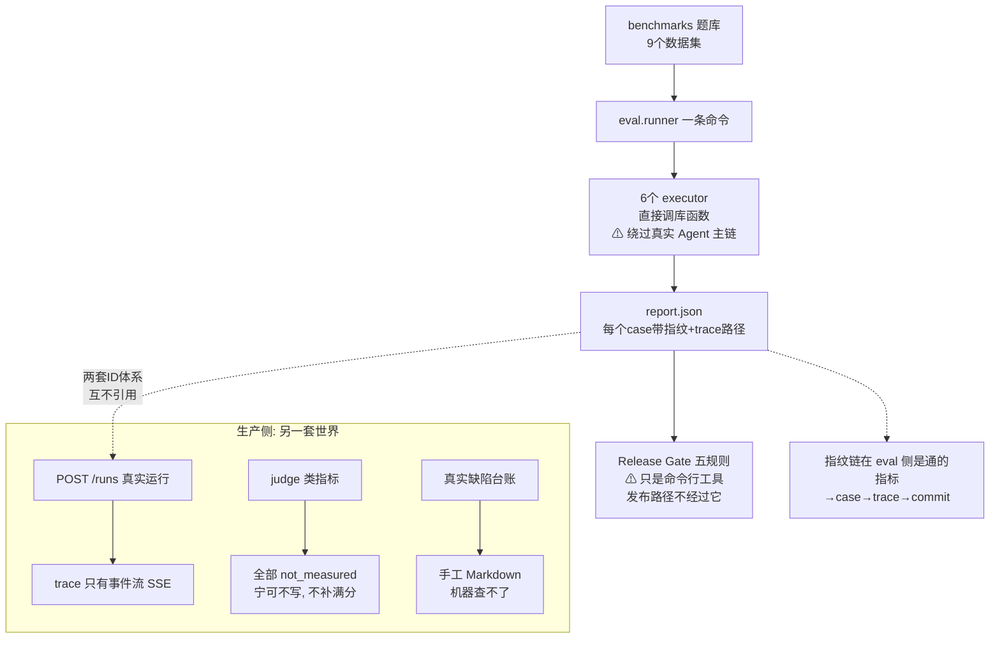
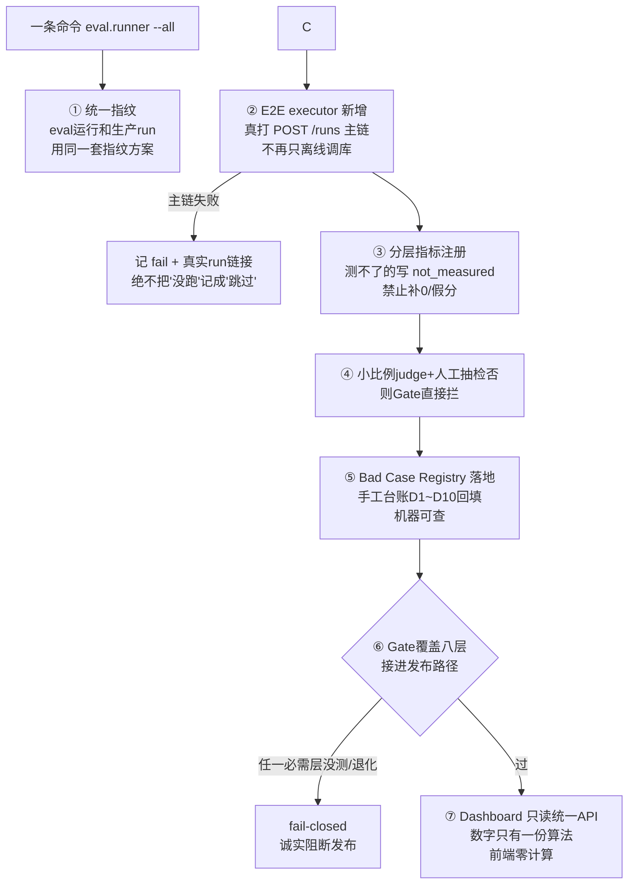

# S8 理解轨讲义：Eval Harness、可观测、Release Gate 与数据飞轮

> 范围：S8（V3 计划第 15 节）。只读代码、只写文档。
> 所有行号以 2026-09-24 的工作区为准；引用前均已打开文件核对。
> 现状基线：S7 阶段门 `551 passed, 0 failed`（artifacts/control-v3/S7/regression-full-s7.txt 末行，本轨未改任何代码）。
> 诚实声明（V3 第 4 节红线）：评测底座（M8 建的 `app/eval/` + `app/observability/`）**真实存在且可单命令运行**，但它是**离线骨架**——六个 executor 全部直接 import 库函数，没有一条 case 走真实 Agent 主链；judge 类指标全部 `not_measured`；Release Gate 只是 CLI，未接 API/CI；Bad Case Registry 只有类、仓库里没有生产 registry 文件；S7 新冻结的 `visual_gold_cases.jsonl` 至今**未注册**（本轨实跑 `--list` 触发 unregistered 告警）。本讲义工整区分【现状】与【目标】，S8-T2 八项全部写成目标。

---

## 1. 人话摘要（200 字内）

S8 要把 S1～S7 各控制面变成一条命令可回归的 Harness，并让简历上任何数字都能追到 case、run、trace、配置和 commit。现状：底座已能跑——9 个注册数据集、6 层 executor、`report.json` 带配置指纹、五规则 Release Gate、统一 trace schema 和 bad-case 类都在；但 harness 只调离线模块、没碰真实 Agent 主链，judge/人审指标一个没有实测，Gate 没接进发布路径，bad case 台账是手工 Markdown。修完用户能看到：一条命令跑出完整候选报告，每个指标点击可下钻到真实 run 的 trace，一个 bad case 从发现到冻结回归全程机器可查，Gate 要么放行要么诚实阻断。

---
好。S8 的定位一句话：

> **S1-S7 是把系统造出来，S8 是回答"凭什么相信你造的东西好"**——简历上写的每个数字，都必须能一路追查到：测的哪道题、哪次运行、哪份代码、哪个模型。这是整个项目的"公证处"。

## 人话摘要翻译

摘要还是熟悉的结构：**评测底座已经能跑（一条命令出报告），但它是离线骨架，有五个没接的口子**：

| 现状（已有） | 没接的口子 |
|---|---|
| 一条命令跑 6 层、9 个冻结数据集，出完整报告 | 但 6 层全是**离线直接调库函数**——没走真实 Agent 主链（HTTP/注册表/租约/真实数据库全绕过了） |
| 报告里每个 case都带配置指纹和 trace 路径 | 但 **eval 运行和生产运行是两套 ID**，互不引用——eval 的数字追不到生产的 trace |
| 有 Release Gate（五规则，不过就拦） | 但它只是个**命令行工具**，没接进发布路径，发布时根本不过它 |
| 有 judge 类指标框架 | **一个都没实测过**——没 judge 就诚实写 `not_measured`，绝不补满分 |
| 有 Bad Case Registry 类 | 活在测试里；真实的缺陷台账是**手工 Markdown**，机器查不了 |

修完后的样子：**一条命令出完整报告 → 每个指标能点进去下钻到真实 run 的 trace → 一个 bug 从发现到冻结成回归测试全程机器可查 → Gate 要么放行要么诚实阻断。**

## 三个核心概念（懂了这三个就懂了 S8）

**① 四类指标，各管一件事，互相不能替代：**

| 指标类 | 回答什么 | 类比 |
|---|---|---|
| 确定性指标 | 可写成规则的对不对（召回率、通过率） | 客观题阅卷 |
| LLM judge | 语义层面的好不好 | 主观题阅卷——会漂移、有，所以**必须记录谁阅的卷、用的哪份评分标准** |
| 人工抽检 | 前两种尺子直不直 | 抽查阅卷老师的评分靠不靠谱 |
| 运营指标 | 跑得动吗、多贵（延迟 p50/p95） | 体检的心率血压 |

**② 五个指纹：数字的"出生证明"。** run（哪次执行）、（为什么是这个结果）、config（哪份代码哪个环境）、data（测的哪份题）、model（哪个模型）。**缺一环，数字就停在"信我"层面**。实证：题目文件从 12 条加到 21 条后，新旧报告的通过率直接对比就是错的——没有 data 指纹你根本发现不了。

**③ "测试绿 ≠ 能发布"，仓库里有尸体为证**：D8 那个 bug——检索模块 **47 测试全绿**的时候，生产环境正在返回已失效的旧版证据。因为单测验证的是"模块在预设输入下的行为"，而 bug 恰恰住在**接线**里（真实服务的环境、时序、状态）。所以 Release Gate 的是 pytest 管不了的三件事：跨版本指标退化、该测没测（少测不算过，直接 fail）、judge 有没有人审背书。

## 修改前图（现状：能跑，但是离线骨架）



## 修改图（目标：一条命令，全程可查）



## 数据飞轮（S8 名字的另一半）

这是 S8 的终极目标形态，用仓库里真实发生的 D8 故事一遍闭环：

```text
发现(S3实测: rank1返回了已失效的旧版证据)
 → 归因(查实: 版本偏好代码是死代码, 命中靠字典序巧合)
 → 冻结回归(把"8/8旧版"的惨状存成基线)
 → 修复(单变量改一处)
 → 复验(8/8 → 0, 测试冻结)
 → Gate(以后每次发布自动防它复发)
```

**每个 bug 修复后都变成一道永久的回归测试，错误绝不犯第二次——这就是"飞轮"**：bad case 不断转化为系统的免疫力。现状是这个流程靠人记 Markdown，S8 要让它机器可查。

## 三条红线

1. **不能说"harness 已一键回归全系统"**——6 层 executor 全是离线的，没碰过真实主链；j 指标零实测；Gate 没接发布路径。
2. **数字必须可辩护**。每个数字出生时就带齐五个指纹；测不了就写 `not_measured`，补 0 和假分是红线。
3. **测试从来不是发布条件**。D8 就是 47 绿测试下的活 bug；发布只看 Gate，不看 pytest。

---

## 2. 修改前图（现状数据流，12 节点）

```text
 [1] benchmarks/*.jsonl  注册 9 集 125 行（router21/policy16/runtime8/
     retrieval16/baseline12/context12/memory17/answer12/visual11）   (JSONL case dict)
   │  load_cases（registry.py:129-134）；discover 扫描匹配（registry.py:145-165）
   ▼  (DiscoveredDataset{spec,status,n_cases}；未注册文件→unregistered 告警)
 [2] eval.runner.run_layers（runner.py:99）── 每次运行先 collect_fingerprint
     （fingerprint.py:131）→ fp dict → fingerprint_hash（16 字符）
   │  (LayerContext{run_id,out_dir,fingerprint_hash})
   ▼  按层分派 LAYER_EXECUTORS（adapters.py:1127-1136）
 [3] 6 个 offline executor（adapters.py）：control/durable/retrieval/context/
     memory/verification —— 全部直接 import 库函数跑（adapters.py:8-11 明言
     "Prefer calling library functions directly (offline)"）
   │  (CaseResult{case_id,status,metrics,artifact_uri/trace_uri,
   │   latency_ms,config_fingerprint}，adapters.py:54-64)
   ▼  逐 case 写 JSON 产物 + 层指标聚合（runner.py:65-96 按 n_cases 加权）
 [4] report.json + report.md（schema radiant-eval-report/v1，runner.py:57）
     + 逐 case artifact（artifacts/eval/<run_id>/<layer>/<dataset>/<case>.json）
   │  (metrics_flat["layer.metric"]，runner.py:190-192)
   ▼
 [5] eval.release_gate（CLI，release_gate.py:297-319）：候选 report vs 基线
     report → 5 规则 → gate pass/fail（exit 0/1）——未接 API、未接 CI

服务侧旁路（与 CLI 链并行，不共享指纹）：
 [6] POST /benchmarks/run（api.py:1413-1473）→ subprocess 跑 eval.runner
     （api.py:1438-1461）→ job.json + runner.log；只带 --baseline 对比，
     从不调 release_gate
 [7] GET /benchmarks(/id)（api.py:1516-1556）→ _benchmark_report_digest
     （api.py:1476-1503）服务端把 report.json 投影成
     {summary, metrics_flat, failed_cases}
 [8] /dashboard 静态页（api.py:1694-1702 挂载）→ app.js 只 fetch 各 API
     （app.js:318/331/351 打 /benchmarks 系；:117/183 打 /runs 系）
 [9] GET /runs/{run_id}/events SSE（api.py:1233）→ durable EventStore 事件流
     ——这是生产 run 目前唯一的"trace 出口"

离线可观测件（有实现，未接生产）：
 [10] observability/trace.py：统一 schema radiant-trace/v1（trace.py:30-47）
      + 三个适配器：M4 retrieval trace(:88)、M3 EventStore(:146)、
      M5 ContextDecision(:193)；无 control/memory/verification 适配器
 [11] observability/bad_cases.py：BadCaseRegistry（bad_cases.py:57-114）
      ——仓库中无任何生产 registry 文件，仅 tests 实例化
      （tests/eval/test_observability.py:158-192）
 [12] 手工台账：RADIANT-Control_执行跟踪与数据飞轮.md 的 D1～D10 缺陷表
      与飞轮历史（BC-parser-003 闭环，台账 13.3 节 #1）——在机器之外
```

### 关键读法一：四类指标各回答什么、各自陷阱（必答点 1）

| 类 | 回答的问题 | 仓库里的真实例子 | 陷阱 |
|---|---|---|---|
| **deterministic** | "可写成规则的正确性/召回/完整性达标吗" | retrieval.anchor_hit@20=0.958333、memory.write_precision=1.0、pass_rate（m8 基线 report）；CiP/CiH/HR 的规则部分（metrics.py:81-105） | 只能测你**写得出规则**的东西；规则错则分数错得理直气壮——escalation 的 gold 标签是 verifier 自身输出派生的，一致性被高估（CLAIM_VERIFICATION.md §4-2，adapters.py:1024-1029 原样沿用）；规则覆盖不到的质量维度测出来是"无感"而非"合格" |
| **LLM judge** | "语义层面的质量好吗"（CoP 语义档 {0,0.25,...,1}、回答质量） | metrics.py:161-199 `run_judge`：注入 callable，记录 judge 模型 id + prompt 模板 sha256 + 重复次数 + 原始逐次分数 | judge 非确定、有自偏好/位置偏好、prompt 漂移即口径漂移——所以**禁止默认满分**：无 judge 时 `judged_metric` 显式 `not_measured`（metrics.py:244-253），且 Gate 要求已测 judge 指标必须附 `human_review.agreement`，否则 fail（release_gate.py:216-240）。现状：全仓库没有任何已测 judge 指标 |
| **人工抽检** | "judge 和规则说的可信吗" | metrics.py:202-226 `manual_scores`：记录 rater id + rubric hash；Gate 的 `judge_human_audit` 规则是它的执法点 | 小样本、rater 漂移、成本高——所以只能"抽检校准"不能全量；抽检结果要落成 agreement 数字进 `human_review` 字段，否则等于没抽 |
| **operational** | "跑得动吗、多贵" | retrieval.latency_p50_ms=54.36 / p95=234.29（adapters.py:376-380 注册为 kind="operational"）；M7 实验的 token 口径（CLAIM_VERIFICATION.md:68） | 环境敏感：冷启动 vs 预热能差一个数量级（台账 D6：planner timeout 5s vs legacy 栈懒导入 >30s）；均值掩盖尾延迟，所以报 p50/p95 不报 mean |

一句话：deterministic 管"可计算的对不对"，judge 管"语义好不好"，人审管"前两者的尺子直不直"，operational 管"上生产行不行"。四类互相不能替代，缺一类报告就有盲区——而现状只有 deterministic 和一小条 operational 有数。

### 关键读法二：五种 fingerprint 各锚定什么、缺一个会怎样（必答点 2）

现状 `collect_fingerprint`（fingerprint.py:131-147）每次 eval run 采集：git commit+dirty（:60-76）、Python/平台、白名单 env（:28-39，名字含 KEY/TOKEN/SECRET 的值记 `<set>`，:83-84）、`configs/baseline.yaml` 模型段+sha256（:112-128）、每个 `benchmarks/*.jsonl` 的 sha256+case 数（:99-109）、关键依赖版本（:89-96），整体规范化后取 16 字符 `fingerprint_hash`。report 里每个 case 都背这个 hash（test_runner.py:40-50 冻结）。

| 指纹 | 锚定 | 缺了会怎样 |
|---|---|---|
| **run**（run_id/状态/时长） | "哪一次执行" | 两次运行混为一谈，"复现"无从谈起；现状 eval report 有 run_id，但**生产 Agent run 与 eval run 是两套 id 体系**，互不引用 |
| **trace**（逐 stage 记录） | "为什么是这个结果" | 指标只剩一个数，bad case 无法归因到层；现状 trace 适配器只覆盖 retrieval/durable/context 三层，生产 run 的 trace 出口只有 durable 事件 SSE（api.py:1233） |
| **config**（git+env+依赖） | "哪份代码、哪个环境" | 数字不可复现。基线 report 的 git.dirty=**true**（09294df）——脏树跑出来的数字，没有 dirty 标记就成了隐形炸弹 |
| **data**（题目 sha256+语料版本） | "测的哪份题、哪份语料" | gold 变了分数变了，你以为是代码的功/锅。实证：m8 基线 report 里 router_cases n=12，现在文件已 21 条（S1-6 冻结 RT-13..21）——没有 data_versions 段，两份 report 的 control.pass_rate 直接对比就是错的。台账 D4（教学 gold 版本被 supersede）是同类事故 |
| **model**（baseline.yaml 模型段+answer_model） | "哪个模型生成的答案" | 换模型分数变，无法归因到模型还是代码。answer_cases 每 case 记 `answer_model`（adapters.py:1039），模型段实测为 chat=deepseek-v4-pro、embeddings=BAAI/bge-base-en-v1.5（基线 report config_fingerprint.models） |

### 关键读法三：offline module test 为什么不能冒充真实 Agent E2E（必答点 3）

executor 的设计原则就写在 adapters.py:8-11：优先直接调库函数，没有离线入口的层 skip。这意味着 harness 绕过：HTTP/API 层、planner 模板与工具注册、预算/租约/心跳、durable 事件落库、review queue、服务的真实 env 与 DB 指针。**单测和 adapter 验证的是"模块在受控输入下的行为"，E2E 验证的是"接线、默认值、状态在真实链路下的行为"——bug 恰恰爱住在接线里。**两个本仓库实证：

- **D8（supersede 错版命中）**：`search_adapter._index_by_chunk` 的 supersede 偏好是死代码——payload 的 valid_to 恒为 NULL，rank 1 靠字典序巧合返回已 supersede 的旧版 evidence_id。当时 **tests/retrieval 47 passed**，零 gold 质量断言，无一人捕获；S3-T1 用 /tmp 副本实跑+sqlite 查证三版本并存才实锤，S3-2 以 `store.current_evidence_by_chunk` 修复并把"superseded 命中 8/8→0"冻结进 artifacts/control-v3/S3/baseline（台账缺陷表 D8、任务表 S3-2）。
- **D6/D10（只在真实服务里出现）**：planner 的 5s timeout 对冷启动 >30s 的懒导入栈偏紧（D6）；租约 TTL 30s 无续约，>30s 的 run 把自己的 fencing token 放过期、永久卡 RUNNING（D10，S6 修：`_renew_lease` 过半 TTL 续约，runner.py:653-665）。这类bug在毫秒级离线 driver 里**结构性不可能**复现。

最接近 E2E 的现状是 answer_cases 的 B2 臂（adapters.py:962-1093）：M2 plan→M3 DurableRunner→BM25→draft→规则 verifier，但它仍是进程内离线拼装，且明言 B0（真实 HTTP 服务）不可复现而排除（adapters.py:977-980）；S7 的 `eval_s7_visual.py` 真打了 `POST /runs` 五步链，但它是 artifacts 里的脚本，**不在 registry 里**，`--all` 永远不会跑到它。

### 关键读法四：bad case 从发现到回归的完整生命周期（必答点 4）

机器底座是 bad_cases.py：`BadCase{id, found_date, source, symptom, attribution_layer, root_cause, fix_commit, regression_case, status}`，状态机 `open→fixing→fixed→verified`（bad_cases.py:25-46），`attribution_layer` 强制非空（:45-46——失败必须归因），`export_ledger()` 导台账表（:117-128）。但现状 registry 只活在测试里，真实生命周期走手工台账。用两个真实例子走完六步：

**例一：D8（supersede 错版命中）**
1. **发现**：S3-T1 实测——TEACH-T01 的 rank 1 返回的 evidence_id 在库里已被 supersede（trace/review 渠道）。
2. **归因**：/tmp 副本实跑 + sqlite 查三版本并存 → 归因 retrieval 层 `_index_by_chunk` 死代码。
3. **冻结回归**：S3-1 冻结 8 case 基线（hit@1 4/8、superseded 命中 8/8）进 artifacts/control-v3/S3/baseline。
4. **修复**：S3-2 `current_evidence_by_chunk` + `query_evidence(current_only=)`，单变量改动。
5. **复验**：superseded 命中 8/8→0，TEACH-T01 rank1 改返回当前版本 ID。
6. **关闭**：台账 D8 行与 S3-2 行记录 commit 与日期。
缺的那一环：这一切**没有进 BadCaseRegistry**（机器不可查），回归 case 也没进 eval registry——飞轮靠人记事。

**例二：D10（租约 30s 自围栏）**：发现（>30s 的 run 永久 RUNNING）→ 归因（durable 层，lease TTL 无续约）→ 修复（S6，`_renew_lease` 过半 TTL 续约，runner.py:653-665；续约被阻塞时抛 LeaseFencingError 而不是假装成功，:664-665）→ 冻结（配套测试）→ 复验（546 passed 阶段门）→ 关闭（台账 D10 标"已修"）。

仓库里第一个完整走满"发现→归因→修复→固化→复验"并登记的闭环是 **BC-parser-003**（邻居计算改 (page, chunk_index) 阅读序，台账 13.3 节 #1）——彼时还没有正式 Gate，记的是"临时标准通过"。S8-T2 第 7 项要做的就是**在正式 Gate 下**完成一次这样的闭环并机器可查。

### 关键读法五：Release Gate 为什么不能只检查"测试绿"（必答点 5）

pytest 绿 = 模块在开发者预设输入下行为符合断言。它管不了三件事：**跨版本指标退化**（断言不比对历史）、**测量缺失**（测试不会去测一个不存在的数据集）、**judge 可信度**（断言里没有"人审一致性"这个概念）。Gate 的五条规则（release_gate.py:258-264）正是补这三个洞：

1. `core_recall`：retrieval.recall@20/anchor_hit@20/recall@5 不许退化，默认阈值 0.0；**基线测过而候选没测 → fail-closed**（release_gate.py:121-125）——少测不算过。
2. `unsupported_rate`：HR 不许升，同样 fail-closed（:154-159）。
3. `integrity`：durable（恢复/幂等）、memory（workspace 隔离）全 case 必须过，context 的 CTX-T05/T07/T08（abstain/隔离/压缩红线）必过；**完整性层被 skip → fail**（:183-187）。test_runner.py:128-137 冻结了这个行为：只有 control+context 两层的 report 必须因 durable/memory 缺席而被 Gate 拒绝。
4. `judge_human_audit`：已测 judge 指标必须带 `human_review.agreement`（:216-240）。
5. `layer_status`：任何层不得相对基线 newly failed（:243-255）。

D8 是"测试绿但不该发布"的本仓库实证：47 个 retrieval 测试全绿时，生产 rank 1 正在返回已失效证据。反过来，Gate 现状的缺口也清楚：它只覆盖 retrieval（recall）、verification（hr）、durable/memory/context（完整性）——V3 §15 要求的 **control/runtime/retrieval/context/memory/claim/visual/ops 八层**里，control 的正确性、visual 的 ViR、ops 的延迟/成本目前没有任何规则看守（S8-T2 第 6 项）。

### 关键读法六：Dashboard 只读统一指标 API 与"复制一套计算逻辑"的差别（必答点 6）

现状 dashboard 的数据源：静态页（api.py:1694-1702 挂载）里的 app.js 只做 fetch——/benchmarks 系（app.js:318/331/351）、/runs 系（:117/138/163/183）、/reviews（:257）、/evidence（:221）、/documents（:81/92）——**JS 里没有一行指标计算**，聚合发生在服务端 `_benchmark_report_digest`（api.py:1476-1503）。这已经是对的半边：数字只有一份算法。

为什么不能"复制一套计算逻辑"：report 的指标聚合不是平凡的平均——层指标按 n_cases 跨数据集加权（runner.py:65-96），`not_measured` 与 `measured` 有状态机，skip 语义影响分母。dashboard 或第二个消费者若自己从 cases 重算 pass rate，舍入、加权、skip 处理任何一处不同，两个数字就开始漂移，而"哪个是真的"没有答案。现状残留的缺口是另半边：digest 只是 report 的**投影函数**，没有统一的指标查询 API（按 case 下钻、按 run 对比）、没有 trace API（生产 run 只有 durable 事件 SSE）、没有 Gate 状态出口（Gate 结果根本没接进服务）。S8-T2 第 8 项的含义：dashboard 继续零计算，但读的是"统一指标+trace API"这份唯一事实源，而不是各自拼装。

---

## 3. 修改后图（T2 目标：新增控制点与失败出口）

以下为**目标，不是现状**（V3 §15 S8-T2 八项；详单见第 8 节）：

```text
一条命令：eval.runner --all
   │
   ▼
 [C1 统一指纹【改造控制点】] run/trace/config/data/model 五段指纹同时
   │  落在 eval run 与生产 Agent run 上；secret 一律不落盘
   ├─ 字段采不到 → 记 null 并 surfaced（fingerprint.py 现有原则），不静默  【失败出口 1】
   ▼
 [C2 Agent E2E executor【新增】] eval adapter 经 POST /runs 调真实五步
   │  主链（沿用 eval_s7_visual.py 已验证的通路），不再是纯离线 import
   ├─ 主链失败 → case fail + 真实 run_id/trace 链接，绝不记 skip-as-pass 【失败出口 2】
   ▼
 [C3 分层指标注册【改造】] 注册 visual_gold_cases 与 ops 层；未测值写
   │  not_measured（metrics.py:244-253 原则推广到全部新层）
   ├─ 禁止补 0 / 假分                                                       【失败出口 3】
   ▼
 [C4 小比例 judge + 人工抽检【新增】] 真实 judge callable 走 run_judge，
   │  provenance（model/prompt hash/repeats/raw scores）+ manual_scores
   │  抽检的 agreement 落 human_review
   ├─ 已测 judge 无 agreement → Gate judge_human_audit fail（现有规则执法）【失败出口 4】
   ▼
 [C5 可审计 Bad Case Registry【落地】] 生产 registry 文件 + D1~D10 回填
   │  + 至少一个"发现→归因→修复→冻结回归→gate"真实闭环机器可查
   ▼
 [C6 Gate 覆盖八层【改造】] control/runtime/retrieval/context/memory/
   │  claim/visual/ops 必需层各有规则；Gate 接进 /benchmarks 发布路径
   ├─ 任一必需层 skip/缺失 → fail-closed，诚实阻断发布                      【失败出口 5】
   ▼
 [C7 Dashboard 只读统一指标与 trace API【改造】] 服务端唯一事实源，
   dashboard 与任何消费者零计算逻辑
```

七个控制点的共同原则：每个数字出生时即携带可回溯链（case→run→trace→指纹→commit），每个"测不了"都以 `not_measured`/fail-closed 显式存在，而不是被平均掉。

---

## 4. 固定案例：TEACH-T01 逐步 I/O

沿用 `benchmarks/teaching_case.jsonl` 的 **TEACH-T01**（frozen_at 2026-09-23，derived_from AN-T01）：

```json
{"case_id": "TEACH-T01",
 "input": {"question": "What two main components does the Transformer
           architecture consist of? Answer with the PDF name, page number
           and Evidence ID.", "workspace_id": "default"},
 "gold": {"document_id": "e8a365c1d8815226",
          "evidence_id": "ev-1467122274c2347e3ed99f4c",
          "chunk_id": "e8a365c1d8815226:p1:c2", "page": 1,
          "expected_facts": ["encoder", "decoder"]},
 "failure_modes": [FM-1 无证据返回 … FM-6 mock 混入]}
```

**现状链逐步（诚实版）**：

1. **harness 根本不跑它**。teaching_case.jsonl 未在 registry.py:41-114 注册——本轨实跑 `--list`，输出 `UNREGISTERED: teaching_case.jsonl, visual_gold_cases.jsonl`。告警机制本身工作正常，这正是它的设计用途（registry.py:161-164，test_registry_fingerprint.py:31-40 冻结）。
2. **它的"替身"在跑**。retrieval_cases/baseline_cases 里有同源问题（derived_from AN-T01），经 `run_retrieval_layer`（adapters.py:293-382）：输入 case dict → `RetrievalPipeline.run(question, anchor)` → 输出 per-case metrics + trace JSON；`anchor_hit@20==1.0` 记 pass，否则 fail；无 gold anchor 记 skip。
3. **一个数字怎么长到报告里**（用真实基线走一遍）：逐 case `anchor_hit@20` → `aggregate` → 层指标 `retrieval.anchor_hit@20=0.958333` → `metrics_flat`（runner.py:190-192）→ report.json。每个 case 背 `config_fingerprint=114e1c2ce11c49ca` 和 `trace_uri`——从这个数可下钻到 `artifacts/eval/m8-baseline-20260922/retrieval/<dataset>/<case_id>.json` 的逐 stage trace，再从指纹段拿到 git `09294df`（dirty:true）、`router_cases.jsonl` 当时的 sha256 与 n=12、`deepseek-v4-pro` 模型段。**这条"指标→case→trace→配置→commit"的链今天在 eval 侧是通的**。
4. **但生产 run 侧是断的**。若今天用 POST /runs 真跑 TEACH-T01，产生的 run_id、durable 事件、review 项与 eval 的 report 没有任何字段互相引用——两套 id 体系，简历数字无法从 eval 报告追到生产 trace。

**目标链逐步（T2 后应呈现的形状）**：

1. TEACH-T01 注册进 registry（agent_e2e 层），`--all` 覆盖；discovery 不再告警。
2. C2 executor 经 POST /runs 执行：输出 CaseResult，metrics 含 verify_action、gold evidence 命中与否，`trace_uri` 指向**真实 run** 的事件流与统一 trace 记录，run 级五段指纹与 eval 指纹同构。
3. 六条 failure_modes 逐条对账：FM-1～FM-6 任一触发 → case fail + 归因层记录；全过 → pass。
4. C6 Gate 的 agent_e2e 规则把"TEACH-T01 必须 pass"写成必需 case（如同现在的 CTX-T05/T07/T08），fail-closed。

---

## 5. 状态流：哪些在内存、哪些进 SQLite、哪些进 trace/artifact

| 状态 | 住哪（现状） | 生命周期 |
|---|---|---|
| `_BENCHMARK_JOBS`、`_INGEST_JOBS`、plans/workspaces 注册表 | **只在内存**（api.py:1383、1563；进程重启即失，靠 job.json 落盘兜底，api.py:1393-1398/1506-1513） | 单次进程 |
| run 状态机、checkpoint、lease、EventStore 事件 | **SQLite durable.db**（S2 产物；lease 表 runner.py:174/278/663） | 跨重启；事件 append-only |
| review 队列、memory 记录、evidence 记录 | **SQLite review_queue.db / memory.db / evidence.db**（S6/S5/S3 产物） | 版本化，supersede 只改列 |
| eval report.json/report.md、逐 case artifact、runner.log、job.json、gate-self.json | **磁盘 artifacts/eval/<run_id>/** | 不可变快照；基线 m8-baseline-20260922 是 Gate 的长期参照 |
| 统一 trace 记录 | **JSONL，TraceWriter append-only**（trace.py:60-73） | 现状只在测试里写；无生产落盘路径 |
| bad case 台账 | **手工 Markdown**（执行跟踪文件）；BadCaseRegistry 的 JSON 只活在 tmp_path 测试里 | 机器外的审计证据 |
| 配置指纹 | **随每次 run 重算**（fingerprint.py:131，无副作用），嵌进 report | 16 字符 hash 随 case 落盘 |

---

## 6. 关键代码位置（5 处）

**① `app/eval/runner.py:99-202` — run_layers（唯一入口）**
输入：layer 列表 + out_dir（+ 可选基线 report）；输出：完整 report dict（schema v1，:57），并写 report.json/report.md（:346-350）；副作用：经 executor 写逐 case artifact，逐层打印进度；失败行为：executor 抛异常 → 该层 `status="failed"`、原因记录、**继续跑后续层**（:167-171），exit code 由 failed 层/case 决定（:355）；重要性：所有可追溯性的装配点——指纹在 :107 采集、case 在 :179 汇聚、metrics_flat 在 :190-192 摊平，S8-T2 的新层、新指纹段都从这里进出。

**② `app/eval/adapters.py:1127-1136` + `:8-11` — LAYER_EXECUTORS 与离线铁律**
输入：层名 → executor 函数；输出：Dict[数据集 → DatasetResult]；副作用：逐 case 写 JSON；失败行为：缺依赖/缺库 → 整数据集 skip + 原因（如 answer_cases 无 OPENAI_API_KEY 时 :983-988，明示"跳过而不是伪造答案"）；retrieval 层有 dense 探针自围栏——向量库坏了拒绝测量（:325-331）；重要性：这张表就是 harness 的能力边界：**六个 executor 全部离线调库函数**（必答点 3 的物证），S8-T2 第 2 项的 agent E2E executor 要在这里登记第七个条目。

**③ `app/eval/metrics.py:229-253` — judged_metric 的诚实默认值**
输入：可选 judge callable + model/prompt/items；输出：MetricResult；副作用：无；失败行为：`judge_fn=None` → `status="not_measured"`、reason 明写"refusing to default to a perfect score"（:244-253）；judge 分数越界 [0,1] 直接 ValueError（:187-188）；重要性：全仓库"未测不补分"原则的执行点，S8-T2 第 3 项（分层指标 not_measured）与第 4 项（judge 落地）都围着它转；JudgeProvenance（:125-137）是 judge 数字将来敢上简历的唯一理由。

**④ `app/eval/fingerprint.py:131-147` + `:79-86` — 配置指纹采集与脱敏**
输入：无（读环境）；输出：六段指纹 + 16 字符 hash；副作用：无（每次 run 重算）；失败行为：任何字段采不到记 None 并 surfaced（模块 docstring :5-7），git 命令失败返回 None（:67-69）；secret 脱敏靠名字启发式——含 KEY/TOKEN/SECRET 记 `<set>`（:83-84），test_registry_fingerprint.py:71-75 冻结；重要性：简历数字可辩护性的根。缺口也在这里：它只覆盖 **eval run**，生产 Agent run 没有同构指纹（必答点 2 的"两套 id 体系"），S8-T2 第 1 项要统一，且"禁止记录 secret"需要比名字启发式更强的红线。

**⑤ `app/eval/release_gate.py:267-294` + `:183-187` — evaluate_gate 与 fail-closed 完整性**
输入：候选 report + 基线 report（+ 可选 GateConfig，未知键报错 :67-73）；输出：`{gate, rules[], n_fail/n_pass/n_skip}`，exit 0/1（:319）；副作用：可选 --out 落盘；失败行为：完整性层 skip/缺失 → fail（:183-187）、基线测过候选没测 → fail（:121-125/:154-159）、verdict 只认"没有任何 rule fail"（:277）；重要性：发布的最后一道门。现状它只是 CLI——api.py 里 grep 不到 release_gate，/benchmarks/run（api.py:1438-1444）只带 --baseline 对比从不调 Gate；S8-T2 第 6 项要把八层规则补进来、把 Gate 接进发布路径。

---

## 7. 术语表（8 个）

1. **deterministic metric（确定性指标）**：纯数据可算、无需模型的指标（Recall@K、anchor hit、pass rate、HR 的规则部分）。可复现是它的优点，"只能测写得出规则的东西"是它的盲区。
2. **LLM judge**：注入的评分 callable（模型或人），评语义质量。仓库铁律：不自带默认模型、不私自调 LLM、每次评分带 provenance（模型 id + prompt 模板 sha256 + 重复次数 + 原始分数），无 judge 一律 not_measured。
3. **人工抽检（human audit）**：人工评分入口 `manual_scores`（记 rater + rubric hash）+ 对 judge 的抽样复核。产物是 agreement 一致性数字；Gate 强制已测 judge 指标必须带它，否则 fail。
4. **operational metric**：延迟 p50/p95、成本。回答"上生产行不行"；环境敏感，现状只有 retrieval 层有。
5. **config fingerprint（配置指纹）**：一次 run 的 git/env/模型/数据版本/依赖快照的哈希（fingerprint.py:131）。回答"这数字是哪份代码、哪份题、哪个模型跑出来的"。
6. **trace**：统一 schema（radiant-trace/v1，trace.py:30-47）的逐 stage 记录：run_id/layer/stage/case_id/输入输出摘要/latency/config_fingerprint/artifact_uri。回答"为什么是这个结果"，bad case 归因靠它。
7. **Release Gate**：候选 report 对基线 report 的五规则判定（recall 不退化、HR 不升、完整性必过、judge 须人审、无 newly failed 层），fail-closed，exit 0/1。回答"能不能发"，而不是"测试绿不绿"。
8. **数据飞轮**：发现→归因→冻结回归→单变量修复→离线回归→Gate→发布的闭环（EVAL_HARNESS.md:107-118）；bad case registry 是它的账本，现状账本是手工台账 + 只活在测试里的 registry 类。

---

## 8. T2 变更清单（S8-T2 按 V3 §15：8 项，全部为目标，不是现状）

| # | 任务（V3 §15） | 预计修改/新增文件 |
|---|---|---|
| 1 | 统一 run/trace/config/data/model 指纹，禁止记录 secret | `app/eval/fingerprint.py`（扩展为 run 级可复用，secret 红线强于名字启发式）；生产 run 侧接入点（`app/api.py` run 创建处或 durable runner），eval 与生产共用同一 hash 方案 |
| 2 | Eval Adapter 调真实 Agent 主链 | `app/eval/adapters.py`（新增 agent_e2e executor，经 POST /runs，复用 artifacts/control-v3/S7/eval_s7_visual.py 已验证通路）；`app/eval/registry.py`（注册新层与 TEACH-T01/visual_gold_cases，消除 unregistered 告警） |
| 3 | 注册分层指标，未测写 not_measured | `app/eval/registry.py` + 各 executor 的 MetricResult 注册；**禁止补 0 或假分**（metrics.py:244-253 原则推广） |
| 4 | 小比例 LLM Judge + 人工抽检 | `app/eval/` 新增 judge 驱动（真实 callable 走 metrics.run_judge，记录 model/prompt/version）；抽检结果以 `human_review.agreement` 落 report；judge prompt 模板与版本冻结进 artifacts |
| 5 | 可审计 Bad Case Registry | `app/observability/bad_cases.py`（生产 registry 文件路径解析）；新建 registry JSON（回填台账 D1～D10 与 BC-parser-003）；台账与 registry 双向一致 |
| 6 | Release Gate 覆盖八层 | `app/eval/release_gate.py`（GateConfig 扩 control/runtime/claim/visual/ops 必需层与必需 case）；`app/api.py` /benchmarks 路径接 Gate（候选不过 Gate 即诚实阻断） |
| 7 | 一个真实飞轮闭环 | 选一个真实 bad case（候选：visual gold 未注册、或模型引用纪律瓶颈——S7 报告第 9 节）走满"发现→归因→修复→冻结回归→gate"，证据进 `artifacts/control-v3/S8/` |
| 8 | Dashboard 只读统一指标与 trace API | `app/api.py` 新增统一指标/trace 只读端点（含 case 下钻与 Gate 状态）；`app/dashboard-static/app.js` 改读该端点，保持 JS 零计算逻辑 |

**禁止修改**：`benchmarks/*.jsonl` 现有冻结期望值；S1～S7 控制面语义（Guard/Policy/Budgets/Checkpoint/ReviewQueue/Visual Fact Gate）；`tests/eval/` 已冻结行为（skip 语义、fail-closed、provenance 字段）；任何"为了让 Gate 变绿而调阈值/删 case"的捷径。
**先写的失败测试**：agent_e2e 层无 executor 时 `--all` 报告该层 missing 而非静默（无注册即 fail）；judge 指标无 `human_review.agreement` 时 Gate 必须 fail（规则已在，补端到端 fixture）；生产 run 的指纹与 eval 指纹同构断言（现状必 fail）。
**smoke**：一条命令跑完整候选 Harness（含 agent_e2e 层真打 POST /runs）→ Gate 对基线出 verdict → dashboard 经统一 API 渲染同一组数字；一个 bad case 走满闭环。
**回滚**：新层/新 executor 全部增量登记，不注册即回到现状六层；Gate 新规则走 GateConfig 扩展，旧基线 report 不兼容新必需层时 fail-closed 报错而非误放——回滚=摘掉新注册项。

---

## 9. 三件必须记住的事

1. **Harness 是真实可用的离线骨架，但它没碰过真实 Agent 主链。** 6 层 executor 全离线调库函数（adapters.py:8-11/1127-1136），judge 指标零实测（全 not_measured），Gate 是 CLI 没接 API，registry 只活在测试里，visual_gold_cases 和 teaching_case 此刻还在触发 unregistered 告警（本轨实跑 --list 确认）。说"harness 已一键回归全系统"在今天就是吹牛。
2. **可辩护的数字 = 五个指纹拼成的链。** run/trace/config/data/model 缺一环，数字就停在"信我"层面：eval 侧链今天已通（report 每 case 背指纹和 trace_uri，test_runner.py:40-50 冻结），但生产 Agent run 与 eval run 是两套互不引用的 id 体系——S8-T2 第 1、2 项就是来接这条断链的。
3. **测试绿从来不是发布条件，本仓库有尸体为证。** D8 的 supersede 错版命中在 tests/retrieval 47 passed 下活着；D10 的租约自围栏在毫秒级离线 driver 里结构性不可见。Gate 的价值恰好是 pytest 管不了的三件事：跨版本指标对比、测量缺失 fail-closed、judge 人审一致性。

---

## 10. 自测题（折叠答案）

**Q1（数据流）**：简历上写 "retrieval anchor_hit@20 = 0.958"。在今天的工作区，这个数字能沿着哪条路径被逐层验证？哪一环最脆弱？

<details><summary>答案</summary>
路径：metrics_flat["retrieval.anchor_hit@20"]=0.958333（artifacts/eval/m8-baseline-20260922/report.json）→ 层指标（aggregate 自逐 case，adapters.py:368-375）→ 逐 case trace_uri 指向 retrieval/<dataset>/<case_id>.json（含完整 pipeline trace）→ 每 case 的 config_fingerprint=114e1c2ce11c49ca → report 的 config_fingerprint 段给出 git 09294df（dirty:true）、configs/baseline.yaml 模型段 sha256、该日 benchmarks/*.jsonl 的 sha256+n_cases。最脆弱一环是 git.dirty=true：commit 锚定的是代码，但脏树意味着跑这份 report 的实际代码与 commit 不完全一致——没有 diff 快照，这一段永远只能"大致复现"。这正是 S8-T2 第 1 项要加固的地方，也是讲数字时必须主动声明的限制。
</details>

**Q2（设计取舍）**：S8-T2 第 2 项要求 eval adapter 调真实 Agent 主链。既然 answer_cases 的 B2 臂已经跑了 M2 plan + M3 DurableRunner + verifier，为什么还要多此一举？

<details><summary>答案</summary>
B2 臂是进程内离线拼装：它 import 库函数、自己组 registry、自己跑 runner（adapters.py:1004-1016），绕过了 HTTP 层、planner 的真实注册表、服务的 env/DB 指针、租约与心跳、review API。D8 证明 bug 住在接线里（47 个模块测试全绿时生产 rank1 返回失效证据）；D6/D10 证明另一批 bug 只在真实服务的时序与状态下出现（5s timeout vs 30s 冷启动；30s 租约自围栏）。B2 臂自己也承认这条边界：B0（真实 HTTP 服务）因"服务内检索不可观测"被明确排除（adapters.py:977-980，CLAIM_VERIFICATION.md §4-1）。离线臂量的是"模块装配后的行为"，E2E 量的是"用户真实走的那条链的行为"——简历数字如果号称是系统能力，只能以后者为口径。
</details>

**Q3（失败后果）**：假如 T2 给 judge 指标接了真实模型、产出了分数，但跳过人工抽检，直接把 judge 分数喂给 Gate，会发生什么？

<details><summary>答案</summary>
第一道防线是现成的：judge_human_audit 规则要求每个已测 judge 指标带 human_review.agreement，缺了直接 fail（release_gate.py:216-240）——所以"跳过抽检"在 Gate 上过不去，这正说明该规则为何存在。假设有人为了让 Gate 变绿而删掉这条规则：judge 的非确定性、自偏好、prompt 漂移再没有任何外部校准，分数变成"judge 说自己好"；更糟的是它能伪装成客观数字进简历——metrics.py 模块 docstring 的红线（judge 指标永不得标为完全客观，:20-23）就是为了防这个。抽检的代价是小样本成本，换来的是 judge 尺子本身的可信度；没有 agreement 的 judge 分数，诚实写法只能是 not_measured。
</details>

---

## 11. 面试表达

**60 秒口述**："这个阶段回答一个问题：简历上的数字凭什么可信。我先盘了现状：评测底座真实存在——一条命令跑六层九个冻结数据集，报告里每个 case 都带配置指纹和 trace 路径，从聚合指标能一路下钻到单个 case 的逐 stage trace、当时的 git commit、题目文件的 sha256 和模型配置；还有一个五规则的 Release Gate，它对'基线测过而这次没测'直接 fail-closed。但我也如实说缺口：所有 executor 都是离线调模块，没走真实 Agent 主链——我们仓库里有现成教训，检索模块 47 个测试全绿时，生产正在返回已被取代的旧证据；judge 类指标一个都没实测，宁可 not_measured 也不补满分；Gate 还没接进发布路径。所以 S8 的工程是四件事：把 run/trace/config/data/model 五种指纹统一落到生产 run 上，让 eval adapter 真打主链，用小比例 judge 加人工抽检把语义指标诚实地做出来，把 Gate 扩到八个控制层并接进发布路径——最后用一个真实 bad case 从发现到冻结回归走满整个数据飞轮。"

**可以说**：M8 底座的真实能力（单命令、6 层 9 集、schema v1 report、五规则 Gate、统一 trace 三适配器）及真实基线数字（anchor_hit@20=0.958333、recall@20=0.427、hr=0.389、write_precision=1.0、Gate 自比 pass，均可开 report.json 验证）；指纹六段内容与 16 字符 hash 机制、secret 脱敏与 dirty 标记；judge 红线（注入式、provenance、not_measured 不补满分、Gate 要人审 agreement）；fail-closed 的三种形态（缺测量 fail、完整性层 skip fail、dense 探针拒测）；bad case 飞轮的两个真实故事（D8 supersede 错版、D10 租约自围栏）与首个闭环 BC-parser-003；dashboard 零计算逻辑、digest 服务端单源的现状。

**暂时不能说**：Harness 已覆盖真实 Agent E2E（executor 全离线，agent_e2e 是 T2 第 2 项）；有任何 judge/人审指标数字（全 not_measured）；Gate 已接 CI 或 API（grep 不到，/benchmarks 只带 baseline 对比）；Gate 已覆盖八层（现状五规则只看 retrieval/verification/durable/memory/context 的一部分）；visual_gold_cases/TEACH-T01 已进回归（此刻 unregistered）；生产 run 与 eval 报告可互相追溯（两套 id 体系，T2 第 1 项）；S7 的视觉指标已进 Harness（eval_s7_visual.py 是 artifacts 脚本，未注册）。
