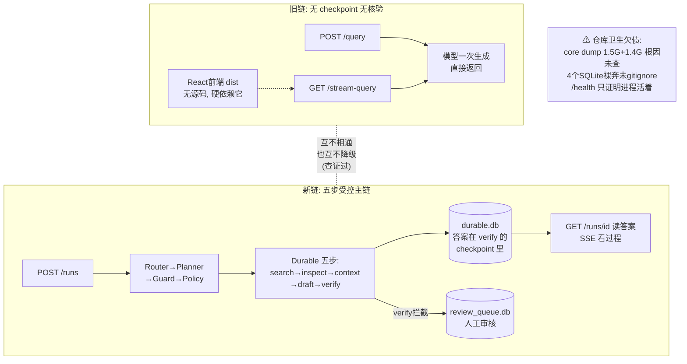
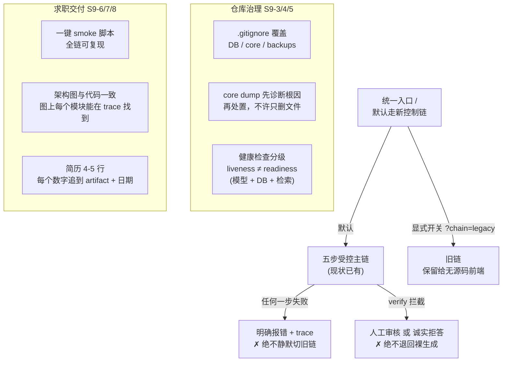

# S9 理解轨讲义：统一主链、部署治理与求职交付

> 范围：S9（V3 计划第 16 节）。只读代码、只写文档，未改任何业务代码。
> 所有行号以 2026-09-24 的工作区为准；引用前均已打开文件核对。
> 现状基线：S8 阶段门 `552 passed, 0 failed`（`artifacts/control-v3/S8/stage-report.md`、`regression-full-s8.txt`，本轨未跑回归）。
> 诚实声明（V3 第 4 节红线）：
> 1. 三条 API 链至今**并列存活**，没有任何统一入口、迁移开关或跨链降级代码——`/runs` 失败不会切旧链，反过来也不会；这是"没有静默降级"的好消息，也是"S9-1 统一语义尚未开始"的坏消息。
> 2. 仓库根目录现存两个 core dump（`core` 1.5G、`app/core` 1.4G）与 4 个 SQLite 运行库，`.gitignore` **均未覆盖**（`git status` 全部为 `??` 未跟踪）；治理是 S9-3/S9-4 的任务，**不是现状**。
> 3. `/health` 只是进程级 liveness（`api.py:98-100` 无条件返回 ok），不代表模型、DB 或检索就绪。
> 4. 本讲义工整区分【现状】与【目标】，S9-T2 八项全部写成目标，不得当作既成事实引用。

---

## 1. 人话摘要（200 字内）

S9 要把并列的三条问答链（旧 `/query`、SSE `/stream-query`、新 `/runs` 五步控制链）收敛成一条默认受控主链，并把仓库根目录的运行产物（core dump、DB、WAL、日志、pid）治理干净，最终交出可演示、可复现、可面试的项目。现状：三链各活各的、互不知晓；新链五步（search→inspect→context→draft→verify）真实可用且全部落盘；旧链仍被无源码的 React 前端依赖，不能删；运行产物散在仓库根，两个 1.4G+ core dump 根因未定位；健康检查只证明"进程活着"。修完用户能看到：一个入口、失败有明确 reason、一键 smoke、每个简历数字都能追到 artifact。

---
好。S9 的定位一句话：

> **S1-S8 是把能力一块块造出来并证明可信，S9 是"收官"——把散落的入口收敛成一条主链、把仓库卫生打扫干净、最后打包成能演示、能复现、能拿去面试的成品。**

## 人话摘要翻译

摘要讲了四件事：**三条链并存 → 收敛成一条 → 打扫仓库 →求职交付**。

**三条链并存（现状）**——同一个服务里有三条互不相通的问答路径：

| 链 | 特点 | 命运 |
|---|---|---|
| 旧链 `/query` | 同步：模型一口气生成直接返回，无 checkpoint、无核验 | **删不得**：没有源码的 React 前端（只有编译产物）硬依赖它 |
| 旧链 `/stream-query` | 同上 + SSE 直播过程 | 同上 |
| 新链 `/runs` | 异步：五步受控链（S1-S6 建的：检索→取证→上下文→起草→核验），全程落盘可恢复 | **未来的默认主链** |

摘要里一个关键事实值得划重点：**三条链之间没有任何隐式降级**——链失败绝不会偷偷退回旧链给你一个"裸生成"答案。这是查证过的事实，也是底线：Guard 拒绝、verify 拒答这些"失败即信息"的语义，一旦被"出错就调旧链兜底"抹掉，S-S8 建的所有门就全废了。

**仓库卫生欠债（具体可点名）**：两个 1.4G+ 的 core dump（根因还没定位，**不许只删文件不修根因**）、4 个 SQLite 数据库裸奔在仓库根目录且 .gitignore 没覆盖、`/health` 只证明"进程活着"（不代表模型/数据库/检索就绪）。

**修完后的样子**：一个入口、失败带明确、一条命令 smoke 全链、简历上每个数字能追到 artifact。

## 修改前图（现状：三条链各活各的）



## 修改后图（目标：收敛 + 治理 + 交付）



## 三条红线

1. **不能说"系统只有一条链"**——三链仍并列，统一入口是目标不是现状。
2. **"没有静默降级"和"有降级机制"含义相反**——现状是**根本没有降级路径**（查证过：`convchain_api` 全仓库只在旧链两个端点被调用）。说错会被击穿。
3. **core dump 没修、健康检查没分级**——这些是任务卡上的欠债，今天写进简历是造假。

## S1-S9 全景（最终版）

| 阶段 | 管什么 | 一句话 |
|---|---|---|
| S1 | 意图/计划/工具 | 问题过安检五件套，调真工具 |
| S2 | Durable 执行 | 随时存档录像，断电读档续跑 |
| S3 | 混合检索 | 两个检索员+融合+门，找得准可解释 |
| S4 | 上下文预算 | 先称行李再上飞机，锚点永不丢 |
| S5 | 记忆治理 | 档案室：读写过闸，默认拒绝 |
| S6 | 引用与验证 | 逐句对账，引用≠支持 |
| S7 | 视觉证据 | 图也要可找可引可验，没有就诚实说 |
| S8 |评测与飞轮 | 数字带出生证明，bug 修一次免疫终身 |
| S9 | 收敛与交付 | 一个入口、干净仓库、可演示可面试 |

九个字串起来：**通、稳、准、省、治、验、视、证、交**。你可以用这九个字当回忆钩子，每个字展开就是一张图。

---

## 2. 修改前图（现状数据流，12 节点）

```text
                        ┌──────────── 旧链（一次生成直接返回）────────────┐
 [1] POST /query (api.py:340-358) ──同步──▶ cb.convchain_api ──▶ {"response": str, ...}
        入: {"query": str}                  (radiant_llm.py:2077)        出: 完整答案 JSON
 [2] GET /stream-query?query= (api.py:486-555) ──后台线程跑同一 convchain_api──▶
        SSE 轮询 cb.reasoning_events（api.py:524-531, 0.25s/次）▶ step* → final → end
        两条旧链共享 [3]：
 [3] convchain_api (radiant_llm.py:2077-2086 三重就绪检查 →
        2089-2127 拼目录提示/会话检索/压缩记忆/skill → 2133 AgentExecutor)
        副作用: streaming_events.log（app/RADIANT_LLM_Logs/）、会话 JSONL
                        └──────── 无 checkpoint、无 verify、无 run 概念 ────────┘

                        ┌──────────── 新链（五步受控主链）────────────────┐
 [4] POST /runs (api.py:1061-1136) 入: {"goal"|"query", workspace, budgets?}
        ──▶ RuleRouter(1073) ──非 tool_call 直接返回 run_id=None（1077-1083）
        ──▶ RulePlanner(1086, planner.py:27-177) ──▶ SchemaGuard(1105)
        ──▶ PolicyEngine(1112) ──▶ 202 Accepted {run_id, steps, config_fingerprint}
 [5] 后台线程 _execute_plan_bg (api.py:958-968) ──▶ DurableRunner 顺序执行：
        s1-search → s2-inspect → s3-context → s4-draft → s5-verify
        （步骤间靠 ADR-0003 结构化绑定传数据，planner.py:59-64/86-97/119-130/144-161）
 [6] durable.db（仓库根）：runs / run_plans / checkpoints / events / leases /
        idempotency 六类表；最终答案落在 s5-verify 的 checkpoint.output.answer
        （answer_tools.py:316-317）
 [7] evidence.db：s1/s2 只读数据源（RADIANT_EVIDENCE_DB 指向，.env.example:54-56）
 [8] review_queue.db：waiting_review 与 verify_action=review 时写入
        （api.py:918-955, 971-1008）
 [9] 读出口：GET /runs（api.py:1165-1167, 只读直查 SQLite mode=ro）、
        GET /runs/{id}（:1224-1230）、SSE /runs/{id}/events（:1233-1279,
        Last-Event-ID 续传）、GET /metrics/summary（:1556-1595）
 [10] 旧链持久态：会话 JSONL（Docker_Executable/RADIANT_LLM_Sessions/）、
        app/RADIANT_LLM_Logs/*.log、治理 Memory memory.db
 [11] 运行产物散点（全部未被 .gitignore 覆盖，git status 均 ??）：
        core（1.5G, Sep 24 11:03）、app/core（1.4G, Sep 24 01:35）、
        durable.db(+wal/shm)、evidence.db、memory.db、review_queue.db、
        backups/、RADIANT_LLM_Logs/（根目录残留）
 [12] 进程管理：radiant-llm.pid（当前 4915 存活）+ radiant-llm.out.log
        （start_radiant.sh:106-116 启动，:35-47 轮转；已被 .gitignore:5-6 覆盖）
```

边即数据类型：`/query` 边是 `{query:str}→{response:str}`；`/runs` 边是 `{goal:str}→{run_id:uuid}`；步骤间边是 checkpoint 里的 `output` dict（hits / evidence records / ContextPackage / draft / verify output）。

---

## 3. 修改后图（S9-T2 目标，含控制点与失败出口）

> 以下是**目标**，不是现状。控制点用 ◆ 标注，失败出口用 ✗ 标注。

```text
 [1] 统一入口 /query（默认走新控制链；显式开关 ?chain=legacy 才走旧链，
     旧链保留只因无源码前端依赖它——S9-1）
   │ ◆控制点A：链选择是**显式参数/配置**，不是 try/except 隐式切换
   ▼
 [2] Router → Planner → ◆Guard → ◆Policy（现状已 fail closed，保留）
   │ ✗ router 非 tool_call → 明确返回 {run_id:null, status:respond|clarify|abstain}
   │ ✗ guard/policy 拒绝 → 422/403 typed error，工具调用数 0
   ▼
 [3] DurableRunner 五步链（现状已有，S9-6 一键 smoke 复验）
   │ ◆控制点B：新链任何一步失败 → run state=failed + typed error + trace
   │ ✗ 失败出口：**不**静默切旧链；如未来加降级，响应必须带
   │   degradation_reason + trace_uri（S9-2）
   ▼
 [4] s5-verify：accept→answer / review→Review Queue / abstain→拒答（现状）
   │ ✗ verify 拒绝 → 人工审核或诚实拒答，绝不退回"裸生成"
   ▼
 [5] 治理后的运行目录（S9-3）：DB/WAL/日志/artifact 各归其位，
     .gitignore 覆盖 *.db/-wal/-shm、core、backups/；core dump 先诊断
     再处置（S9-4，✗ 禁止只删文件不修根因）
 [6] 分级健康检查（S9-5）：/health=liveness；readiness 另含模型+DB+检索
 [7] 求职交付（S9-7/8）：与代码一致的架构图、5 分钟 demo、
     简历 4～5 行——每个数字可追到 artifact+配置指纹+测试日期
```

---

## 4. 固定案例 TEACH-T01：从 POST /runs 到 answer 的每一步落盘

案例本体：`benchmarks/teaching_case.jsonl` 的 `TEACH-T01`——问题 "What two main components does the Transformer architecture consist of? Answer with the PDF name, page number and Evidence ID."，workspace=`default`；gold 指向 `attention_is_all_you_need_1706.03762.pdf` 第 1 页 `ev-1467122274c2347e3ed99f4c`（gold 只用于验收比对，**不**作为运行参数）。case 自带的 `input.note` 写明"S1 起经 /runs 控制链执行；**S9 后由统一 /query 承接**"——这正是本阶段迁移方向的冻结表述。

逐步数据流（每步注明落盘位置）：

| # | 动作 | 代码位置 | 输入→输出形状 | 落盘 |
|---|---|---|---|---|
| 1 | `POST /runs {"goal": <TEACH-T01 question>, "workspace": "default"}` | `api.py:1061-1069` | goal str → 202 `{run_id, status:"running", steps[], config_fingerprint}` | 此刻**尚无** DB 行（后台线程异步建） |
| 2 | RuleRouter 判定 intent=knowledge_qa、action=tool_call | `api.py:1073`；S1-6 已冻结中英文等价 | goal → `RouterDecision{intent, action, reason_codes}` | 仅内存；若 respond/clarify/abstain 直接返回 `run_id=None`（:1077-1083） |
| 3 | RulePlanner 生成五步 plan，步骤参数含 ADR-0003 绑定引用 | `planner.py:32-170` | decision → raw plan dict（s1..s5 + budgets 8000tok/8calls/120s，:18） | 内存 `rt.plans[run_id]`（api.py:1120-1122）；Runner 启动时 `save_plan` → durable.db `run_plans` 表（checkpoint.py:229-239） |
| 4 | SchemaGuard + Policy 校验 | `api.py:1105-1117` | plan → ok / 422 `plan_rejected` / 403 `policy_denied` | 不落盘；失败时工具调用数为 0 |
| 5 | s1-search：`evidence.search` 混合检索 top_k=3 | `planner.py:32-44`；adapter 注册 `registry.py:299` | `{query, top_k:3}` → `output.hits[*]{evidence_id, ...}` | checkpoint → durable.db；event `node_completed` → events 表 |
| 6 | s2-inspect：绑定解析 `output.hits[*].evidence_id` → 批量取证据 | `planner.py:49-72` | 引用 `{ref:"step_output", from_step:"s1-search", path:"output.hits[*].evidence_id"}` → `output.evidence[*]` 完整记录 | 同上；绑定解析另发 `binding_resolved` 事件（只记形状/数量/digest） |
| 7 | s3-context：组装预算化 ContextPackage | `planner.py:76-105` | evidence 数组 + question → `output.context_package`（带预算 trace） | checkpoint |
| 8 | s4-draft：调 LLM 从 ContextPackage 起稿 | `planner.py:108-138`，handler `answer_tools.py:94` | context_package+question → `output.draft` + claims | checkpoint；timeout 120s、transient_only 重试 |
| 9 | ◆review gate：draft 含 numeric/unit claim 时 verify 前暂停 | `api.py:729-738` | claims → waiting_review → review_queue.db 一条 pending item | review_queue.db（携带真实 claims+evidence snapshot+plan_json，api.py:918-955） |
| 10 | s5-verify：Claim-Evidence 核验，accept/一次 revise/review/abstain | `planner.py:139-170`；`answer_tools.py:249-332` | draft+evidence+question → `output{verify_action, answer, claims, coverage, reason_codes}` | checkpoint；**answer 只在 verify_action=accept 时非 None**（answer_tools.py:265/310）；revise 最多一次，二次失败转 review（:304-305） |
| 11 | 读取答案：`GET /runs/{run_id}` → `steps[4].output.answer`；过程看 SSE | `api.py:1224-1230`、`:1233-1279` | run_id → snapshot / event stream | 全部读自 durable.db，重启后仍可读 |

验收锚点：PDF 名、page=1、evidence_id 必须出现在 answer/claims 里；`mock=false`；trace 无 `_MOCK_DOCS`。TEACH-T01 的 expected_facts 是 `["encoder","decoder"]`——它们由 verify 的 claim 核验把关，而非字符串匹配。

---

## 5. 状态流：内存 / SQLite / 文件 trace 三分

| 状态 | 位置 | 重启后 | 说明 |
|---|---|---|---|
| `rt.plans` / `rt.workspaces` / `rt.cleared_steps` | 仅内存（api.py:713-719） | **丢失**；resume 时从 `run_plans` 重建（api.py:1313-1325，S2-2 的成果） | 旧债残留：`run_plans` 之前创建的 run 走 review item 的 plan_json 恢复（:1318-1322） |
| run/step 状态机、checkpoint、事件、lease、幂等 ledger | durable.db（api.py:691-696） | 完整保留 | `GET /runs` 直接 mode=ro 读库（api.py:1143-1145），历史列表天然 survive 重启 |
| `_INGEST_JOBS` / `_BENCHMARK_JOBS` | 内存（api.py:1628、1383） | ingest job 丢失；benchmark 从 `artifacts/eval/*/job.json` 重建（api.py:1544-1551） | 重启中正在 ingest 的任务会"消失"（状态滞留 running）——S9-5 待治理 |
| 旧链会话、reasoning_events、`_memory_summary_note` | 会话 JSONL 落盘 / 后两者仅内存 | 会话可 `POST /sessions/{id}/load` 恢复；reasoning 流与压缩便签丢失 | `convchain_api` 的会话检索依赖这些 JSONL（radiant_llm.py:2097-2100） |
| 证据、治理 Memory、Review Queue | evidence.db / memory.db / review_queue.db | 完整保留 | 路径解析链见 §关键读法三 |
| 过程 trace | streaming_events.log（旧链+run_bg_error）、`reasoning_chain.log`、SSE 事件、durable events 表 | 文件与 DB 保留；SSE 靠 Last-Event-ID 续传（api.py:1236-1249） | 新链 trace 的权威出口是 durable 事件表，不是日志文件 |

---

## 6. 关键代码位置（5 个）

**1) `app/api.py:340-358` —— POST /query（旧链主入口）**
输入 `{"query": str}`；输出 convchain_api 的结果 dict（含 `response`）。副作用：`wait_for_model_ready` 最长阻塞 180s（:78-95）、写 streaming_events.log。失败行为：缺 query→400；模型未就绪→503；链内 error→400。**为什么重要**：它是无源码 React 前端之外最老的契约面，也是 S9-1 统一入口的迁移落点（teaching_case 的 note 指定 /query 承接统一链）；任何语义改动都要同时考虑前端 dist 兼容性。

**2) `app/api.py:1061-1136` —— POST /runs（新链唯一创建口）**
输入 `{"goal"|"query", workspace, budgets?}`；输出 202 `{run_id, steps, config_fingerprint, policy_verdict}`，或 router 非 tool_call 时 `{run_id: None, status: respond|clarify|abstain}`。副作用：内存注册 plan + 起后台线程（:1120-1124）。失败行为：router 异常→500 `router_error:<type>`；plan 非法→422 `planner.invalid_output`；guard→422 `plan_rejected`；policy→403 `policy_denied`——全部 typed，**无一处调用 convchain_api**。**为什么重要**：三链收敛的"默认路径"就是它；它的 fail-closed 语义是 S9-2"禁止静默降级"的现状基础。

**3) `app/control/planner.py:27-177` —— RulePlanner（链语义决定者）**
输入 RouterDecision + goal + 只读工具 catalog；输出 raw plan dict（无执行能力，必须过 Guard/Policy）。副作用：无。失败行为：非法输出在 scheduler 端 fail closed。**为什么重要**：五步链长什么样、步骤间数据怎么流（s2 的 evidence_ids 引用 s1 输出，:59-64；s4 的 context_package 引用 s3，:119-124；s5 同时引用 s4/s2/s1，:144-161）全部在这里冻结；knowledge_qa/visual_qa 之外的 intent 只生成单步 search——这是"新链不等于全能链"的直接证据。

**4) `app/api.py:1300-1328` + `app/durable/checkpoint.py:229-251` —— resume 与 plan 持久化**
输入 run_id；输出 `{"status":"resuming"}` + 后台恢复线程。副作用：优先用内存 plan，缺失时 `load_plan` 从 SQLite `run_plans` 表重建 plan+workspace 并回填内存（api.py:1313-1325）。失败行为：终态 run→409；无持久化 plan→409 并指引走 review item 恢复。**为什么重要**：这是"服务重启后历史可续"的关键证据，也是 §5 内存/SQLite 分界的执法点。

**5) `app/api.py:98-100` + `start_radiant.sh:49-68` —— 健康检查现状**
输入无；输出恒 `{"status":"ok"}`。副作用：无（不碰模型、不碰 DB）。失败行为：进程死→连接失败，脚本侧 120s 轮询超时后打印日志尾部（start_radiant.sh:57-67）。**为什么重要**：它只证明 uvicorn 进程活着；模型就绪靠 `/query` 侧的 `wait_for_model_ready` 兜底（api.py:78-95），DB/检索/evidence 配置完全不在检查范围内——`/health` 200 时 `evidence.search` 仍可能 fail closed（`evidence.kb_dir_missing`）。S9-5 的分级 readiness 是目标不是现状。

---

## 7. 术语表（8 个）

1. **三链**：`/query`（同步一次生成）、`/stream-query`（同一生成 + SSE 过程事件）、`/runs`（异步五步受控链）——同一服务里三套互不相通的问题回答路径。
2. **convchain_api**：旧链核心方法（`radiant_llm.py:2077`），把 query 直接丢给 AgentExecutor，一次生成直接返回，无 checkpoint、无核验。
3. **Run**：新链的一次受控执行，有 run_id、状态机、预算和 owner；答案不是 HTTP 响应体，而是最后一步 checkpoint 里的 `output.answer`。
4. **Checkpoint**：某一步执行完后落进 durable.db 的输入/输出/状态快照；崩溃恢复时"成功的步骤不重跑"靠它。
5. **步骤输出绑定（ADR-0003）**：plan 里用 `{"ref":"step_output","from_step":...,"path":...}` 声明"这一步的参数来自上一步的真实输出"，执行时解析，禁止模板 eval。
6. **Feature flag**：用环境变量切换实现路径的开关。本项目的 flag（`RADIANT_EVIDENCE_SEARCH_REAL` 等）只切换**工具 adapter 的真假**，从不切换**链**。
7. **WAL**：SQLite 的写前日志（`durable.db-wal` 等 `-wal/-shm` 文件）。WAL 模式下主库文件可能不含已提交数据，所以备份必须用 SQLite 在线 backup API（`deploy/backup.sh:38-57`），直接 `cp` 会丢数据。
8. **Release Gate**：S8 建的发布闸——测试绿不够，还要对比基线指标、检查 judge 人审口径；不过就诚实阻断（`/benchmarks/run` 完成时自动执行，api.py:1410-1412）。

---

## 8. T2 变更清单（S9-T2 八项，全部为目标）

按 V3 §16，逐项映射（括号为台账/证据锚点）：

| 项 | 内容 | 预计修改/新增 | 失败测试先行 | 备注 |
|---|---|---|---|---|
| S9-1 | 统一三 API 语义，默认走新链；旧链保留显式迁移开关 | `app/api.py`（/query 入口）、可能新增链选择配置；前端 dist **无源码不可改**（README 限制） | 默认 /query 请求产生 run_id 且 trace 含五步事件 | teaching_case note 已冻结"/query 承接统一链" |
| S9-2 | 新链失败不得静默切旧链；降级必须返回 reason + trace | 现状已无跨链切换代码（convchain_api 仅在 api.py:352/507 被调用）——此项主要是**写负向测试冻结现状** + 若加降级路径则带 `degradation_reason` | 注入新链失败，断言响应不含旧链答案、含 typed error | 不得把"无降级"退化成"有静默降级" |
| S9-3 | 治理 .gitignore、运行目录、DB/WAL/artifact；测试基础设施（台账 D5：pytest.ini 被删致裸 pytest 收集 runtime/ 树 INTERNALERROR） | `.gitignore`、目录约定文档、（D5 修复需恢复 pythonpath 配置或等效物） | `git status` 不再列出 *.db/core/backups；裸 `pytest -q` 不 INTERNALERROR | **禁止直接删除用户数据**；DB 只归档移动不删 |
| S9-4 | 定位 1.4G+ core dump 与启动竞态根因，先复现/诊断再修（台账 D3、D7；V3 §3.1 commit 994db75） | 诊断记录 + 最小修复（D3：`general_utilities.py:114-115` 导入期 env None 崩溃；D7：pytest 退出时 C 级 abort exit 134） | 复现脚本 + 修复后不 core | **不得只删 core 文件** |
| S9-5 | 日志轮转、分级健康检查、重启后历史状态读取 | `start_radiant.sh`（轮转已存在于 :35-47）、`api.py` /health 分级、ingest job 持久化 | 重启后 GET /runs 历史完整（现状已成立，写测试冻结）；readiness 覆盖模型+DB | /health=liveness 的语义不得破坏（脚本依赖） |
| S9-6 | 一键小数据 E2E smoke：query/retrieve/context/verify/memory/resume/trace | 新增 smoke 脚本 + artifacts/control-v3/S9/ | smoke 脚本退出码即门 | ingest 只在必要时单独验证 |
| S9-7 | 与真实代码一致的架构图 + 5 分钟 demo；图上每个模块可在 trace 找到 | `docs/ARCHITECTURE.md`、`docs/DEMO_SCRIPT.md` | demo 脚本走查 | 图上不得出现未实现模块 |
| S9-8 | 简历 4～5 行、面试 Q&A、限制清单（只用已验收事实，V3 §21） | `docs/RESUME_BULLETS.md` 等 | 每个数字附 artifact 路径+日期 | 禁止论文数字、LangGraph、Cross-Encoder 表述 |

**禁止修改**：`benchmarks/teaching_case.jsonl` gold、S1～S8 已验收 artifact、任何 DB 内容、前端 dist。**smoke**：S9-6 一键脚本 + TEACH-T01 通过 /runs 全链。**回滚方式**：S9 不改数据格式，回滚=还原 api.py/.gitignore/脚本的工作区修改（git 层面）；任何 DB 迁移必须先 `deploy/backup.sh`。

---

## 9. 三件必须记住的事

1. **三链并列、互不降级**：`convchain_api` 全仓库只在 `api.py:352` 和 `api.py:507` 被调用——`/runs` 失败永远不会偷偷变成旧链答案，旧链也永远不会走控制面。S9-1 的统一是"加显式开关"，不是"拆隐式炸弹"，因为隐式炸弹不存在（已用负向查证证实，不是设计假设）。
2. **旧链删不得**：无源码的 React 前端 dist 硬依赖 `/stream-query`（`frontend-dist/assets/index-*.js` 实测含该端点），旧链还独有会话/skill/压缩记忆生态（`radiant_llm.py:2089-2127`）；所以收敛路径是"统一入口 + 显式 legacy 开关"，不是删除。
3. **运行产物治理欠债具体且可点名**：两个 core dump（根 `core` 1.5G、`app/core` 1.4G）、根目录 4 个 SQLite + WAL、`.gitignore` 对它们零覆盖；`/health` 只是 liveness。这些是 S9-3/4/5 的任务卡，今天写进简历是造假。

---

## 10. 三道自测题

**Q1（数据流）**：TEACH-T01 经 POST /runs 执行后，最终答案文本存在哪里、通过哪个 API 读到？如果 s5-verify 的 verify_action 是 review，answer 字段是什么、接下来发生什么？

<details><summary>答案</summary>

答案文本在 durable.db 中 s5-verify 步骤的 checkpoint 里：`output.answer`（`answer_tools.py:316-317`），通过 `GET /runs/{run_id}` 的 `steps[4].output.answer` 读取（api.py:1224-1230 的 snapshot 逻辑）。若 verify_action=review，`answer=None`（answer_tools.py:265/276/310 只在 accept 时赋值），随后 `_maybe_enqueue_verify_review`（api.py:971-1008）把真实 claims+evidence snapshot+plan 写入 review_queue.db；人工 `POST /reviews/{id}/decision` approve/edit 后原 run 在后台恢复（api.py:1346-1374）。也就是说"被拦截的答案"永远有审计轨迹，不会静默放行也不会静默丢弃。</details>

**Q2（设计取舍）**：既然新链明显更强，为什么 S9-1 选择"统一入口 + 显式 legacy 开关"而不是直接删除 /query 和 /stream-query？

<details><summary>答案</summary>

三个硬约束：(1) React 前端只有编译后的 dist、无源码（README 限制节），实测 `frontend-dist/assets/index-DcJeqqyn.js` 调用 `/stream-query`，删旧链=唯一聊天 UI 报废且无法重写；(2) 新链的 router 对 respond/clarify/abstain 意图直接返回 `run_id=None`（api.py:1077-1083），纯聊天/技能类请求在新链没有等价承载；(3) 旧链的会话检索、skill 注入、压缩记忆（radiant_llm.py:2089-2127）在新链尚无对应物。所以正确工程动作是把默认路径切到新链、旧链降级为显式可选，等前端与生态迁移后再谈删除。</details>

**Q3（失败后果）**：假设有人在 S9-1 时图省事，给 /runs 包了一层"任何异常就调 convchain_api 兜底"。这会造成什么后果？现状代码里用什么证据证明这种兜底不存在？

<details><summary>答案</summary>

后果：控制面被整体架空——Guard/Policy 拒绝、verify 拒答、review 暂停这些"失败即信息"的语义会被一层兜底全部抹掉，用户拿到一个无引用、无核验、无 trace 的答案还以为走了受控链；S1～S8 建的全部验收门（负向拦截、审计、release gate）失效，且这种失败模式在测试绿的情况下完全不可见。不存在的证据：`grep convchain_api app/api.py` 只有 :352（/query）和 :507（/stream-query）两处调用，`/runs` 组端点（:1061-1374）的每一条错误路径都是 raise typed HTTPException 或写 failed run state，无任何 catch 后转调旧链的代码。S9-2 的任务就是把这一现状用负向测试冻结，防未来回归。</details>

---

## 11. 面试表达

**60 秒口述**：

"我接手时这个核工程 PDF Agent 有三条互不相通的问答链：老的同步 /query、SSE 流式 /stream-query，和我逐步建起来的 /runs 五步受控链——路由、计划、schema 与策略前置校验、持久化执行、claim 级核验。S9 这一步我做的是收敛与交付：先用负向查证确认三链之间不存在任何隐式降级——新链失败绝不会偷偷退回裸生成；然后把默认路径统一切到受控链，旧链因前端 dist 无源码只能保留为显式 legacy 开关。同时治理运行产物：两个 1.4G 以上的 core dump 先诊断根因再处置，四个 SQLite 运行库和 WAL 从 git 裸奔状态纳入 ignore 与备份体系，健康检查从'进程活着'升级为分级 readiness。最终交付一条命令可复现的 smoke，简历上每个数字都能追到 artifact、配置指纹和测试日期。"

**可以说（S1～S8 已验收、有 artifact）**：
- 五步受控主链真实存在且经 HTTP smoke：router→planner→guard→policy→durable runner→hybrid search→inspect→context budget→draft→verify（`artifacts/control-v3/S1..S8`，回归 552 passed）。
- 持久执行语义：kill/restart 后恢复、成功步骤重跑 0 次、事件丢失/重复 0、stale owner 写入 0（S2-9 `smoke-s29.json`）。
- 六组对照数字（全部带 artifact 路径与口径声明）：检索 Recall@5 0.234→0.299、gold 证据保留 0.4→1.0、恢复率 8/8、Memory 泄漏 0、unsupported 拦截口径 0.425→0.000（README 六组对照表，路径逐一可查）。
- 诚实口径：B3 收益来自拦截弃答而非修复生成；judge/人审 agreement 样本量 1 仅机制验证；S8 e2e 6 case 全部进 review 无 accept（CURRENT_TASK 已声明）。

**暂时不能说**：
- "系统只有一条链" / "已完成统一入口" —— 三链仍并列，统一是 S9-1/2 目标。
- "无静默降级设计" 说成 "有降级机制" —— 现状是**根本没有降级路径**，两者含义相反，说错会被追问击穿。
- "core dump 已修复" —— 根因未定位（S9-4）；台账 D7 只确认 pytest 退出时 C 级 abort 这一现象。
- "健康检查覆盖服务就绪" —— /health 是 liveness；readiness 是 S9-5 目标。
- LangGraph、Cross-Encoder、region-level 视觉证据、论文 CoP/CiP/CiH/HR/ViR 数字（V3 §21 全局禁止项）。

---

## 附：七个必答点速查（V3 §16 S9-T1）

1. **旧链新链如何迁移**：见 §2/§9.2/Q2。语义差异=/query 同步直接返回答案 vs /runs 异步 202+run_id、答案在 checkpoint；迁移=统一 /query 入口默认新链+显式 legacy 开关（teaching_case note 已冻结此方向）。
2. **feature flag/降级现状**：链级 flag 与跨链降级**均不存在**（负向查证）；adapter 级 flag 存在（`RADIANT_EVIDENCE_SEARCH_REAL`/`INSPECT_REAL`/`RADIANT_EVIDENCE_SEARCH_MODE`，.env.example:48-62），生产 `RunRuntime` 直接 `evidence="real"`（api.py:697）不依赖 flag；检索 auto 模式降级会显式输出 `hybrid_fallback_reason`（search_adapter.py:158-159），非静默。
3. **运行产物边界**：见 §2 节点 11 与 §9.3。现状：4 个 DB + WAL/shm、两个 core、backups/、根 RADIANT_LLM_Logs/ 全在仓库根且未被 .gitignore 覆盖；`radiant-llm.pid/out.log`、`app/RADIANT_LLM_Logs/`、runtime/、artifacts/ 已覆盖（.gitignore:5-26）。路径解析链：env 覆盖 > `RADIANT_LLM_CONFIG_DIR` > 仓库根（api.py:673-680、memory/store.py:33-43、evidence/store.py:81-87）。
4. **健康检查与重启历史**：/health=liveness（api.py:98-100）；模型就绪由 /query 侧 `wait_for_model_ready` 180s 兜底（:78-95）；/runs 不等模型（RuleRouter 无 LLM 依赖）。重启后 run 历史、checkpoint、事件、review、benchmark 报告均可读（durable.db 只读直查 + job.json 重建）；内存 plan map、ingest job、reasoning 流丢失（§5）。
5. **完整请求流/数据流/状态流**：§4（TEACH-T01 逐步落盘表）+ §5（三分状态表）。
6. **简历指标来源与限制**：§11 可说/不可说 + README 六组对照表（每行含 artifact 路径）+ CURRENT_TASK 诚实声明。
7. **core dump 与启动竞态证据**：`core`（1.58G, Sep 24 11:03）与 `app/core`（1.50G, Sep 24 01:35）实测存在；台账 D7 记录 pytest 进程解释器退出时 C 级 abort（exit 134）产生 core、测试本身全绿；台账 D3 记录 `general_utilities.py:114-115` 导入期 env None 崩溃仅以懒导入规避、根源未修；启动竞态侧 commit `994db75`"模型就绪竞态三重修复"（V3 §3.1 锚定）+ `wait_for_model_ready`（api.py:78-95）为已落地缓解；`radiant-llm.out.log` 显示当前实例 4915 正常 auto-init（deepseek-v4-pro）后服务 /runs 流量。根因未实锤，S9-4 先诊断后修。
